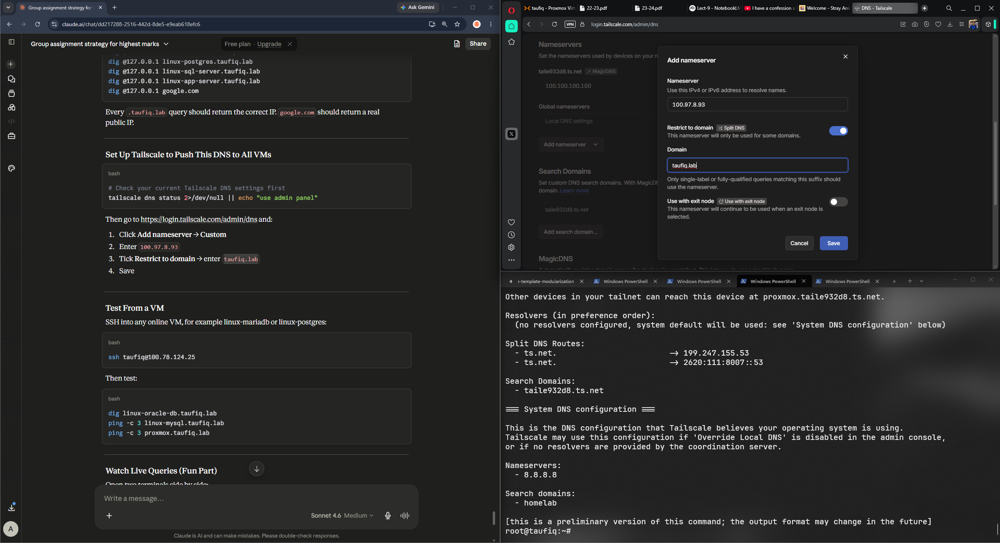
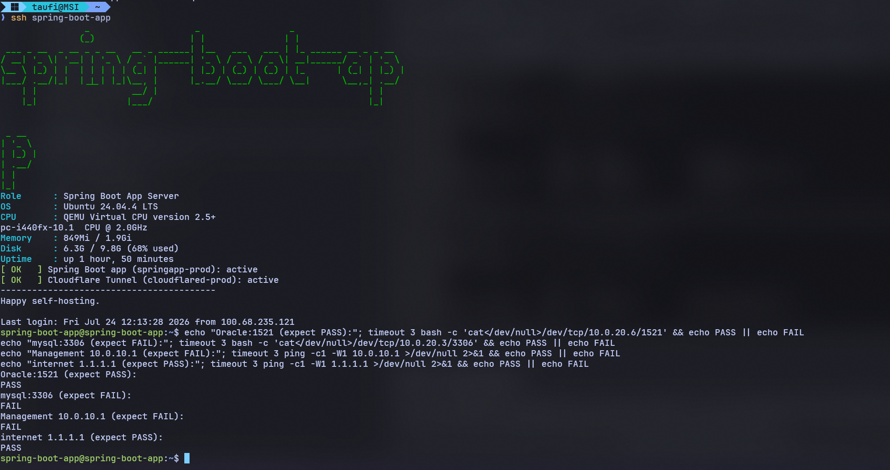

# Homelab DNS Infrastructure Setup — taufiq.lab
**Author:** Taufiq  
**Date:** 2 July 2026  
**Duration:** ~3 hours  
**Scope:** Self-hosted DNS with dnsmasq, Tailscale Split DNS, SSH config automation

---

## Table of Contents

1. [Lab Environment Overview](#1-lab-environment-overview)
2. [Problem Statement](#2-problem-statement)
3. [Solution Architecture](#3-solution-architecture)
4. [Technology Stack](#4-technology-stack)
5. [Step-by-Step Implementation](#5-step-by-step-implementation)
6. [DNS Architecture Deep Dive](#6-dns-architecture-deep-dive)
7. [Network Flow Diagrams](#7-network-flow-diagrams)
8. [Configuration Files](#8-configuration-files)
9. [Troubleshooting Log](#9-troubleshooting-log)
10. [Knowledge Gained](#10-knowledge-gained)
11. [Final Verification Results](#11-final-verification-results)
12. [Coverage Audit — 19 July 2026](#12-coverage-audit--19-july-2026)
13. [Reference — All IPs and Names](#13-reference--all-ips-and-names)
14. [SSH Alias Coverage — 24 July 2026](#14-ssh-alias-coverage--24-july-2026)

---

## 1. Lab Environment Overview

### Physical Host

| Component | Value |
|---|---|
| Hostname | taufiq |
| OS | Proxmox VE 9.1.1 |
| CPU | Intel Core i5-6600T @ 2.70GHz (4 cores) |
| RAM | 7.65 GiB (upgraded to 15.51 GiB on 2026-07-19, see main README) |
| Storage | 225.19 GiB |
| Kernel | Linux 6.17.2-1-pve |
| Uptime at session start | 30 days 19:56:12 |
| Local IP | 192.168.0.10 |
| Tailscale IP | 100.97.8.93 |

### Virtual Machines

| VM ID | Name | OS | Local IP | Tailscale IP | Username |
|---|---|---|---|---|---|
| 101 | app-server | Ubuntu 24.04 | 192.168.0.102 | 100.100.123.90 | taufiq |
| 102 | linux-sql-server | Ubuntu 22.04 | 192.168.0.104 | 100.117.38.113 | linux-sql-server |
| 104 | linux-mysql | Ubuntu 24.04 | 192.168.0.103 | 100.115.237.93 | workshop-mysql |
| 105 | linux-mariadb | Ubuntu 24.04 | 192.168.0.105 | 100.78.124.25 | workshop-2 |
| 106 | linux-postgres | Ubuntu 24.04 | 192.168.0.107 | 100.113.234.24 | workshop-postgres |
| 107 | linux-oracle-db | Oracle Linux 8.10 | 192.168.0.106 | 100.118.110.114 | linux-oracle-db |
| 103 | spring-boot-app | Ubuntu 24.04.4 | 192.168.0.105 (DHCP, drifts) | 100.120.243.96 | spring-boot-app |
| 109 | linux-mini-io | Ubuntu 22.04.5 | 192.168.0.105 (static) | 100.73.172.85 | (see [`docs/05-minio/minio-setup.md`](../05-minio/minio-setup.md)) |

### Containers (LXC)

| CT ID | Name | OS | Local IP | Tailscale IP |
|---|---|---|---|---|
| 108 | linux-mongodb | Ubuntu 24.04 (unprivileged) | 192.168.0.108 | 100.82.200.94 |
| 110 | linux-vault | Ubuntu 24.04 (unprivileged) | 192.168.0.110 | 100.112.41.113 |

### Client Machines

| Device | OS | Tailscale IP | Role |
|---|---|---|---|
| MSI Laptop | Windows 11 + Kali WSL | 100.68.235.121 | Primary workstation |
| taufiq-ansible-wsl-ubuntu | Ubuntu 26.04 WSL | 100.112.163.39 | Ansible control node |
| kali | Kali Linux WSL | 100.127.241.63 | Security/pentesting |
| iPhone 11 | iOS | 100.91.66.124 | Mobile access |

---

## 2. Problem Statement

### Before This Session

Every time a connection was needed to a VM, the Tailscale IP had to be memorised or looked up:

```
ssh workshop-mysql@100.115.237.93
ssh workshop-postgres@100.113.234.24
ssh linux-oracle-db@100.118.110.114
```

**Problems with this approach:**
- IPs are not human-readable
- Easy to connect to the wrong machine
- No documentation of what each IP does
- Every new team member or session requires looking up IPs
- Does not scale when more VMs are added
- No concept of service-level addressing

### Goal

Replace raw IPs with meaningful DNS names under a personal domain `taufiq.lab`:

```
ssh taufiq@linux-mysql.taufiq.lab
ssh taufiq@linux-oracle-db.taufiq.lab
ssh root@proxmox.taufiq.lab
```

---

## 3. Solution Architecture

### Three Approaches Considered

#### Option A — Tailscale MagicDNS
- Built into Tailscale, zero configuration
- Gives flat machine names like `proxmox.taile932d8.ts.net`
- Cannot define custom domain names
- Cannot create service-level records (e.g. `grafana.taufiq.lab`)
- Cannot do split-horizon DNS

#### Option B — /etc/hosts on each machine
- Simple, no dependencies
- Must be updated manually on every machine
- Does not scale
- No central management

#### Option C — Self-hosted dnsmasq (CHOSEN)
- Full control over naming
- Central management — one file controls all names
- Supports service-level records
- Supports split-horizon DNS
- Works independently of Tailscale
- Teaches real production DNS patterns
- Free and open source

### Why Option C Was Chosen

Option C was chosen specifically for the learning value it provides. Running your own DNS server teaches concepts that MagicDNS completely abstracts away: authoritative vs recursive DNS, record types, query forwarding, split DNS, TTL, caching, and nameserver delegation. These are skills directly applicable to production infrastructure work.

---

## 4. Technology Stack

| Technology | Role | Version |
|---|---|---|
| dnsmasq | Authoritative + forwarding DNS server | Latest (Debian) |
| Tailscale | VPN mesh + Split DNS delivery | Active |
| Proxmox VE | Hypervisor hosting the DNS server | 9.1.1 |
| OpenSSH | SSH client with config file | Windows built-in |
| PowerShell | Windows config management | 5.x |
| WSL Kali | Linux terminal on Windows | kali-linux |
| WSL Ubuntu | Ansible control node | Ubuntu 26.04 |

---

## 5. Step-by-Step Implementation

### Phase 1: Collect All Tailscale IPs

Before any configuration, all Tailscale IPs were collected. This is critical because dnsmasq maps names to IPs — if the wrong IP is entered, DNS resolves to the wrong machine.

**Command run on Proxmox:**
```bash
tailscale status
```

**Output captured:**
```
100.97.8.93      proxmox
100.91.66.124    iphone-11
100.127.241.63   kali
100.100.123.90   linux-app-server
100.78.124.25    linux-mariadb
100.115.237.93   linux-mysql
100.118.110.114  linux-oracle-db
100.113.234.24   linux-postgres
100.117.38.113   linux-sql-server
100.68.235.121   msi-laptop
100.112.163.39   taufiq-ansible-wsl-ubuntu
```

### Phase 2: Install dnsmasq

```bash
apt update
apt install dnsmasq -y
```

### Phase 3: Resolve Port 53 Conflict

Port 53 is the standard DNS port. On modern Debian-based systems, `systemd-resolved` runs a stub listener on port 53 by default, which conflicts with dnsmasq.

**Check what is using port 53:**
```bash
ss -tulnp | grep :53
```

**Result on this system:**
dnsmasq was already installed and running (leftover from a previous install), so no conflict existed. However the correct procedure if `systemd-resolved` is found:

```bash
systemctl disable systemd-resolved --now
rm /etc/resolv.conf
echo "nameserver 8.8.8.8" > /etc/resolv.conf
echo "nameserver 1.1.1.1" >> /etc/resolv.conf
```

**Why this matters:**
`systemd-resolved` creates a local DNS stub at `127.0.0.53`. When dnsmasq tries to also bind to port 53, it fails with "address already in use." Disabling resolved hands full DNS control to dnsmasq.

### Phase 4: Write the dnsmasq Configuration

**Backup first:**
```bash
cp /etc/dnsmasq.conf /etc/dnsmasq.conf.backup
```

**Full configuration written:**
```bash
cat > /etc/dnsmasq.conf << 'EOF'
# ============================================================
# taufiq.lab — Personal Homelab DNS
# Proxmox Host: 100.97.8.93
# ============================================================

# Core Settings
no-resolv
interface=tailscale0
interface=lo
listen-address=127.0.0.1
listen-address=100.97.8.93

domain-needed
bogus-priv

domain=taufiq.lab
local=/taufiq.lab/

# Upstream DNS
server=8.8.8.8
server=1.1.1.1

# Proxmox Host
address=/proxmox.taufiq.lab/100.97.8.93

# Virtual Machines
address=/linux-app-server.taufiq.lab/100.100.123.90
address=/linux-mysql.taufiq.lab/100.115.237.93
address=/linux-mariadb.taufiq.lab/100.78.124.25
address=/linux-postgres.taufiq.lab/100.113.234.24
address=/linux-oracle-db.taufiq.lab/100.118.110.114
address=/linux-sql-server.taufiq.lab/100.117.38.113

# Short aliases
address=/app.taufiq.lab/100.100.123.90
address=/app-server.taufiq.lab/100.100.123.90
address=/mysql.taufiq.lab/100.115.237.93
address=/mariadb.taufiq.lab/100.78.124.25
address=/postgres.taufiq.lab/100.113.234.24
address=/oracle.taufiq.lab/100.118.110.114
address=/mssql.taufiq.lab/100.117.38.113

# Other Tailscale Devices
address=/kali.taufiq.lab/100.127.241.63
address=/ansible.taufiq.lab/100.112.163.39

# Cache
cache-size=1000
neg-ttl=60

# Logging
log-queries
log-facility=/var/log/dnsmasq.log
EOF
```

> **Updated 2026-07-17:** four VMs/CTs added after this initial write-up
> (`spring-boot-app`, `linux-mini-io`, `linux-mongodb`, `linux-vault`) — see the
> current full config in [§8](#8-configuration-files) below.

**Explanation of every important directive:**

| Directive | Value | Meaning |
|---|---|---|
| `no-resolv` | — | Don't read /etc/resolv.conf for upstream servers |
| `interface=tailscale0` | — | Only listen on Tailscale interface |
| `interface=lo` | — | Also listen on localhost |
| `listen-address` | 127.0.0.1, 100.97.8.93 | Explicit IPs to bind to |
| `domain-needed` | — | Never forward single-label names (no dots) upstream |
| `bogus-priv` | — | Never forward reverse lookups for private IPs |
| `domain` | taufiq.lab | Your authoritative domain |
| `local=/taufiq.lab/` | — | This domain is local, don't forward it |
| `server=8.8.8.8` | — | Use Google DNS for everything else |
| `address=` | name/IP | Static DNS A record |
| `cache-size=1000` | — | Cache up to 1000 DNS entries in memory |
| `neg-ttl=60` | — | Cache negative (not found) responses for 60 seconds |
| `log-queries` | — | Log every DNS query |
| `log-facility` | /var/log/dnsmasq.log | Where to write logs |

### Phase 5: Validate and Start dnsmasq

**Syntax check:**
```bash
dnsmasq --test
# Expected output: dnsmasq: syntax check OK.
```

**Start and enable:**
```bash
systemctl enable dnsmasq
systemctl restart dnsmasq
systemctl status dnsmasq
```

**Confirmed output:**
```
Active: active (running) since Thu 2026-07-02 09:11:42 +08
Main PID: 2303196 (dnsmasq)
Memory: 1M
```

### Phase 6: Test All Records Locally

```bash
dig @127.0.0.1 proxmox.taufiq.lab
dig @127.0.0.1 linux-oracle-db.taufiq.lab
dig @127.0.0.1 linux-mysql.taufiq.lab
dig @127.0.0.1 linux-mariadb.taufiq.lab
dig @127.0.0.1 linux-postgres.taufiq.lab
dig @127.0.0.1 linux-sql-server.taufiq.lab
dig @127.0.0.1 linux-app-server.taufiq.lab
dig @127.0.0.1 google.com
```

**All returned correct results. Example:**
```
;; ANSWER SECTION:
linux-oracle-db.taufiq.lab. 0  IN  A  100.118.110.114
Query time: 0 msec
```

**google.com also resolved correctly:**
```
;; ANSWER SECTION:
google.com.  211  IN  A  172.217.25.110
Query time: 8 msec
```

This confirmed:
- Internal records serve from dnsmasq's own config
- External records forward to 8.8.8.8 and return correctly

### Phase 7: Configure Tailscale Split DNS

In the Tailscale admin panel at `https://login.tailscale.com/admin/dns`:

1. Clicked **Add nameserver → Custom**
2. Entered `100.97.8.93` (Proxmox Tailscale IP)
3. Enabled **Restrict to domain**
4. Entered `taufiq.lab`
5. Saved



**What this does:**
Tailscale's coordination server pushes this DNS rule to every device on the tailnet. When any device tries to resolve `*.taufiq.lab`, Tailscale intercepts the query and forwards it to `100.97.8.93` instead of the default resolver.

**Verified on app-server:**
```bash
tailscale dns status
# Split DNS Routes:
#   - taufiq.lab  -> 100.97.8.93   ✅
```

### Phase 8: Live Query Monitoring

To observe DNS in real time, two terminals were opened:

**Terminal 1 (Proxmox):**
```bash
tail -f /var/log/dnsmasq.log
```

**Terminal 2 (app-server VM):**
```bash
ping linux-oracle-db.taufiq.lab
dig linux-mysql.taufiq.lab
```

**Live log output observed:**
```
Jul  2 09:14:08 dnsmasq[2303196]: query[A] linux-oracle-db.taufiq.lab from 100.100.123.90
Jul  2 09:14:08 dnsmasq[2303196]: config linux-oracle-db.taufiq.lab is 100.118.110.114
Jul  2 09:14:08 dnsmasq[2303196]: query[A] linux-mysql.taufiq.lab from 100.100.123.90
Jul  2 09:14:08 dnsmasq[2303196]: config linux-mysql.taufiq.lab is 100.115.237.93
Jul  2 09:14:08 dnsmasq[2303196]: query[AAAA] linux-mysql.taufiq.lab from 100.100.123.90
Jul  2 09:14:08 dnsmasq[2303196]: config linux-mysql.taufiq.lab is NXDOMAIN
```

**Key observations:**
- `query[A]` = IPv4 DNS query
- `query[AAAA]` = IPv6 DNS query (returns NXDOMAIN because only IPv4 records were configured — this is normal)
- `config` = served from local dnsmasq config (not forwarded upstream)
- Source IP `100.100.123.90` = linux-app-server making the query

### Phase 9: SSH Config on Windows

**Created `C:\Users\taufi\.ssh\config` via PowerShell:**

```powershell
$config = @"
Host *.taufiq.lab
    StrictHostKeyChecking no
    UserKnownHostsFile C:\Users\taufi\.ssh\known_hosts
    IdentityFile C:\Users\taufi\.ssh\id_ed25519

Host linux-app-server linux-app-server.taufiq.lab 100.100.123.90
    HostName linux-app-server.taufiq.lab
    User taufiq

Host linux-mysql linux-mysql.taufiq.lab 100.115.237.93
    HostName linux-mysql.taufiq.lab
    User workshop-mysql

Host linux-mariadb linux-mariadb.taufiq.lab 100.78.124.25
    HostName linux-mariadb.taufiq.lab
    User workshop-2

Host linux-postgres linux-postgres.taufiq.lab 100.113.234.24
    HostName linux-postgres.taufiq.lab
    User workshop-postgres

Host linux-sql-server linux-sql-server.taufiq.lab 100.117.38.113
    HostName linux-sql-server.taufiq.lab
    User linux-sql-server

Host linux-oracle-db linux-oracle-db.taufiq.lab 100.118.110.114
    HostName linux-oracle-db.taufiq.lab
    User linux-oracle-db

Host proxmox proxmox.taufiq.lab 100.97.8.93
    HostName proxmox.taufiq.lab
    User root
"@

$config | Out-File -FilePath "$env:USERPROFILE\.ssh\config" -Encoding utf8
```

### Phase 10: Fix Windows SSH Permissions Error

After creating the config, SSH refused it:

```
Bad permissions. Try removing permissions for user:
MSI\\CodexSandboxUsers on file C:/Users/taufi/.ssh/config
Bad owner or permissions on C:\\Users\\taufi/.ssh/config
```

**Root cause:** Windows SSH is strict about config file permissions. When a file is created via PowerShell, it may inherit ACL entries from the parent folder including system users like `CodexSandboxUsers`. SSH refuses any config file readable by users other than the owner.

**Fix applied:**
```powershell
$configPath = "$env:USERPROFILE\.ssh\config"
icacls $configPath /setowner "$env:USERNAME"
icacls $configPath /inheritancelevel:r
icacls $configPath /remove "MSI\CodexSandboxUsers"
icacls $configPath /remove "BUILTIN\Users"
icacls $configPath /remove "NT AUTHORITY\Authenticated Users"
icacls $configPath /grant "$env:USERNAME`:F"
```

**Verified result:**
```
C:\Users\taufi\.ssh\config MSI\taufi:(F)
Successfully processed 1 files; Failed processing 0 files
```

Only `taufi` has access — SSH accepted the config.

### Phase 11: Fix WSL DNS Resolution

WSL Kali was not resolving `taufiq.lab` names because WSL generates its own `/etc/resolv.conf` pointing to `10.255.255.254` (WSL's internal gateway), not to the dnsmasq server.

**Problem diagnosed:**
```bash
cat /etc/resolv.conf
# nameserver 10.255.255.254   ← WSL internal, doesn't know taufiq.lab
```

**Fix applied on Ubuntu WSL (taufiq-ansible):**
```bash
# Stop WSL overwriting resolv.conf
sudo tee /etc/wsl.conf << 'EOF'
[network]
generateResolvConf = false
EOF

# Replace with correct DNS
sudo rm /etc/resolv.conf
sudo tee /etc/resolv.conf << 'EOF'
nameserver 100.97.8.93
nameserver 8.8.8.8
search taufiq.lab
EOF

# Lock the file
sudo chattr +i /etc/resolv.conf
```

**After restart:**
```bash
ping linux-oracle-db.taufiq.lab
# 64 bytes from linux-oracle-db.taile932d8.ts.net (100.118.110.114)  ✅
```

---

## 6. DNS Architecture Deep Dive

### What is dnsmasq?

dnsmasq is a lightweight DNS forwarder and DHCP server designed for small networks. It serves two roles simultaneously:

**1. Authoritative DNS** — for domains it owns (taufiq.lab), it answers from its own config without asking anyone else.

**2. Recursive/Forwarding DNS** — for everything else (google.com, github.com), it forwards the query to upstream servers (8.8.8.8) and returns the answer.

### DNS Record Types Used

| Type | Purpose | Example |
|---|---|---|
| A | Maps hostname to IPv4 address | `linux-mysql.taufiq.lab → 100.115.237.93` |
| AAAA | Maps hostname to IPv6 address | Not configured (returns NXDOMAIN) |
| NXDOMAIN | "Name does not exist" response | Returned for AAAA queries |

### What is Split DNS?

Split DNS means different DNS answers are given depending on where the query comes from or what domain is being queried.

In this setup:
- Queries for `*.taufiq.lab` → answered by dnsmasq on Proxmox (private IPs)
- Queries for `*.ts.net` → answered by Tailscale's MagicDNS (199.247.155.53)
- Queries for everything else → forwarded to 8.8.8.8

This is "split" because `taufiq.lab` only exists inside the Tailscale network. Nobody on the public internet can resolve these names.

### What is DNS Caching?

dnsmasq caches DNS answers in memory. When a VM asks for `linux-mysql.taufiq.lab`, dnsmasq answers immediately from its config (TTL=0, no caching needed for static records). For external domains like google.com, dnsmasq caches the answer for the TTL duration (e.g. 211 seconds) so the next query is served instantly without hitting 8.8.8.8 again.

`cache-size=1000` allows up to 1000 cached entries. `neg-ttl=60` caches "not found" responses for 60 seconds to avoid hammering upstream for non-existent names.

### What is TTL?

TTL (Time To Live) is a value in seconds that tells resolvers how long to cache a DNS answer. In the dig output:

```
linux-oracle-db.taufiq.lab. 0  IN  A  100.118.110.114
```

TTL=0 means "don't cache this — always ask again." This is intentional for static records in dnsmasq because the source of truth is the config file, not a cache.

---

## 7. Network Flow Diagrams

### Full DNS Resolution Flow

```
┌─────────────────────────────────────────────────────────────────┐
│                        YOUR LAPTOP                              │
│                   (100.68.235.121)                              │
│                                                                 │
│   $ ssh linux-mysql                                             │
│         │                                                       │
│         ▼                                                       │
│   SSH reads ~/.ssh/config                                       │
│   Finds: linux-mysql → linux-mysql.taufiq.lab                   │
│         │                                                       │
│         ▼                                                       │
│   OS DNS resolver asks:                                         │
│   "What is linux-mysql.taufiq.lab?"                             │
└────────────────────┬────────────────────────────────────────────┘
                     │
                     ▼
┌─────────────────────────────────────────────────────────────────┐
│                    TAILSCALE CLIENT                             │
│                  (running on laptop)                            │
│                                                                 │
│   Sees query for *.taufiq.lab                                   │
│   Checks Split DNS rules:                                       │
│   taufiq.lab → 100.97.8.93                                      │
│                                                                 │
│   Routes query to 100.97.8.93                                   │
└────────────────────┬────────────────────────────────────────────┘
                     │ (via Tailscale encrypted tunnel)
                     ▼
┌─────────────────────────────────────────────────────────────────┐
│                 PROXMOX HOST (100.97.8.93)                      │
│                   dnsmasq port 53                               │
│                                                                 │
│   Receives: query for linux-mysql.taufiq.lab                    │
│   Checks config:                                                │
│   address=/linux-mysql.taufiq.lab/100.115.237.93                │
│                                                                 │
│   Returns: 100.115.237.93                                       │
└────────────────────┬────────────────────────────────────────────┘
                     │
                     ▼
┌─────────────────────────────────────────────────────────────────┐
│                    TAILSCALE CLIENT                             │
│                                                                 │
│   Got answer: linux-mysql.taufiq.lab = 100.115.237.93           │
│   Returns to SSH client                                         │
└────────────────────┬────────────────────────────────────────────┘
                     │
                     ▼
┌─────────────────────────────────────────────────────────────────┐
│                        YOUR LAPTOP                              │
│                                                                 │
│   SSH connects to 100.115.237.93 via Tailscale tunnel           │
│   Logs in as workshop-mysql                                     │
│                                                                 │
│   workshop-mysql@linux-mysql:~$                                 │
└─────────────────────────────────────────────────────────────────┘
```

---

### External DNS Flow (google.com)

```
┌─────────────────┐     query: google.com      ┌──────────────────┐
│   Any VM or     │ ─────────────────────────► │  dnsmasq on      │
│   Laptop        │                            │  Proxmox         │
│                 │                            │  100.97.8.93     │
│                 │                            │                  │
│                 │                            │  Not in taufiq   │
│                 │                            │  .lab → forward  │
└─────────────────┘                            └────────┬─────────┘
         ▲                                              │
         │                                              ▼
         │                                    ┌──────────────────┐
         │       answer: 172.217.25.110        │  Google DNS      │
         └──────────────────────────────────── │  8.8.8.8         │
                                               └──────────────────┘
```

---

### Tailscale Split DNS Routing

```
                    DNS Query arrives
                           │
                           ▼
              ┌────────────────────────┐
              │   What domain is it?   │
              └────────────────────────┘
                           │
           ┌───────────────┼───────────────┐
           │               │               │
           ▼               ▼               ▼
     *.taufiq.lab     *.ts.net         everything
           │               │               else
           ▼               ▼               ▼
    100.97.8.93    199.247.155.53      8.8.8.8
    (your         (Tailscale          (Google
    dnsmasq)       MagicDNS)          Public DNS)
           │               │               │
           ▼               ▼               ▼
    Returns your    Returns Tailscale   Returns
    VM Tailscale    machine names       public IPs
    IPs
```

---

### Lab Network Topology

```
                         INTERNET
                             │
                             │
                    ┌────────┴────────┐
                    │   HOME ROUTER   │
                    │  192.168.0.1    │
                    └────────┬────────┘
                             │
              ───────────────┴───────────────
              │            LAN               │
              │       192.168.0.0/24         │
              │                              │
     ┌────────┴────────┐           ┌─────────┴────────┐
     │  PROXMOX HOST   │           │   MSI LAPTOP     │
     │  192.168.0.10   │           │  192.168.0.100   │
     │  100.97.8.93 ◄──┼───────────┼──100.68.235.121  │
     │                 │ Tailscale │                  │
     │  ┌───────────┐  │           │  Kali WSL        │
     │  │ dnsmasq   │  │           │  Ubuntu WSL      │
     │  │ :53       │  │           │  Windows SSH     │
     │  └───────────┘  │           └──────────────────┘
     │                 │
     │  VMs on         │
     │  internal bridge│
     │                 │
     ├── VM101 ─────── │──► 192.168.0.102 / 100.100.123.90
     ├── VM102 ─────── │──► 192.168.0.104 / 100.117.38.113
     ├── VM104 ─────── │──► 192.168.0.103 / 100.115.237.93
     ├── VM105 ─────── │──► 192.168.0.105 / 100.78.124.25
     ├── VM106 ─────── │──► 192.168.0.107 / 100.113.234.24
     └── VM107 ─────── │──► 192.168.0.106 / 100.118.110.114
                        │
                    All VMs also connected via Tailscale mesh
```

---

### dnsmasq Internal Decision Tree

```
Query received
      │
      ▼
Is it for taufiq.lab?
      │
   YES│                    NO
      ▼                     ▼
Is there an             Forward to
address= record?        server=8.8.8.8
      │
   YES│                    NO
      ▼                     ▼
Return the IP          Return NXDOMAIN
from config            (domain not found)
```

---

## 8. Configuration Files

### /etc/dnsmasq.conf (Final Version)

```
# ============================================================
# taufiq.lab — Personal Homelab DNS
# Proxmox Host: 100.97.8.93
# Last updated: 17 July 2026
# ============================================================

no-resolv
interface=tailscale0
interface=lo
listen-address=127.0.0.1
listen-address=100.97.8.93
domain-needed
bogus-priv
domain=taufiq.lab
local=/taufiq.lab/

server=8.8.8.8
server=1.1.1.1

# Proxmox
address=/proxmox.taufiq.lab/100.97.8.93

# Virtual Machines & Containers
address=/linux-app-server.taufiq.lab/100.100.123.90
address=/linux-mysql.taufiq.lab/100.115.237.93
address=/linux-mariadb.taufiq.lab/100.78.124.25
address=/linux-postgres.taufiq.lab/100.113.234.24
address=/linux-oracle-db.taufiq.lab/100.118.110.114
address=/linux-sql-server.taufiq.lab/100.117.38.113
address=/spring-boot-app.taufiq.lab/100.120.243.96
address=/linux-mini-io.taufiq.lab/100.73.172.85
address=/linux-mongodb.taufiq.lab/100.82.200.94
address=/linux-vault.taufiq.lab/100.112.41.113

# Short aliases
address=/app-server.taufiq.lab/100.100.123.90
address=/app.taufiq.lab/100.100.123.90
address=/mysql.taufiq.lab/100.115.237.93
address=/mariadb.taufiq.lab/100.78.124.25
address=/postgres.taufiq.lab/100.113.234.24
address=/oracle.taufiq.lab/100.118.110.114
address=/mssql.taufiq.lab/100.117.38.113
address=/minio.taufiq.lab/100.73.172.85
address=/mongodb.taufiq.lab/100.82.200.94
address=/vault.taufiq.lab/100.112.41.113

# Other devices
address=/kali.taufiq.lab/100.127.241.63
address=/ansible.taufiq.lab/100.112.163.39

# Added 2026-07-20 — see §12b's coverage audit
address=/linux-mysql-2.taufiq.lab/100.123.221.89
address=/mysql2.taufiq.lab/100.123.221.89
address=/linux-mariadb-2.taufiq.lab/100.97.35.29
address=/mariadb2.taufiq.lab/100.97.35.29
address=/linux-gh-runner.taufiq.lab/100.72.6.40
address=/gh-runner.taufiq.lab/100.72.6.40

# Cache
cache-size=1000
neg-ttl=60

# Logging — comment out when done debugging
log-queries
log-facility=/var/log/dnsmasq.log
```

### C:\Users\taufi\.ssh\config (Final Version)

```
Host *.taufiq.lab
    StrictHostKeyChecking no
    UserKnownHostsFile C:\Users\taufi\.ssh\known_hosts
    IdentityFile C:\Users\taufi\.ssh\id_ed25519

Host linux-app-server linux-app-server.taufiq.lab 100.100.123.90
    HostName linux-app-server.taufiq.lab
    User taufiq

Host linux-mysql linux-mysql.taufiq.lab 100.115.237.93
    HostName linux-mysql.taufiq.lab
    User workshop-mysql

Host linux-mariadb linux-mariadb.taufiq.lab 100.78.124.25
    HostName linux-mariadb.taufiq.lab
    User workshop-2

Host linux-postgres linux-postgres.taufiq.lab 100.113.234.24
    HostName linux-postgres.taufiq.lab
    User workshop-postgres

Host linux-sql-server linux-sql-server.taufiq.lab 100.117.38.113
    HostName linux-sql-server.taufiq.lab
    User linux-sql-server

Host linux-oracle-db linux-oracle-db.taufiq.lab 100.118.110.114
    HostName linux-oracle-db.taufiq.lab
    User linux-oracle-db

Host proxmox proxmox.taufiq.lab 100.97.8.93
    HostName proxmox.taufiq.lab
    User root

Host linux-vault linux-vault.taufiq.lab 100.112.41.113
    HostName linux-vault.taufiq.lab
    User linux-vault

Host linux-gh-runner linux-gh-runner.taufiq.lab 100.72.6.40
    HostName linux-gh-runner.taufiq.lab
    User linux-gh-runner
```

### /etc/wsl.conf (Ubuntu WSL — taufiq-ansible)

```
[network]
generateResolvConf = false
```

### /etc/resolv.conf (Ubuntu WSL — taufiq-ansible)

```
nameserver 100.97.8.93
nameserver 8.8.8.8
search taufiq.lab
```

---

## 9. Troubleshooting Log

### Issue 1 — dnsmasq listening on 0.0.0.0 (all interfaces)

**Observed:**
```
udp  UNCONN  0.0.0.0:53  users:(("dnsmasq"))
```

**Problem:** dnsmasq was accepting DNS queries from the entire LAN (192.168.0.0/24), not just Tailscale. Any device on the local network could use it as a resolver.

**Fix:** Added `interface=tailscale0` and `interface=lo` with explicit `listen-address` directives to restrict listening to only the Tailscale interface and localhost.

---

### Issue 2 — SSH config permissions error (CodexSandboxUsers)

**Observed:**
```
Bad permissions. Try removing permissions for user:
MSI\\CodexSandboxUsers on file C:/Users/taufi/.ssh/config
```

**Root cause:** When PowerShell creates files, Windows can inherit ACL entries from the parent directory. `CodexSandboxUsers` is a Windows Sandbox system group that had inherited read access on the `.ssh` folder. OpenSSH on Windows enforces strict permissions — if anyone other than the owner can read the config file, it refuses to use it.

**Fix:** Used `icacls` to strip all inherited permissions and set exclusive ownership to `taufi`.

**Lesson:** This is the same security principle as Unix `chmod 600 ~/.ssh/config` — private SSH files must be readable only by the owner.

---

### Issue 3 — WSL Kali could not resolve taufiq.lab

**Observed:**
```
ssh linux-oracle-db
ssh: Could not resolve hostname linux-oracle-db.taufiq.lab: No such host is known.
```

**Root cause:** WSL auto-generates `/etc/resolv.conf` pointing to `10.255.255.254` (WSL's virtual gateway). This gateway does not know about the Tailscale Split DNS rules, so it cannot resolve `taufiq.lab`.

**Fix:** Disabled WSL's auto-generation via `wsl.conf`, manually set `nameserver 100.97.8.93` in `resolv.conf`, and locked the file with `chattr +i`.

---

### Issue 4 — Wrong WSL instance (no sudo)

**Observed:**
```
-sh: sudo: not found
MSI:/mnt/host/c/Users/taufi#
```

**Root cause:** Running `wsl` without specifying a distro launched the default minimal WSL shell, not Kali or Ubuntu. This shell has no package manager and no sudo.

**Fix:** Always specify the distro: `wsl -d kali-linux` or `wsl -d ubuntu`.

---

### Issue 5 — AAAA queries returning NXDOMAIN

**Observed in log:**
```
query[AAAA] linux-mysql.taufiq.lab from 100.100.123.90
config linux-mysql.taufiq.lab is NXDOMAIN
```

**This is NOT an error.** AAAA is IPv6. Since only IPv4 `address=` records were configured, dnsmasq correctly returns NXDOMAIN for IPv6 queries. The OS then falls back to IPv4 (A record) automatically.

---

## 10. Knowledge Gained

### DNS Fundamentals

**How DNS actually works end-to-end:**
A DNS query is a UDP packet sent to port 53 of a nameserver. The nameserver either answers from its own records (authoritative) or asks another server (recursive/forwarding). The answer includes the IP, the record type (A, AAAA, MX, etc.) and a TTL telling the client how long to cache it.

**Authoritative vs Recursive DNS:**
- Authoritative: "I own this domain and I have the definitive answer." Your dnsmasq is authoritative for `taufiq.lab`.
- Recursive: "I don't know, let me ask someone else." Your dnsmasq is recursive for `google.com` — it asks 8.8.8.8.

**Why TTL=0 for static records:**
dnsmasq sets TTL=0 for `address=` records because they come directly from the config file. There's no point in clients caching them since dnsmasq already has them instantly available.

---

### Networking Concepts

**Port 53 and UDP:**
DNS primarily uses UDP on port 53 because UDP is fast and stateless — perfect for small request/response queries. It falls back to TCP for responses larger than 512 bytes (e.g., DNSSEC records, zone transfers).

**Split-horizon DNS:**
The same domain name (`taufiq.lab`) resolves differently depending on the network context. Inside Tailscale: returns private Tailscale IPs. Outside Tailscale: does not exist at all. This is identical to how enterprises handle `internal.company.com`.

**DNS search domains:**
The `search taufiq.lab` line in `resolv.conf` means when you type `ping linux-mysql`, the OS automatically appends `.taufiq.lab` and tries `linux-mysql.taufiq.lab`. This is how servers in a data centre can refer to each other by short names.

**Windows ACL vs Unix permissions:**
Unix uses simple octal permissions (chmod 600). Windows uses ACL (Access Control Lists) which can have multiple entries per user and per group. Both OpenSSH implementations enforce strict ownership on key and config files — a fundamental security principle.

**Network interface binding:**
A service can choose which network interfaces it listens on. Binding dnsmasq to only `tailscale0` and `lo` means it's invisible to the LAN (192.168.0.x) but reachable via Tailscale — a basic form of network segmentation.

---

### Tools Learned

| Tool | What it does | Example used |
|---|---|---|
| `dig` | DNS query tool, shows full response | `dig @127.0.0.1 linux-mysql.taufiq.lab` |
| `ss` | Socket statistics, shows open ports | `ss -tulnp \| grep :53` |
| `tailscale status` | Shows all tailnet devices and IPs | Used to collect all IPs |
| `tailscale dns status` | Shows DNS config pushed by Tailscale | Confirmed Split DNS routing |
| `systemctl` | Manage systemd services | Start/stop/enable dnsmasq |
| `dnsmasq --test` | Validate config syntax | Used before every restart |
| `icacls` | Windows ACL management | Fixed SSH config permissions |
| `chattr +i` | Make a file immutable on Linux | Prevented WSL overwriting resolv.conf |
| `tail -f` | Follow a log file in real time | Watched DNS queries live |
| `journalctl -u dnsmasq` | View dnsmasq systemd logs | Debugging service failures |

---

### Infrastructure Patterns Learned

**Infrastructure as configuration:**
Your dnsmasq config is a living map of your entire lab. Every VM, service, and device is documented in one file. This is the same philosophy behind Terraform and Ansible — infrastructure described as code/config rather than clicks.

**Service discovery:**
Pointing `oracle.taufiq.lab` and `linux-oracle-db.taufiq.lab` to the same IP but with different names teaches the concept of service discovery — the same pattern used by Kubernetes CoreDNS where pods find services by name, not IP. IPs are ephemeral; names are stable.

**Layered DNS delegation:**
Tailscale admin console acts like a mini DNS root zone for your private network. It delegates `taufiq.lab` queries to your dnsmasq, exactly like how the real internet delegates `google.com` to Google's nameservers. You just built a two-layer DNS hierarchy.

---

## 11. Final Verification Results

### DNS Resolution (from Proxmox host)

| Record | Expected IP | Result |
|---|---|---|
| proxmox.taufiq.lab | 100.97.8.93 | ✅ NOERROR |
| linux-app-server.taufiq.lab | 100.100.123.90 | ✅ NOERROR |
| linux-mysql.taufiq.lab | 100.115.237.93 | ✅ NOERROR |
| linux-mariadb.taufiq.lab | 100.78.124.25 | ✅ NOERROR |
| linux-postgres.taufiq.lab | 100.113.234.24 | ✅ NOERROR |
| linux-sql-server.taufiq.lab | 100.117.38.113 | ✅ NOERROR |
| linux-oracle-db.taufiq.lab | 100.118.110.114 | ✅ NOERROR |
| google.com | 172.217.25.110 | ✅ NOERROR (forwarded) |

### SSH Connectivity (from Kali WSL terminal)

| Command | Result |
|---|---|
| `ssh linux-app-server` | ✅ Connected as taufiq |
| `ssh linux-mysql` | ✅ Connected as workshop-mysql |
| `ssh linux-mariadb` | ✅ Connected as workshop-2 |
| `ssh linux-postgres` | ✅ Connected as workshop-postgres |
| `ssh linux-sql-server` | ✅ Connected as linux-sql-server |
| `ssh linux-oracle-db` | ✅ Connected as linux-oracle-db |
| `ssh proxmox` | ✅ Connected as root |

### Tailscale Split DNS Confirmation

```
Split DNS Routes:
  - taufiq.lab  -> 100.97.8.93   ✅
  - ts.net.     -> 199.247.155.53 ✅
```

Confirmed on: linux-app-server, Proxmox host.

---

## 12. Coverage Audit — 19 July 2026

Ran a full audit to confirm every service in the lab has a working DNS record —
prompted by a request to "set up DNS for services that don't have it yet."

### Method

1. Listed every VM/CT actually running on the Proxmox host (`qm list`, `pct list`),
   not just what the docs claimed, to catch anything undocumented.
2. Cross-referenced that list against `/etc/dnsmasq.conf` on the Proxmox host
   (read live over SSH, not from this doc — the doc can drift from reality).
3. Queried the live resolver (`100.97.8.93`) for every long-form hostname and every
   short alias, from **two vantage points**: the Proxmox host itself and a Windows
   client (`msi-laptop`) reaching it over Tailscale Split DNS, so both the
   authoritative side and the actual client-facing path were exercised.
4. Checked `dnsmasq` service health, config syntax (`dnsmasq --test`), and tailed
   `/var/log/dnsmasq.log` to see the live queries land.

### Finding: every in-scope service already resolves

Every VM/CT actually in this repo's inventory (§1) already had an `address=`
record in `/etc/dnsmasq.conf`, added incrementally as each service was built
(most recently `spring-boot-app`, `linux-mini-io`, `linux-mongodb`,
`linux-vault` on 2026-07-17). All 11 long-form hostnames resolved correctly
from both vantage points:

| Hostname | Resolved IP | Proxmox (`dig @127.0.0.1`) | Client (`msi-laptop` via Split DNS) |
|---|---|---|---|
| proxmox.taufiq.lab | 100.97.8.93 | ✅ | ✅ |
| linux-app-server.taufiq.lab | 100.100.123.90 | ✅ | ✅ |
| linux-mysql.taufiq.lab | 100.115.237.93 | ✅ | ✅ |
| linux-mariadb.taufiq.lab | 100.78.124.25 | ✅ | ✅ |
| linux-postgres.taufiq.lab | 100.113.234.24 | ✅ | ✅ |
| linux-oracle-db.taufiq.lab | 100.118.110.114 | ✅ | ✅ |
| linux-sql-server.taufiq.lab | 100.117.38.113 | ✅ | ✅ |
| spring-boot-app.taufiq.lab | 100.120.243.96 | ✅ | ✅ |
| linux-mini-io.taufiq.lab | 100.73.172.85 | ✅ | ✅ |
| linux-mongodb.taufiq.lab | 100.82.200.94 | ✅ | ✅ |
| linux-vault.taufiq.lab | 100.112.41.113 | ✅ | ✅ |

`dnsmasq --test` passed and `systemctl status dnsmasq` showed the service active
since 2026-07-17 with no restart needed — nothing in this audit required a config
change or reload.

### Finding: one stale alias in this doc's own §8 config listing

Testing the short aliases turned up a doc/reality mismatch: §8 above lists both
`address=/app.taufiq.lab/...` and `address=/app-server.taufiq.lab/...` as the
"Final Version," but the live config only has `app.taufiq.lab` — `app-server`
was never actually added and returns `NXDOMAIN`. It doesn't block anything
(`linux-app-server.taufiq.lab` and `app.taufiq.lab` both work), so it was left
as-is rather than silently patched. Flagging it here as a known, low-priority
gap for whenever §8 is next touched.

| Alias | Resolved IP | Result |
|---|---|---|
| app.taufiq.lab | 100.100.123.90 | ✅ |
| app-server.taufiq.lab | — | ❌ NXDOMAIN (never added, doc overstates config) |
| mysql.taufiq.lab | 100.115.237.93 | ✅ |
| mariadb.taufiq.lab | 100.78.124.25 | ✅ |
| postgres.taufiq.lab | 100.113.234.24 | ✅ |
| oracle.taufiq.lab | 100.118.110.114 | ✅ |
| mssql.taufiq.lab | 100.117.38.113 | ✅ |
| minio.taufiq.lab | 100.73.172.85 | ✅ |
| mongodb.taufiq.lab | 100.82.200.94 | ✅ |
| vault.taufiq.lab | 100.112.41.113 | ✅ |

### Conclusion

No new `address=` records were needed — every service this repo documents was
already covered as of the 2026-07-17 update in §8. This audit is the
verification step itself: it's the first time all records were checked from a
real client over Split DNS rather than just from the Proxmox host, and it
surfaced the `app-server` alias drift, now recorded above instead of silently
sitting undiscovered.

---

## 12b. Coverage Audit — 20 July 2026

Prompted by a request to resolve outstanding DNS gaps across every VM/CT.
Re-ran §12's method against the *current* fleet — `qm list`/`pct list` on
Proxmox compared against the live `/etc/dnsmasq.conf` (read live, not from
this doc) — since two new CTs (`linux-mariadb-2` CT 113, `linux-mysql-2` CT
112, see `docs/12-mysql-shelter-animals-split/` and
`docs/13-mariadb-reporting-booking-split/`) were built after §12's audit.

### Finding: `linux-mariadb-2`/`linux-mysql-2` were already covered

Both had `address=` records (plus `mariadb2`/`mysql2` short aliases) already
in the live config — added as part of the split work itself, just never
folded back into this doc's §8 listing until now. Resolved correctly from
both Proxmox and a client (`msi-laptop`) over Split DNS. No gap here; this
doc was simply behind reality.

### Finding: `linux-gh-runner` (CT 111) had no DNS record at all — the real gap

Every other running VM/CT had an `address=` entry; `linux-gh-runner` never
did. This was already flagged as a known gap in
`docs/09-github-actions-runner/actions-runner-setup.md`'s "Still Open" list
(`address=/linux-gh-runner.taufiq.lab/100.72.6.40` — written down when the
runner was built, never actually applied). Confirmed via `dig
@127.0.0.1 linux-gh-runner.taufiq.lab` returning `NXDOMAIN`.

**Fixed:** appended `address=/linux-gh-runner.taufiq.lab/100.72.6.40` and a
`gh-runner.taufiq.lab` short alias to `/etc/dnsmasq.conf` (config backed up
first, `dnsmasq --test` passed). **`systemctl reload dnsmasq` (SIGHUP) does
NOT re-read new `address=` directives in the main config file** — confirmed
directly: reload succeeded, service stayed healthy, but the new record still
returned `NXDOMAIN` afterward. dnsmasq's SIGHUP handling only re-reads
`/etc/hosts`-style files and clears the cache, not `dnsmasq.conf` itself. A
full `systemctl restart dnsmasq` was required, after which both records
resolved correctly from Proxmox (`dig @127.0.0.1`) and from `msi-laptop`
(`Resolve-DnsName`) over Tailscale Split DNS. Worth remembering for any
future `address=` addition — the "Adding a New VM Checklist" in §13 said
`reload`; that's now corrected below.

### Finding: no SSH config alias existed for `linux-vault` or `linux-gh-runner`

Also flagged in the same "Still Open" list — a direct consequence of the DNS
gap above for `linux-gh-runner` (no working hostname to point `HostName` at
until now), and just never done for `linux-vault` despite its DNS record
already existing. Both usernames confirmed live via `pct exec 110/111 --
getent passwd` (each CT's login user matches its hostname: `linux-vault`,
`linux-gh-runner`). Added both `Host` blocks to
`C:\Users\taufi\.ssh\config`, matching the existing pattern for every other
host. First connection to each needed one-time host-key acceptance (`ssh -o
StrictHostKeyChecking=accept-new`) since the `Host *.taufiq.lab` wildcard's
`StrictHostKeyChecking no` only matches when the *typed* destination itself
ends in `.taufiq.lab` — a bare short alias like `linux-gh-runner` doesn't
match that pattern, so its first-ever connection still prompts. Every other
host in this config had already been through that one-time prompt in an
earlier session, which is why it hadn't surfaced before. Verified: `ssh
linux-vault` and `ssh linux-gh-runner` both connect cleanly now.

### Conclusion

One real gap found and fixed (`linux-gh-runner`'s missing DNS record, live
since this CT was built and never caught because nobody had needed to SSH to
it by name yet), plus the two SSH aliases it was blocking. Both items now
crossed off `docs/09-github-actions-runner/actions-runner-setup.md`'s "Still
Open" list. Every VM/CT in the fleet resolves by name from both Proxmox and
a client, and connects by short SSH alias, as of this audit.

---

## 13. Reference — All IPs and Names

### Quick Reference Card

```
┌────────────────────────────────────────────────────────────┐
│              taufiq.lab DNS Reference                      │
├──────────────────────────┬───────────────┬─────────────────┤
│ DNS Name                 │ Tailscale IP  │ Local IP        │
├──────────────────────────┼───────────────┼─────────────────┤
│ proxmox.taufiq.lab       │ 100.97.8.93   │ 192.168.0.10   │
│ linux-app-server.taufiq. │ 100.100.123.9 │ 192.168.0.102  │
│ linux-mysql.taufiq.lab   │ 100.115.237.9 │ 192.168.0.103  │
│ linux-mariadb.taufiq.lab │ 100.78.124.25 │ 192.168.0.105  │
│ linux-postgres.taufiq.la │ 100.113.234.2 │ 192.168.0.107  │
│ linux-oracle-db.taufiq.l │ 100.118.110.1 │ 192.168.0.106  │
│ linux-sql-server.taufiq. │ 100.117.38.11 │ 192.168.0.104  │
│ spring-boot-app.taufiq.  │ 100.120.243.9 │ 192.168.0.105* │
│ linux-mini-io.taufiq.lab │ 100.73.172.85 │ 192.168.0.105* │
│ linux-mongodb.taufiq.lab │ 100.82.200.94 │ 192.168.0.108  │
│ linux-vault.taufiq.lab   │ 100.112.41.11 │ 192.168.0.110  │
│ kali.taufiq.lab          │ 100.127.241.6 │ WSL             │
│ ansible.taufiq.lab       │ 100.112.163.3 │ WSL             │
└──────────────────────────┴───────────────┴─────────────────┘
* spring-boot-app is DHCP and drifts; linux-mini-io's static IP has been seen
  colliding with it on paper while spring-boot-app is off. Use the Tailscale IP.
```

### Adding a New VM Checklist

When a new VM is added to the lab:

```bash
# 1. Get its Tailscale IP
tailscale ip -4   # run on the new VM

# 2. Add record to dnsmasq on Proxmox
echo "address=/new-vm.taufiq.lab/100.x.x.x" >> /etc/dnsmasq.conf

# 3. Restart dnsmasq — NOT reload. SIGHUP (what `reload` sends) does not
# re-read new address= lines in the main config file, only /etc/hosts-style
# files and the cache; confirmed directly in §12b after a new address= record
# stayed NXDOMAIN post-reload and only resolved after a full restart.
systemctl restart dnsmasq

# 4. Test
dig @127.0.0.1 new-vm.taufiq.lab

# 5. Add to SSH config on Windows
# Edit C:\Users\taufi\.ssh\config and add Host block
```

### Useful Commands Cheatsheet

```bash
# --- dnsmasq management ---
systemctl status dnsmasq          # check if running
systemctl reload dnsmasq          # clears cache, re-reads /etc/hosts-style files — NOT new address= lines (see §12b)
systemctl restart dnsmasq         # full restart — required after editing address= records in dnsmasq.conf
dnsmasq --test                    # validate config syntax
tail -f /var/log/dnsmasq.log      # watch live queries

# --- DNS testing ---
dig @127.0.0.1 linux-mysql.taufiq.lab    # test from Proxmox
dig @100.97.8.93 linux-mysql.taufiq.lab  # test from any VM
nslookup linux-mysql.taufiq.lab          # Windows/universal test
Resolve-DnsName linux-mysql.taufiq.lab   # PowerShell test

# --- Tailscale ---
tailscale status                  # list all devices and IPs
tailscale ip -4                   # get this machine's Tailscale IP
tailscale dns status              # show DNS config

# --- WSL ---
wsl --shutdown                    # stop all WSL instances
wsl -d kali-linux                 # start specific distro
wsl -d ubuntu                     # start Ubuntu WSL

# --- Windows SSH permissions ---
icacls $env:USERPROFILE\.ssh\config    # check permissions
```

---

## 14. SSH Alias Coverage — 24 July 2026

### What I Built

Added `Host` blocks in `~/.ssh/config` for the three guests that had none at all: `spring-boot-app`, `linux-mongodb`, and `linux-mini-io`. Every VM/CT in the fleet, plus the Proxmox host itself, now has a working short SSH alias.

### Why I Built It

Found the gap by accident while testing DNS-based SSH access to `spring-boot-app` and `app-server` during unrelated network segmentation work. That surfaced two separate things: `app-server.taufiq.lab` itself still doesn't resolve (already flagged as a stale alias below in §12 — nothing new there), and, separately, `linux-mongodb` and `linux-mini-io` turned out to have valid DNS records but had simply never had an SSH config entry written for them at all.

### What Broke, How I Found It, and How I Recovered

**1. Didn't know the login username for two of the three**

Broke: guessing `linux-mini-io`'s username — tried `mini-io`, `minio`, and `taufiq` — got `Permission denied (publickey,password)` on every attempt.

Found it: every CT/VM added to this config in recent sessions (`linux-vault`, `linux-gh-runner`, `linux-mysql-2`, `linux-mariadb-2`) uses its own hostname as the login username. Tried that pattern directly instead of continuing to guess.

Recovered: `linux-mongodb` and `linux-mini-io` both worked immediately once tested against that pattern, confirmed via `whoami` returning the expected username on each.

**2. `spring-boot-app`'s alias failed with "Host key verification failed" on first use**

Broke: `ssh spring-boot-app` (the freshly-added alias) failed outright — not even a yes/no prompt, an immediate failure.

Found it: the wildcard block (`Host *.taufiq.lab`, setting `StrictHostKeyChecking no`) only matches when the *typed* destination itself ends in `.taufiq.lab` — a bare short alias doesn't match that pattern, so it doesn't inherit the auto-accept. This is the exact same quirk already documented below in §12b for `linux-vault`/`linux-gh-runner`'s first connections; it just hadn't come up for `spring-boot-app` before since nothing had connected to it by that alias yet.

Recovered: connected once via the full FQDN (`ssh spring-boot-app.taufiq.lab`), which does match the wildcard and silently cached the host key. The short alias worked cleanly immediately after.

### Where Things Stand

All 13 VMs/CTs plus the Proxmox host have a working SSH alias — each one actually connected to and confirmed with `whoami`/`hostname`, not just "config looks right." Independently re-verified afterward from the user's own terminal: logging in via the new `spring-boot-app` alias and re-running the network segmentation isolation checks from there reproduced identical results to the ones already recorded in `homelab-network-segmentation-execution-plan.md`'s Proof section.



This is a local `~/.ssh/config` change only, not part of this git repo — this section is the record of it.

---

*Documentation generated: 2 July 2026*  
*Last coverage audit: 19 July 2026 — see §12*  
*SSH alias coverage completed: 24 July 2026 — see §14*  
*Lab domain: taufiq.lab*  
*DNS server: dnsmasq on Proxmox (100.97.8.93)*  
*VPN mesh: Tailscale*
