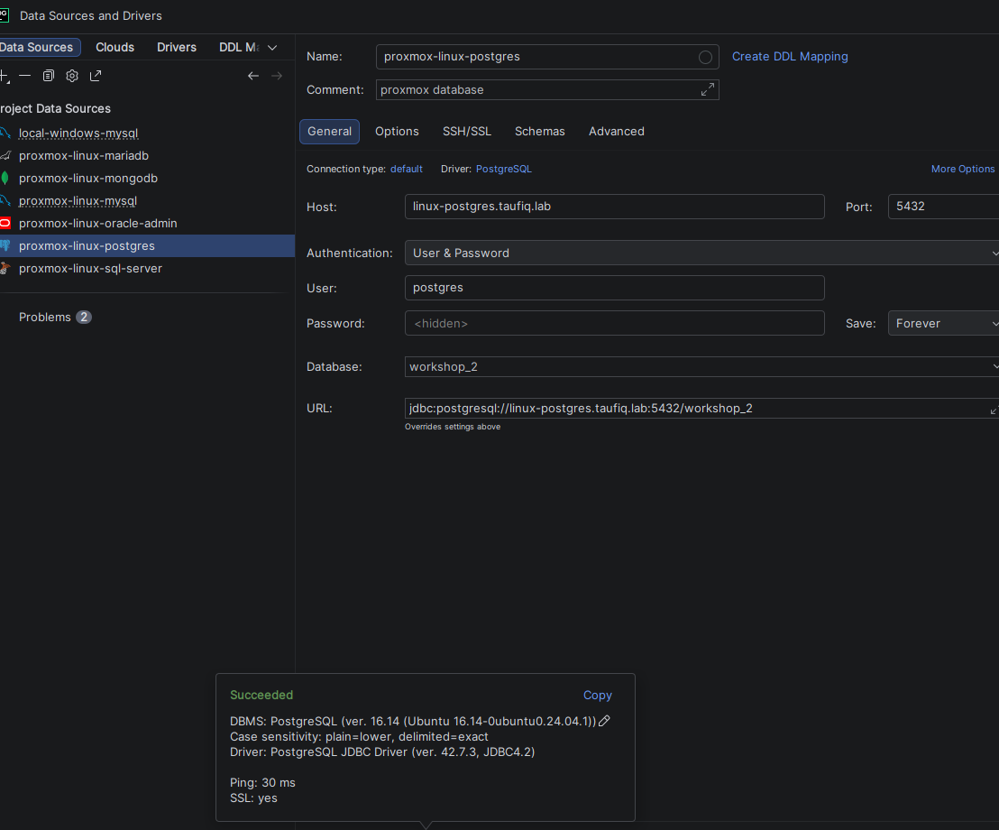
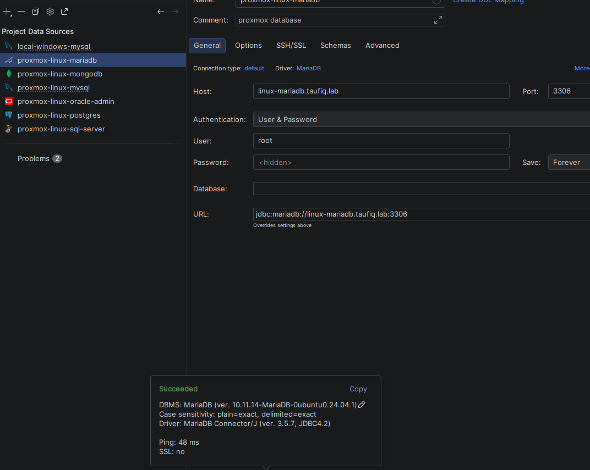
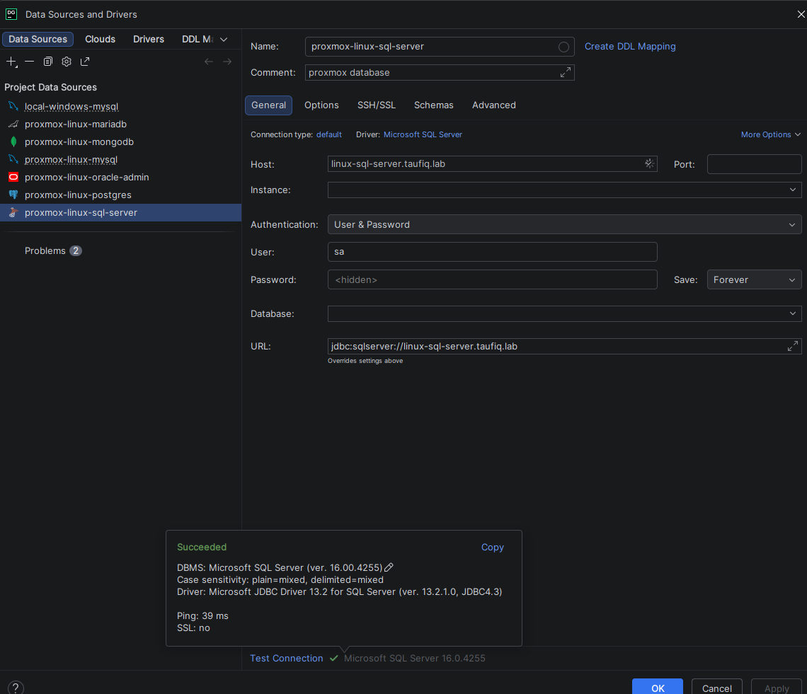
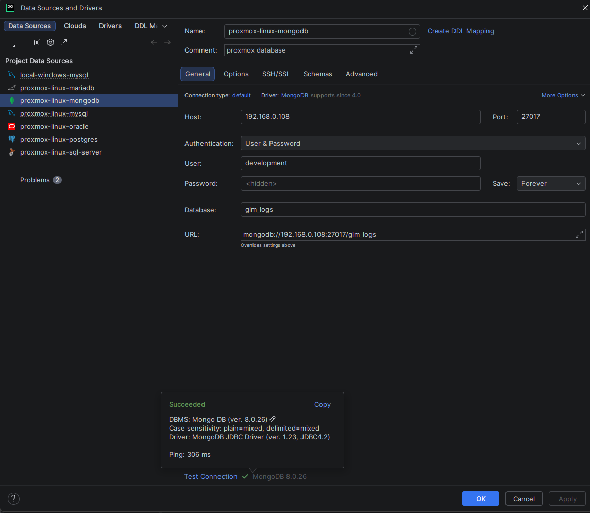
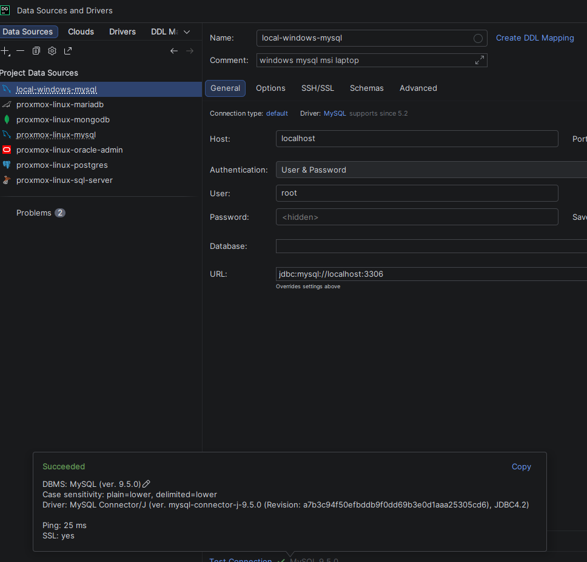

# DataGrip Homelab Database Connectivity

**Date:** 2026-07-15
**Scope:** Single GUI client for every database engine in the homelab, including the MongoDB CT (DBeaver was used earlier in the project but is no longer in use).

---

## Overview

With six different DBMS engines running across the homelab, switching between native
clients or CLI tools got old fast, especially since VMs get powered on and off depending
on what's being worked on that day. DataGrip covers every engine here — PostgreSQL,
MariaDB, MySQL, Oracle, SQL Server, and MongoDB — from one interface. Same underlying
connectivity model throughout: Tailscale VPN plus `taufiq.lab` DNS hostnames, no SSH
tunnels, no exposed public ports.

All connections live under one **Project Data Sources** list in DataGrip:

```
local-windows-mysql
proxmox-linux-mariadb
proxmox-linux-mongodb
proxmox-linux-mysql
proxmox-linux-oracle
proxmox-linux-postgres
proxmox-linux-sql-server
```

`proxmox-linux-mysql` and `proxmox-linux-oracle` are configured the same way as the
others (DNS hostname, `User & Password` auth) but aren't screenshotted below.

---

## PostgreSQL (linux-postgres)

| Field | Value |
|---|---|
| Host | `linux-postgres.taufiq.lab` |
| Port | 5432 |
| Database | `workshop_2` (renamed `workshop_2_prod` 2026-07-20, alongside a new `workshop_2_dev` — see [`Animal-Shelter-Workshop`](https://github.com/tttaufiqqq/Animal-Shelter-Workshop)'s `CLAUDE.md`; `workshop_2` itself no longer exists on this server) |
| User | `postgres` |
| URL | `jdbc:postgresql://linux-postgres.taufiq.lab:5432/workshop_2_prod` |

**Test Connection: Succeeded** — PostgreSQL 16.14 (Ubuntu 16.14-0ubuntu0.24.04.1), ping 30ms, SSL yes.



---

## MariaDB (linux-mariadb)

| Field | Value |
|---|---|
| Host | `linux-mariadb.taufiq.lab` |
| Port | 3306 |
| User | `root` |
| URL | `jdbc:mariadb://linux-mariadb.taufiq.lab:3306` |

**Test Connection: Succeeded** — MariaDB 10.11.14-MariaDB-0ubuntu0.24.04.1, ping 48ms, SSL no.



---

## SQL Server (linux-sql-server)

| Field | Value |
|---|---|
| Host | `linux-sql-server.taufiq.lab` |
| User | `sa` |
| URL | `jdbc:sqlserver://linux-sql-server.taufiq.lab` |

**Test Connection: Succeeded** — Microsoft SQL Server 16.00.4255, ping 39ms, SSL no.



---

## MongoDB (linux-mongodb)

This CT joined the tailnet 2026-07-17 and `mongod` was bound to that address the same
day (see [`docs/06-mongodb/mongodb-setup.md`](../06-mongodb/mongodb-setup.md)), so
`linux-mongodb.taufiq.lab` / `100.82.200.94` work now too. The screenshot below predates
that change and still shows the raw LAN IP.

| Field | Value |
|---|---|
| Host | `192.168.0.108` |
| Port | 27017 |
| Database | `glm_logs` |
| User | `development` |
| URL | `mongodb://192.168.0.108:27017/glm_logs` |

**Test Connection: Succeeded** — MongoDB 8.0.26, ping 306ms.



---

## Local MySQL (msi laptop, non-homelab)

Not part of the Proxmox inventory — a MySQL instance installed directly on the Windows
laptop (`local-windows-mysql`), kept in the same DataGrip project for convenience when
comparing against the homelab engines.

| Field | Value |
|---|---|
| Host | `localhost` |
| Port | 3306 |
| User | `root` |
| URL | `jdbc:mysql://localhost:3306` |

**Test Connection: Succeeded** — MySQL 9.5.0, ping 25ms, SSL yes.


