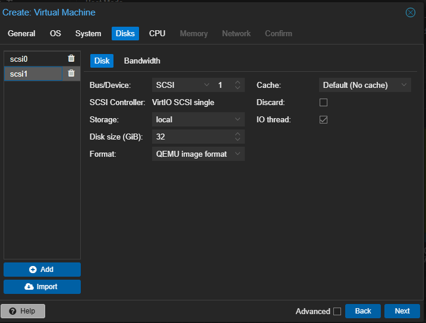

# MinIO Self-Hosted Object Storage — Setup Documentation

**Date:** 2026-07-15  
**Server:** `linux-mini-io` (Proxmox VM 109)  
**Local IP:** `192.168.0.105` (static — collides on paper with `linux-mariadb`'s DHCP
lease when that VM is off; use the Tailscale IP or DNS name to avoid ambiguity)  
**Tailscale IP:** `100.73.172.85`  
**SSH login user:** `linux-mini-io` (key-based; `sudo` requires a password, so remote
admin work needs either an interactive session or `qm reboot 109` / console access from
the Proxmox host — this wasn't written down anywhere until now)  
**Host Node:** `taufiq` (Proxmox VE 9.1.1)

---

## Overview

Set up a self-hosted S3-compatible object storage server using MinIO on a dedicated Ubuntu 22.04 VM in Proxmox. The server is hardened and fully auto-recovers on reboot.

---

## VM Specifications

| Component | Value |
|-----------|-------|
| VM ID | 109 |
| Name | linux-mini-io |
| OS | Ubuntu 22.04.5 LTS |
| CPU | 2 cores |
| RAM | 4 GiB |
| OS Disk (scsi0) | 18 GiB — Ubuntu system |
| Data Disk (scsi1) | 32 GiB — MinIO data (XFS) |
| Local Network | vmbr0 — `192.168.0.105` (static) |
| Tailscale IP | `100.73.172.85` |
| Tailscale Interface | `tailscale0` |

---

## Step 1 — Proxmox VM Creation

- Created new VM (type: VM, not LXC container)
- Added two separate SCSI disks:
  - `scsi0` — 18 GiB for OS
  - `scsi1` — 32 GiB for MinIO data storage
- Installed Ubuntu 22.04 Server, selected `scsi0` as install target
- Enabled OpenSSH during installation
- Ejected ISO before rebooting to avoid re-running the installer



---

## Step 2 — Data Disk Setup

Partitioned, formatted, and mounted `scsi1` as XFS:

```bash
sudo fdisk /dev/sdb          # created partition /dev/sdb1
sudo mkfs.xfs /dev/sdb1
sudo mkdir -p /mnt/minio-data
sudo blkid /dev/sdb1         # got UUID
```

Added to `/etc/fstab` for persistent mount on boot:

```
UUID=82ff8357-bc07-49ab-878b-6b7c7186aa65 /mnt/minio-data xfs defaults,nofail 0 2
```

```bash
sudo mount -a
df -h /mnt/minio-data        # verified: 32G mounted
```

---

## Step 3 — MinIO Installation

```bash
wget https://dl.min.io/server/minio/release/linux-amd64/minio
chmod +x minio
sudo mv minio /usr/local/bin/

sudo useradd -r minio-user -s /sbin/nologin
sudo chown minio-user:minio-user /mnt/minio-data
```

---

## Step 4 — MinIO Configuration

Created `/etc/default/minio`:

```ini
MINIO_ROOT_USER=minioadmin
MINIO_ROOT_PASSWORD=<redacted>
MINIO_VOLUMES="/mnt/minio-data"
MINIO_OPTS="--console-address :9001"
```

Created `/etc/systemd/system/minio.service`:

```ini
[Unit]
Description=MinIO Object Storage
Documentation=https://docs.min.io
Wants=network-online.target
After=network-online.target

[Service]
User=minio-user
Group=minio-user
EnvironmentFile=/etc/default/minio
ExecStart=/usr/local/bin/minio server $MINIO_OPTS $MINIO_VOLUMES
Restart=always
LimitNOFILE=65536
TimeoutStopSec=infinity
SendSIGKILL=no

[Install]
WantedBy=multi-user.target
```

```bash
sudo systemctl daemon-reload
sudo systemctl enable minio
sudo systemctl start minio
```

---

## Step 5 — MinIO Client (mc)

```bash
wget https://dl.min.io/client/mc/release/linux-amd64/mc
chmod +x mc
sudo mv mc /usr/local/bin/

mc alias set local http://localhost:9000 minioadmin <password>
mc admin info local
mc mb local/test-bucket
mc ls local
```

---

## Step 6 — Server Hardening

### Static IP
Configured via `/etc/netplan/00-installer-config.yaml`:
- IP: `192.168.0.105/24`
- Gateway: `192.168.0.1`
- DNS: `8.8.8.8`, `1.1.1.1`

### Firewall (UFW)
```bash
sudo ufw default deny incoming
sudo ufw default allow outgoing
sudo ufw allow ssh
sudo ufw allow 9000/tcp
sudo ufw allow 9001/tcp
sudo ufw enable
```

### SSH Hardening (`/etc/ssh/sshd_config`)
```
PermitRootLogin no
MaxAuthTries 3
ClientAliveInterval 300
ClientAliveCountMax 2
```

### Additional
```bash
sudo apt install fail2ban -y        # brute force protection
sudo apt install unattended-upgrades -y  # auto security updates
sudo systemctl disable snapd        # disabled unused services
sudo timedatectl set-timezone Asia/Kuala_Lumpur
sudo chown -R minio-user:minio-user /mnt/minio-data
sudo chmod 750 /mnt/minio-data
```

---

## Access Details

### Local Network
| Service | URL |
|---------|-----|
| S3 API endpoint | `http://192.168.0.105:9000` |
| Web console | `http://192.168.0.105:9001` |

### Via Tailscale (remote access)
| Service | URL |
|---------|-----|
| S3 API endpoint | `http://100.73.172.85:9000` |
| Web console | `http://100.73.172.85:9001` |

### S3 Client Config
```
# Local
Endpoint:   http://192.168.0.105:9000

# Remote (Tailscale)
Endpoint:   http://100.73.172.85:9000

Access Key: minioadmin
Secret Key: <redacted>
```

---

## Post-Reboot Verification

After `sudo reboot`, all services recovered automatically:

```
minio.service     → active (running)
/mnt/minio-data   → 32G mounted
ufw               → active
Local IP          → 192.168.0.105 (static)
Tailscale IP      → 100.73.172.85 (tailscale0)
```

**Re-verified 2026-07-17** as part of a hardening pass across every VM/CT added since
initial setup — rebooted via `qm reboot 109` from the Proxmox host this time (no sudo
password available non-interactively). Confirmed after boot: `minio` active and
listening on 9000/9001, data disk mounted, `ufw` and `tailscaled` both active with the
tailnet reconnected without re-authentication, and the S3 health endpoint
(`/minio/health/live`) reachable from the Windows client over Tailscale. No manual
intervention needed — matches the result from the original test above.

---

## Notes

- VM type chosen over LXC container for full kernel control, better disk I/O, and native MinIO support
- Data disk (`scsi1`) kept separate from OS disk (`scsi0`) for data safety
- XFS chosen as filesystem per MinIO recommendation
- MinIO version: `RELEASE.2025-09-07T16-13-09Z`
- Tailscale installed for remote access — reachable at `100.73.172.85` from any Tailscale device
- To add DNS alias: `address=/linux-mini-io.taufiq.lab/100.73.172.85` in dnsmasq on Proxmox
