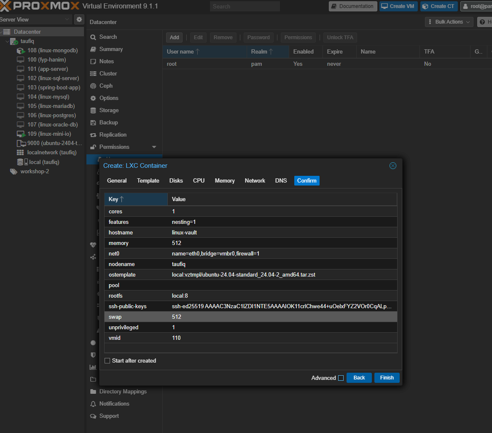

# HashiCorp Vault — Setup Documentation

**Date:** 2026-07-16  
**Server:** `linux-vault` (Proxmox CT 110)  
**Local IP:** `192.168.0.110`  
**Tailscale IP:** `100.112.41.113`  
**Host Node:** `taufiq` (Proxmox VE 9.1.1)

---

## Overview

Set up a self-hosted HashiCorp Vault instance as a centralized secrets manager for all VMs and CTs in the homelab. All credentials (database passwords, API tokens, endpoints) are stored here instead of in code, `.env` files, or documentation.

---

## CT vs VM Decision

Used **LXC Container (CT)** instead of VM because:

- Vault only serves secrets over HTTPS — no special kernel features needed
- No heavy disk I/O (stores small secrets, not large data like MinIO)
- Lighter resource usage than a full VM
- CT is fully sufficient for a pure API/network workload

---

## CT Specifications

| Component | Value |
|-----------|-------|
| CT ID | 110 |
| Type | LXC Container (Unprivileged) |
| Hostname | linux-vault |
| OS | Ubuntu 24.04 LTS |
| CPU | 1 core |
| RAM | 512 MB |
| Disk | 8 GiB |
| Local IP | `192.168.0.110/24` (static) |
| Gateway | `192.168.0.1` |
| Bridge | vmbr0 |
| Tailscale IP | `100.112.41.113` |
| Tailscale Interface | `tailscale0` |



---

## Issues Encountered During Setup

### 1. No IPv4 address on CT
CT was created with no IP. Fixed by running on Proxmox host:
```bash
pct set 110 --net0 name=eth0,bridge=vmbr0,ip=192.168.0.110/24,gw=192.168.0.1
```

### 2. DNS not resolving
CT was using Tailscale DNS (`100.100.100.100`) before Tailscale was installed. Fixed by:
```bash
pct exec 110 -- bash -c "echo 'nameserver 8.8.8.8' > /etc/resolv.conf && echo 'nameserver 1.1.1.1' >> /etc/resolv.conf"
```

### 3. linux-vault user had no sudo
Fixed by running on Proxmox host:
```bash
pct exec 110 -- bash -c "usermod -aG sudo linux-vault"
```

### 4. GPG key format wrong
HashiCorp GPG key must be dearmored before saving:
```bash
wget -O- https://apt.releases.hashicorp.com/gpg | sudo gpg --dearmor -o /usr/share/keyrings/hashicorp-archive-keyring.gpg
```

### 5. Vault failed to start — mlock error
LXC containers cannot use `mlock` syscall. Fixed by adding `disable_mlock = true` to vault config.

### 6. Tailscale TUN device missing
LXC needs TUN device explicitly allowed. Fixed on Proxmox host:
```bash
echo 'lxc.cgroup2.devices.allow = c 10:200 rwm' >> /etc/pve/lxc/110.conf
echo 'lxc.mount.entry = /dev/net/tun dev/net/tun none bind,create=file' >> /etc/pve/lxc/110.conf
pct reboot 110
```

---

## Step 1 — Install Vault

```bash
# Install dependencies
sudo apt update && sudo apt install -y gpg wget curl

# Add HashiCorp GPG key
wget -O- https://apt.releases.hashicorp.com/gpg | sudo gpg --dearmor -o /usr/share/keyrings/hashicorp-archive-keyring.gpg

# Add HashiCorp repo
echo "deb [signed-by=/usr/share/keyrings/hashicorp-archive-keyring.gpg] https://apt.releases.hashicorp.com $(lsb_release -cs) main" | sudo tee /etc/apt/sources.list.d/hashicorp.list

# Install Vault
sudo apt update && sudo apt install vault -y

# Verify
vault --version
```

---

## Step 2 — Configure Vault

Created `/etc/vault.d/vault.hcl`:

```hcl
ui = true
disable_mlock = true

storage "file" {
  path = "/opt/vault/data"
}

listener "tcp" {
  address     = "0.0.0.0:8200"
  tls_disable = true
}

api_addr = "http://0.0.0.0:8200"
cluster_addr = "http://0.0.0.0:8201"
```

```bash
sudo mkdir -p /opt/vault/data
sudo chown -R vault:vault /opt/vault/data
sudo chown vault:vault /etc/vault.d/vault.hcl
sudo chmod 640 /etc/vault.d/vault.hcl
```

---

## Step 3 — Start Vault Service

```bash
sudo systemctl enable vault
sudo systemctl start vault
sudo systemctl status vault
```

---

## Step 4 — Initialize Vault

```bash
export VAULT_ADDR='http://127.0.0.1:8200'
echo 'export VAULT_ADDR="http://127.0.0.1:8200"' >> ~/.bashrc

vault operator init
```

**Output:** 5 unseal keys + 1 root token generated.  
**Storage:** Saved securely in Bitwarden.  
**Threshold:** 3 of 5 keys required to unseal.

---

## Step 5 — Unseal Vault

```bash
vault operator unseal   # key 1
vault operator unseal   # key 2
vault operator unseal   # key 3

vault login             # root token
```

---

## Step 6 — Enable Secrets Engine

```bash
vault secrets enable -path=secret kv-v2
```

---

## Step 7 — Store Secrets

```bash
vault kv put secret/minio \
  root_user="minioadmin" \
  root_password="<redacted>" \
  endpoint="http://100.73.172.85:9000"

vault kv put secret/proxmox \
  api_token="<redacted>" \
  host="https://192.168.0.10:8006"

vault kv put secret/mysql \
  root_password="<redacted>" \
  host="linux-mysql.taufiq.lab"

vault kv put secret/postgres \
  root_password="<redacted>" \
  host="linux-postgres.taufiq.lab"

vault kv put secret/oracle \
  password="<redacted>" \
  host="linux-oracle-db.taufiq.lab"

vault kv put secret/mariadb \
  root_password="<redacted>" \
  host="linux-mariadb.taufiq.lab"

vault kv put secret/mssql \
  password="<redacted>" \
  host="linux-sql-server.taufiq.lab"
```

Verify all stored:
```bash
vault kv list secret/
```

---

## Step 8 — Auto-Unseal on Reboot

Created `/usr/local/bin/vault-unseal.sh`:

```bash
#!/bin/bash
export VAULT_ADDR="http://127.0.0.1:8200"
sleep 5
vault operator unseal <key-1>
vault operator unseal <key-2>
vault operator unseal <key-3>
```

Created `/etc/systemd/system/vault-unseal.service`:

```ini
[Unit]
Description=Vault Auto Unseal
After=vault.service
Requires=vault.service

[Service]
Type=oneshot
ExecStart=/usr/local/bin/vault-unseal.sh
RemainAfterExit=yes

[Install]
WantedBy=multi-user.target
```

```bash
sudo systemctl daemon-reload
sudo systemctl enable vault-unseal
sudo systemctl start vault-unseal
```

---

## Secrets Stored

| Secret Path | Contents |
|-------------|----------|
| `secret/minio` | root_user, root_password, endpoint |
| `secret/proxmox` | api_token, host |
| `secret/mysql` | root_password, host |
| `secret/postgres` | root_password, host |
| `secret/oracle` | password, host |
| `secret/mariadb` | root_password, host |
| `secret/mssql` | password, host |

---

## Access Details

| Service | Local URL | Tailscale URL |
|---------|-----------|---------------|
| Vault UI | `http://192.168.0.110:8200` | `http://100.112.41.113:8200` |
| Vault API | `http://192.168.0.110:8200/v1/` | `http://100.112.41.113:8200/v1/` |

---

## How To Read a Secret from Any VM

```bash
# Install vault client
sudo apt install vault -y

# Set Vault address
export VAULT_ADDR="http://192.168.0.110:8200"
export VAULT_TOKEN="<root-token>"

# Read a secret
vault kv get secret/minio

# Get a single field
vault kv get -field=root_password secret/minio
```

Via curl (no vault client needed):
```bash
curl -H "X-Vault-Token: <root-token>" \
  http://192.168.0.110:8200/v1/secret/data/minio
```

---

## Hardening — 2026-07-17

Auditing this CT for reboot survival (as part of hardening every VM/CT added since the
initial setup) surfaced one real gap: **UFW was never enabled here at all.** Every other
VM/CT in the lab has a firewall; this one was reachable on port 8200 (and 8201) from
anywhere on the LAN or tailnet with zero restriction. Fixed:

```bash
ufw allow 22/tcp
ufw allow from 192.168.0.0/24 to any port 8200 proto tcp
ufw allow in on tailscale0 to any port 8200 proto tcp
ufw --force enable
```

Port 8201 (cluster port) deliberately left closed — `HA Enabled: false`, so nothing
needs to reach it. Verified: `vault status` still reachable over both LAN and Tailscale
after enabling.

**Reboot test:** `pct reboot 110` from the Proxmox host. Confirmed after boot: `vault`
active, `vault-unseal.service` ran and successfully unsealed (`Sealed: false`) with no
manual intervention, `tailscaled` active and reconnected without re-authentication, UFW
active with the rules above. Full recovery, no manual steps required.

---

## Notes

- CT chosen over VM — Vault is a pure network/API workload, no special kernel needed
- `disable_mlock = true` required for LXC containers
- TUN device must be explicitly allowed in LXC config for Tailscale
- UFW enabled 2026-07-17 — see Hardening section above
- Vault version: `2.0.3`
- Unseal keys and root token stored in Bitwarden only — never in Git
- Tailscale installed and connected — reachable at `100.112.41.113` from any Tailscale device
- DNS alias to add in dnsmasq on Proxmox host: `address=/linux-vault.taufiq.lab/100.112.41.113`
