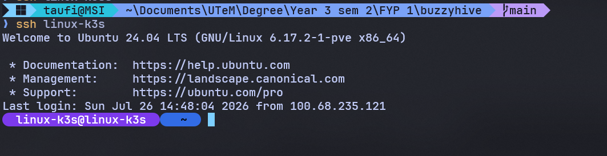
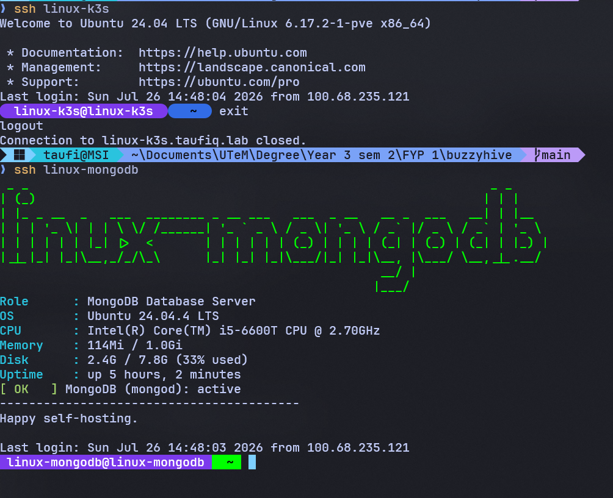

# Oh My Posh Per-Host Prompt Themes — Setup Documentation

**Date:** 2026-07-27
**Scope:** Fleet-wide — every VM/CT in [`01-custom-ssh-motd-setup.md`](01-custom-ssh-motd-setup.md)'s
fleet, plus two hosts that postdate that rollout (`linux-k3s`,
`linux-observability`), plus the `taufiq` host node itself
**Mechanism:** [oh-my-posh](https://ohmyposh.dev/), one shared rounded-pill
theme shape (`~/.config/oh-my-posh/theme.omp.json`), only the path
segment's background color changes per host
**Host Node:** `taufiq` (Proxmox VE 9.1.1)

---

## Overview

The MOTD banner in [`01-custom-ssh-motd-setup.md`](01-custom-ssh-motd-setup.md)
solves "which host am I on" for the moment you log in. It doesn't solve it
for the rest of the session — once the banner scrolls past, the prompt
looks the same on every host. This doc covers giving every VM/CT its own
distinct **prompt** color too, so the answer stays on screen for as long as
the session lasts, not just at login.

The two mechanisms are deliberately separate and complementary: MOTD paints
once via PAM at login, oh-my-posh repaints the prompt every time it draws.
Same "each host should be visually distinguishable" goal as the MOTD work,
applied to a different part of the terminal.

## Design: one shape, per-host color

The plan for this (`plans/oh-my-posh-server-theme-plan.md`) went through a
few iterations before landing here. The first draft assigned different
*theme families* to tiers like "web", "database", "staging", modeled on a
dev → staging → production pipeline this homelab doesn't actually have.
That would have lumped 8 different database engines (MySQL, MySQL split
instance, MariaDB, MariaDB split instance, PostgreSQL, Oracle, MongoDB,
MSSQL) under one shared tier color, which defeats "every VM/CT gets its own
color."

Settled on the opposite approach instead: **one shared prompt shape across
the entire fleet**, and only one segment's color changes per host. Same
principle the MOTD script uses — one script, one `case "$HOST"` block,
`ACCENT` is the only thing that varies — applied to the prompt instead of
the banner.

For the shape itself, three visual options were mocked up (Tokyo Night
arrows, dark neutral + coral, rounded pill segments) and rounded pills won:
capsule segments instead of sharp powerline arrows, the shape most
different from a plain unthemed terminal, so it can't be mistaken for one
even before you read any color.

## Segments

Every host runs the exact same template, `~/.config/oh-my-posh/theme.omp.json`:

- **Session** (fixed purple `#7c3aed` everywhere except `taufiq`, see the
  host node section below): `user@host`. Kept as a text fallback even
  though color is the primary signal, same "don't rely on text alone, but
  don't remove it either" call the MOTD script made with figlet.
- **Path** (this host's accent color, the only segment that changes per
  host): current working directory.
- **Git** (fixed mint `#2dd4a7`, only renders inside a git repo): branch
  name, kept neutral so it never competes with the host color.
- **Exit code** (right-aligned, green on success, red on nonzero exit): the
  one segment that's dynamic per-command rather than per-host.

Rounded pills come from giving every segment `"style": "diamond"` with the
Nerd Font rounded-cap glyphs (U+E0B6 leading, U+E0B4 trailing) instead of
the sharp powerline arrow (U+E0B0).

## Fleet + accent color

Same identity-color idea as the MOTD script's `ACCENT=` table, converted
from xterm 256 codes to hex (oh-my-posh's JSON takes hex, not xterm codes),
so a host's MOTD banner and its prompt agree on its color:

| Host | Accent (hex) | Note |
|---|---|---|
| `linux-app-server` | `#ff8700` | |
| `linux-sql-server` | `#af00ff` | |
| `spring-boot-app` | `#00af00` | |
| `linux-mysql` | `#0087ff` | real OS hostname `workshop-mysql` |
| `linux-mysql-2` | `#00d7ff` | split instance |
| `linux-mariadb` | `#875f00` | real OS hostname `workshop-2` |
| `linux-mariadb-2` | `#af5f00` | split instance |
| `linux-postgres` | `#005f87` | real OS hostname `workshop-postgres` |
| `linux-oracle-db` | `#ff0000` | |
| `linux-mongodb` | `#00ff00` | |
| `linux-vault` | `#875fff` | |
| `linux-mini-io` | `#ffd700` | |
| `linux-gh-runner` | `#00ffff` | |
| `linux-k3s` | `#326ce5` | Kubernetes blue, new host, not in the MOTD table |
| `linux-observability` | `#14b8a6` | new host, not in the MOTD table |
| `taufiq` | `#607d8b` (path) / `#e65100` (session) | host node, see below |

## Deployment

Every host except `taufiq` had at least one of: no passwordless sudo, no
`unzip` (which oh-my-posh's official `install.sh` needs), or both. Rather
than block on a sudo password for every host, skipped the installer script
entirely and pulled the plain Linux binary straight from GitHub releases:

```bash
mkdir -p ~/.local/bin ~/.config/oh-my-posh
curl -sL -o ~/.local/bin/oh-my-posh \
  https://github.com/JanDeDobbeleer/oh-my-posh/releases/latest/download/posh-linux-amd64
chmod +x ~/.local/bin/oh-my-posh
```

Then the per-host `theme.omp.json` (same template, `__ACCENT__` swapped for
that host's color from the table above) gets copied into
`~/.config/oh-my-posh/theme.omp.json`, and one line goes into `~/.bashrc`:

```bash
eval "$(~/.local/bin/oh-my-posh init bash --config ~/.config/oh-my-posh/theme.omp.json)"
```

An Ansible playbook version of the same three steps (`template:` task
rendering `theme.omp.json.j2` with a per-host `oh_my_posh_accent` variable,
same shape as `01-custom-ssh-motd-setup.md`'s `motd.yml`) is in the plan
file for anyone wiring this into the existing Ansible inventory later; the
actual rollout below was done host-by-host directly since it needed to be
staged around live power state anyway (see Notes).

## Rollout

Done in two batches based on what was actually powered on in Proxmox at
the time, not a single all-or-nothing push:

- **7 hosts already running**: `linux-k3s` and `linux-mongodb` first (each
  one verified live over SSH before moving on), then `linux-vault`,
  `linux-gh-runner`, `linux-mysql-2`, `linux-mariadb-2`, and
  `linux-observability` autonomously once the first two were approved.
- **8 hosts that needed a power cycle or were already up by the time this
  batch started**: `linux-app-server`, `linux-mysql`, `linux-mariadb`,
  `linux-postgres`, and `linux-mini-io` turned out to already be running
  (see Notes), customized directly with no power change; `linux-sql-server`,
  `spring-boot-app`, and `linux-oracle-db` were genuinely off, each powered
  on, customized, and powered back off to restore its original state.
- **`taufiq`** (the Proxmox host node itself) last, alongside its own
  session-color exception (see below).

All 16 hosts verified with `oh-my-posh print primary --config
theme.omp.json --shell bash`, reading the actual rendered ANSI color codes
back to confirm each host's accent matched the table, not just that the
script ran without error.



## Proxmox host node (`taufiq`)

Keeps `fastfetch` exactly as it was (that's the login-splash equivalent of
MOTD for this host, from the earlier addendum in
[`01-custom-ssh-motd-setup.md`](01-custom-ssh-motd-setup.md)) and
additionally gets its own oh-my-posh prompt. Same interactive-shell guard
fastfetch already uses there, since `.bashrc` on this specific host sources
even for non-interactive scripted SSH commands:

```bash
# Append to /root/.bashrc, same guard fastfetch already uses there
case $- in
    *i*) eval "$(/usr/local/bin/oh-my-posh init bash --config /root/.config/oh-my-posh/theme.omp.json)" ;;
esac
```

Confirmed scripted SSH (`ssh taufiq "echo hello"`) stays clean, and that
`PROMPT_COMMAND` is only set to oh-my-posh's `_omp_hook` inside a real
interactive shell (`bash -ic`), not a scripted one.

`taufiq` also got one deliberate exception to the "session segment is
always purple" rule every guest host follows: its session segment is
orange (`#e65100`) instead, on top of its own slate path/accent color
(`#607d8b`) already set. That makes the host node distinct in *both*
segments, not just the path/accent one, the same "this is management
plane, not a workload" reasoning already applied when picking its accent
color in the first place.

Also cleaned up the default login noise above the fastfetch banner on this
host, which the guest fleet's MOTD script already avoided by disabling
every stock `/etc/update-motd.d/` script except its own (Step 4 in
[`01-custom-ssh-motd-setup.md`](01-custom-ssh-motd-setup.md)), but `taufiq`
never had that treatment since it uses fastfetch instead of the per-role
script. Three separate things were producing it, not one:

- `/etc/motd` (static file) had the default Debian license text — cleared
  it (`: > /etc/motd`).
- `/etc/update-motd.d/10-uname` printed the kernel/build line — disabled
  it (`chmod -x`), same pattern as the guest fleet's Step 4.
- sshd itself prints "Last login: ..." independent of the MOTD mechanism
  entirely — turned off with `PrintLastLog no` in `/etc/ssh/sshd_config`,
  validated with `sshd -t` before restarting the `ssh` service (this
  host's actual unit name; `sshd.service` here is just an alias).

Verified by triggering a real interactive login afterward, straight into
fastfetch's Proxmox logo with nothing above it.

## Notes (issues found and fixed during rollout)

1. **Neither `linux-k3s` nor `linux-mongodb` had passwordless sudo, and
   neither had `unzip` installed** (required by oh-my-posh's official
   `install.sh`). Skipped the installer script for the whole fleet and
   pulled the plain `posh-linux-amd64` binary directly instead — no root,
   no `unzip`, for any host.
2. **This Windows client couldn't resolve `*.taufiq.lab` hostnames during
   the rollout** (`ssh linux-k3s` failed with "Could not resolve
   hostname"), the same Tailscale/NRPT DNS quirk documented in
   [`01-custom-ssh-motd-setup.md`](01-custom-ssh-motd-setup.md)'s Notes
   item 7. Worked around it mid-rollout by connecting via each host's
   Tailscale IP directly with `-F /dev/null` (bypassing `~/.ssh/config`'s
   `HostName` override, which otherwise rewrites an IP-based connection
   back to the broken hostname). Properly fixed later with `tailscale set
   --accept-dns=false` then `--accept-dns=true` — confirmed via `ssh`
   itself, since `nslookup` doesn't reliably go through Windows' NRPT
   policy and gave a false "still broken" reading even after the fix
   worked.
3. **`linux-mongodb` was completely unreachable over SSH** (TCP port 22
   timed out, nothing logged in the container's `auth.log`) despite
   Tailscale reporting it "active" with a recent handshake. Ruled out an
   OPNsense/VLAN-wide block by confirming two other active VLAN 20
   (database tier) hosts were reachable the whole time. Root cause was a
   stuck `tailscaled` process inside the container itself — fixed with
   `pct exec 108 -- systemctl restart tailscaled` from the Proxmox host,
   SSH worked immediately after.
4. **A hand-typed theme file for `linux-mongodb` had silently empty
   `leading_diamond`/`trailing_diamond` fields**, losing the invisible
   Unicode rounded-cap glyphs (U+E0B6/U+E0B4) that render as nothing in a
   plain-text view but are very much required bytes in the JSON. Caught it
   by comparing raw bytes (`cat -A`) between the known-good `linux-k3s`
   file and this one. Fixed by generating every other host's file as a
   byte-exact copy of the known-good file via `sed`, substituting only the
   color, never hand-typing the JSON again.
5. **`linux-k3s` and `linux-observability` had no custom MOTD banner at
   all** (plain stock Ubuntu welcome message), since both postdate the
   original 13-host fleet in
   [`01-custom-ssh-motd-setup.md`](01-custom-ssh-motd-setup.md). Extended
   that script's `case` blocks with an entry for each — `linux-k3s` (role
   "K3s (Kubernetes) Server", accent 63) and `linux-observability` (role
   "Observability Stack (Prometheus/Grafana/Loki)", accent 37, checking
   `prometheus`, `grafana-server`, `loki`). Neither host had passwordless
   sudo either (needed for `apt install figlet` and writing to
   `/etc/update-motd.d/`), fixed with an `/etc/sudoers.d/<user>` NOPASSWD
   entry on each, added interactively rather than over a non-interactive
   session. Verified both by triggering a real login and reading
   `/run/motd.dynamic` directly.
6. **By the time the second rollout batch started, the actual Proxmox
   power state no longer matched the original plan** — `linux-app-server`,
   `linux-mysql`, `linux-mariadb`, `linux-postgres`, and `linux-mini-io`
   were all already running, not off as originally planned around. Rather
   than force a power-cycle onto hosts already up, customized those 5
   directly with no power change, and kept the power-on/customize/power-off
   cycle for the 3 hosts that were genuinely still off.
7. **`linux-postgres`'s first binary download timed out** (`curl` exit 28),
   but every diagnostic (DNS, TLS handshake, the redirect chain to
   `release-assets.githubusercontent.com`) came back clean, and a retry
   immediately after succeeded in well under a second. Concluded it was a
   one-off transient hiccup, not a host-specific network gap.
8. **`spring-boot-app`'s graceful shutdown timed out on the first
   attempt** ("VM quit/powerdown failed - got timeout"). A retry with an
   explicit longer timeout (`qm shutdown 103 --timeout 60`) succeeded.
9. **`linux-oracle-db` hit the exact same tailnet-wide DNS gap documented
   in [`01-custom-ssh-motd-setup.md`](01-custom-ssh-motd-setup.md)'s Notes
   item 11**, and still has no sudo at all for its SSH user. Since the
   binary-only install needs no root, the only actual blocker was the
   download — worked around it by copying the binary already fetched onto
   `linux-vault` straight across Tailscale (`scp` host-to-host) instead of
   touching this host's DNS or root access, the same "borrow it from a
   peer with working DNS" trick used for `figlet` on this exact host
   originally.
10. **This client's `*.taufiq.lab` DNS quirk (item 2) turned out to affect
    normal terminal use directly, not just scripted SSH calls** —
    `ssh linux-observability` failed to resolve outside of any automation.
    Confirmed the `tailscale set --accept-dns` toggle fixed it by testing
    with `ssh` itself rather than `nslookup`, which kept reporting failure
    even after the fix actually worked.

## Result

Every VM/CT in the fleet, plus `linux-k3s`, `linux-observability`, and the
`taufiq` host node, now shows a rounded-pill oh-my-posh prompt with its own
fixed accent color on the path segment, verified by reading back the
actual rendered ANSI codes on each host, not just running the config
without error. `linux-k3s` and `linux-observability` also picked up the
custom MOTD banner they were missing entirely. All power-cycled hosts were
restored to their original on/off state.


