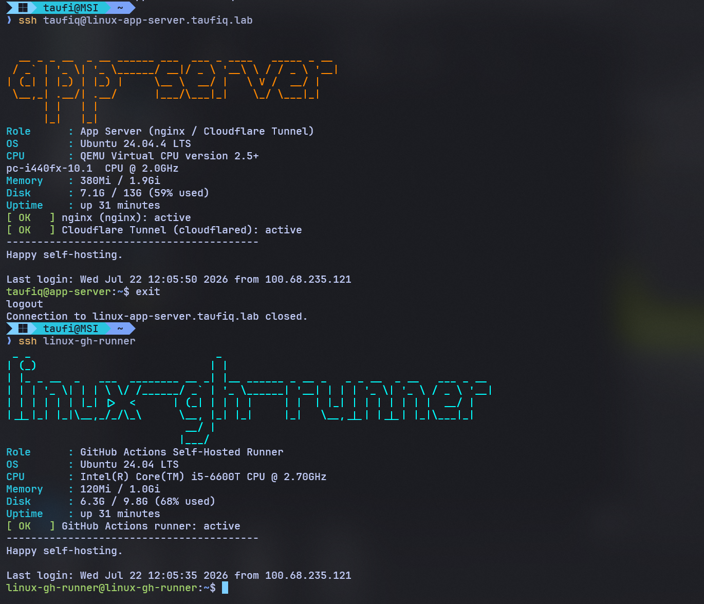
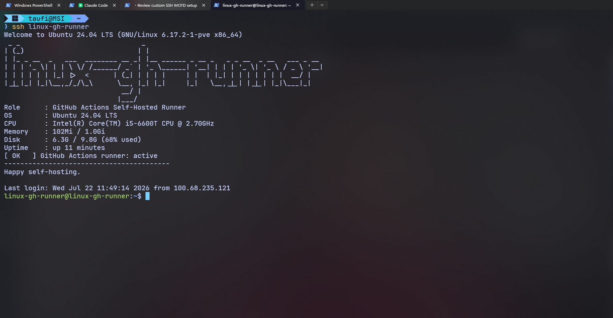

# Custom SSH Login Banner (Dynamic MOTD) — Setup Documentation

**Date:** 2026-07-22
**Scope:** Fleet-wide — every VM/CT in [`docs/02-dns/dns-setup.md`](../02-dns/dns-setup.md)'s inventory
**Mechanism:** `/etc/update-motd.d/99-custom` (Ubuntu/Debian hosts) or
`/etc/profile.d/` + `/usr/local/bin/custom-motd.sh` (Oracle Linux), a figlet +
per-role `case` script
**Host Node:** `taufiq` (Proxmox VE 9.1.1)

---

## Overview

A banner that displays when you SSH into any server, showing its role (MySQL,
Vault, MinIO, etc.) based on hostname, plus live system stats and a per-role
service health check. No emoji — text and figlet ASCII only, so it renders
correctly in any terminal (PuTTY, older Windows consoles, etc.).

The hostname banner uses the plain figlet `big` font colored in a fixed
accent color per host/role, so each server is visually distinct at a glance —
MySQL is always blue, Vault is always violet, the app server is always
orange, etc. (full mapping in Step 2). An embossed/3D `shadow` font was tried
first and reverted — see Notes below.

Works on Ubuntu/Debian-based servers using the `/etc/update-motd.d/`
mechanism; `linux-oracle-db` (Oracle Linux, no such mechanism) uses an
`/etc/profile.d/` equivalent instead — see Notes. Not every VM/CT in the
fleet is powered on at any given time, so this was rolled out host-by-host as
each one came up rather than as one all-or-nothing push — see Step 5 and
Rollout Status.

---

## Current Fleet

| SSH alias | Real OS hostname | Proxmox ID | Role | Service to check |
|---|---|---|---|---|
| `linux-app-server` | `app-server` | VM 101 | App server (nginx, Cloudflare Tunnel) | `nginx`, `cloudflared` (confirmed) |
| `linux-sql-server` | `linux-sql-server` | VM 102 | MSSQL Database Server | `mssql-server` (confirmed) |
| `spring-boot-app` | `spring-boot-app` | VM 103 | Spring Boot App Server | `springapp-prod`, `cloudflared-prod` (confirmed) |
| `linux-mysql` | `workshop-mysql` | VM 104 | MySQL Database Server | `mysql` (confirmed) |
| `linux-mariadb` | `workshop-2` | VM 105 | MariaDB Database Server | `mariadb` (confirmed) |
| `linux-postgres` | `workshop-postgres` | VM 106 | PostgreSQL Database Server | `postgresql` (confirmed) |
| `linux-oracle-db` | `linux-oracle-db` | VM 107 | Oracle Database Server | `oracle-free-23ai` (confirmed) |
| `linux-mini-io` | `linux-mini-io` | VM 109 | MinIO Object Storage | `minio` (confirmed) |
| `linux-mongodb` | `linux-mongodb` | CT 108 | MongoDB Database Server | `mongod` (confirmed, currently failing — see Notes) |
| `linux-vault` | `linux-vault` | CT 110 | HashiCorp Vault — Secrets Manager | `vault` (confirmed) |
| `linux-gh-runner` | `linux-gh-runner` | CT 111 | GitHub Actions Self-Hosted Runner | `actions.runner.*.service` (dynamic name, confirmed) |
| `linux-mysql-2` | `linux-mysql-2` | CT 112 | MySQL (split instance, `animals` DB) | `mysql` (confirmed) |
| `linux-mariadb-2` | `linux-mariadb-2` | CT 113 | MariaDB (split instance, `booking` DB) | `mariadb` (confirmed) |

**Real hostname vs. SSH alias caveat (this bit everyone, not a theoretical
risk):** the script matches on `$(hostname)`, i.e. what the guest OS reports —
not the SSH alias in `~/.ssh/config`. Three hosts predate the DNS-alias
project and never got renamed at the OS level: `linux-mysql` is really
`workshop-mysql`, `linux-postgres` is really `workshop-postgres`, and
`linux-mariadb` is really `workshop-2`. The first two happen to still contain
`mysql`/`postgres` as substrings so the `case` patterns matched anyway by
luck; `workshop-2` does not contain `mariadb` anywhere and was silently
falling through to "General Purpose Server" with no health check until this
was caught during the full-fleet verification below and fixed by adding an
explicit `workshop-2` pattern alongside `*mariadb*` (see Step 2 and Notes
item 9). If you rename any of these hosts, or add a new one, verify with
`hostname` before assuming the `case` block matches.

---

## Step 1 — Install figlet (on every server)

```bash
sudo apt install figlet -y
```

---

## Step 2 — Create the custom MOTD script

Create the file `/etc/update-motd.d/99-custom`:

```bash
sudo nano /etc/update-motd.d/99-custom
```

Paste the following. Edit the `case` block hostname patterns and service names
to match what `hostname` and `systemctl list-units` actually show on each box.

```bash
#!/bin/bash

HOST=$(hostname)
clear 2>/dev/null

# ROLE is the human-readable label; ACCENT is this host's fixed banner color
# (xterm 256-color code) so each server is visually distinct at a glance,
# not just by hostname text.
case "$HOST" in
  *mysql-2*)    ROLE="MySQL Database Server (split instance)"        ; ACCENT=45  ;;
  *mysql*)      ROLE="MySQL Database Server"                        ; ACCENT=33  ;;
  *mariadb-2*)  ROLE="MariaDB Database Server (split instance)"      ; ACCENT=130 ;;
  *mariadb*|workshop-2) ROLE="MariaDB Database Server"               ; ACCENT=94  ;;
  *postgres*)   ROLE="PostgreSQL Database Server"                   ; ACCENT=24  ;;
  *oracle*)     ROLE="Oracle Database Server"                       ; ACCENT=196 ;;
  *mongodb*)    ROLE="MongoDB Database Server"                      ; ACCENT=46  ;;
  *sql-server*) ROLE="MSSQL Database Server"                        ; ACCENT=129 ;;
  *vault*)      ROLE="HashiCorp Vault - Secrets Manager"             ; ACCENT=99  ;;
  *mini-io*)    ROLE="MinIO - Object Storage"                       ; ACCENT=220 ;;
  *spring-boot*)ROLE="Spring Boot App Server"                       ; ACCENT=34  ;;
  *gh-runner*)  ROLE="GitHub Actions Self-Hosted Runner"             ; ACCENT=51  ;;
  *app-server*) ROLE="App Server (nginx / Cloudflare Tunnel)"        ; ACCENT=208 ;;
  *)            ROLE="General Purpose Server"                       ; ACCENT=15  ;;
esac

# Always emit color. Ubuntu's pam_motd runs this script with stdout
# redirected into /run/motd.dynamic (a plain file, not a tty) and only
# displays that file's contents to the user's real terminal afterward -
# so a `[ -t 1 ]` check here always sees "not a terminal" and would disable
# color for every real login, even though the terminal that later shows
# this file supports color fine.
COLOR=1

RESET=$'\e[0m'
LABEL=$'\e[1;36m'   # bold cyan, for stat labels
GREEN=$'\e[1;32m'
RED=$'\e[1;31m'
YELLOW=$'\e[1;33m'

# Whole banner in this host's fixed ACCENT color (set above per role), so
# each server reads as a distinct color, not the same look on every host.
print_banner() {
  if [ "$COLOR" -eq 1 ] && command -v figlet &>/dev/null; then
    figlet -f big "$HOST" | while IFS= read -r line; do
      printf '\e[1;38;5;%sm%s\e[0m\n' "$ACCENT" "$line"
    done
  elif command -v figlet &>/dev/null; then
    figlet -f big "$HOST"
  else
    echo "== $HOST =="
  fi
}

stat_line() {
  # $1 = label, $2 = value
  if [ "$COLOR" -eq 1 ]; then
    printf "%s%-10s:%s %s\n" "$LABEL" "$1" "$RESET" "$2"
  else
    printf "%-10s: %s\n" "$1" "$2"
  fi
}

print_banner

stat_line "Role" "$ROLE"
stat_line "OS" "$(grep PRETTY_NAME /etc/os-release | cut -d'"' -f2)"
stat_line "CPU" "$(lscpu | awk -F: '/Model name/{gsub(/^[ \t]+/,"",$2); print $2}')"
stat_line "Memory" "$(free -h | awk '/Mem:/{print $3}') / $(free -h | awk '/Mem:/{print $2}')"
stat_line "Disk" "$(df -h / | awk 'NR==2{print $3}') / $(df -h / | awk 'NR==2{print $2}') ($(df -h / | awk 'NR==2{print $5}') used)"
stat_line "Uptime" "$(uptime -p)"

# Role-specific service health check
check_service() {
  # $1 = friendly name, $2 = systemd unit
  if systemctl is-active --quiet "$2"; then
    if [ "$COLOR" -eq 1 ]; then
      printf "%s[ OK   ]%s %s (%s): active\n" "$GREEN" "$RESET" "$1" "$2"
    else
      echo "[ OK   ] $1 ($2): active"
    fi
  else
    if [ "$COLOR" -eq 1 ]; then
      printf "%s[ DOWN ]%s %s (%s): inactive or not found\n" "$RED" "$RESET" "$1" "$2"
    else
      echo "[ DOWN ] $1 ($2): inactive or not found"
    fi
  fi
}

case "$HOST" in
  *mysql*)      check_service "MySQL" mysql ;;
  *mariadb*|workshop-2) check_service "MariaDB" mariadb ;;
  *postgres*)   check_service "PostgreSQL" postgresql ;;
  *oracle*)     check_service "Oracle" oracle-free-23ai ;;
  *sql-server*) check_service "MSSQL" mssql-server ;;
  *mongodb*)    check_service "MongoDB" mongod ;;
  *mini-io*)    check_service "MinIO" minio ;;
  *spring-boot*)
    check_service "Spring Boot app" springapp-prod
    check_service "Cloudflare Tunnel" cloudflared-prod
    ;;
  *app-server*)
    check_service "nginx" nginx
    check_service "Cloudflare Tunnel" cloudflared
    ;;
  *vault*)
    # /etc/update-motd.d scripts run non-interactively via PAM and never
    # source ~/.bashrc, so VAULT_ADDR set there is invisible here - fall
    # back to Vault's documented local listener address.
    VADDR="${VAULT_ADDR:-http://127.0.0.1:8200}"
    if ! command -v vault &>/dev/null; then
      [ "$COLOR" -eq 1 ] && printf "%s[ WARN ]%s Vault CLI not installed on this host\n" "$YELLOW" "$RESET" \
        || echo "[ WARN ] Vault CLI not installed on this host"
    elif VAULT_ADDR="$VADDR" vault status &>/dev/null; then
      [ "$COLOR" -eq 1 ] && printf "%s[ OK   ]%s Vault (%s): unsealed\n" "$GREEN" "$RESET" "$VADDR" \
        || echo "[ OK   ] Vault ($VADDR): unsealed"
    else
      [ "$COLOR" -eq 1 ] && printf "%s[ DOWN ]%s Vault (%s): sealed or unreachable\n" "$RED" "$RESET" "$VADDR" \
        || echo "[ DOWN ] Vault ($VADDR): sealed or unreachable"
    fi
    ;;
  *gh-runner*)
    if systemctl list-units --type=service --state=running --no-legend 2>/dev/null | grep -q 'actions\.runner'; then
      [ "$COLOR" -eq 1 ] && printf "%s[ OK   ]%s GitHub Actions runner: active\n" "$GREEN" "$RESET" \
        || echo "[ OK   ] GitHub Actions runner: active"
    else
      [ "$COLOR" -eq 1 ] && printf "%s[ DOWN ]%s GitHub Actions runner: inactive or not found\n" "$RED" "$RESET" \
        || echo "[ DOWN ] GitHub Actions runner: inactive or not found"
    fi
    ;;
esac

echo "-----------------------------------------"
echo "Happy self-hosting."
echo ""
```

Per-host accent colors used above (xterm 256-color codes):

| Host / role | Color code | Approx. color |
|---|---|---|
| `linux-mysql` | 33 | blue |
| `linux-mysql-2` | 45 | cyan-blue |
| `linux-mariadb` | 94 | brown |
| `linux-mariadb-2` | 130 | orange-brown |
| `linux-postgres` | 24 | deep teal |
| `linux-oracle-db` | 196 | red |
| `linux-mongodb` | 46 | green |
| `linux-sql-server` | 129 | purple |
| `linux-vault` | 99 | violet |
| `linux-mini-io` | 220 | gold |
| `spring-boot-app` | 34 | green |
| `linux-gh-runner` | 51 | cyan |
| `linux-app-server` | 208 | orange |
| anything else | 15 | white |

Tweak any of these by editing the `ACCENT=` value on that host's line in the
first `case` block — the number is any xterm 256-color code (`0`-`255`); run
`for i in {0..255}; do printf '\e[38;5;%sm%3d \e[0m' "$i" "$i"; done` on any
host to see the full palette before picking one.

Save and exit (in nano: `Ctrl+O`, `Enter`, `Ctrl+X`).

---

## Step 2b — Oracle Linux / RHEL-family hosts (no `/etc/update-motd.d/`)

`linux-oracle-db` is Oracle Linux, not Ubuntu/Debian — it has no
`/etc/update-motd.d/` directory or `pam_motd.so motd=/run/motd.dynamic`
mechanism at all, so Steps 1-4 as written don't apply to it. Use
`/etc/profile.d/` instead, which every login shell sources:

```bash
# as root (this host's SSH user has no sudo rights at all - not just a
# password prompt - so su directly instead of using sudo):
su -

# put the exact same script (everything inside the code block in Step 2)
# in a regular executable file instead of /etc/update-motd.d/99-custom:
nano /usr/local/bin/custom-motd.sh
chmod +x /usr/local/bin/custom-motd.sh

# then a tiny wrapper that every login shell sources automatically:
cat > /etc/profile.d/99-custom-motd.sh <<'EOF'
#!/bin/sh
[ -x /usr/local/bin/custom-motd.sh ] && /usr/local/bin/custom-motd.sh
EOF
chmod +x /etc/profile.d/99-custom-motd.sh
```

This host's `dnf` also can't reach `yum.oracle.com` by default — same family
of Tailscale-DNS gap as `linux-vault` in Notes item 1, root-caused and fixed
properly in Notes item 11 (a temporary `nameserver 1.1.1.1` line, `dnf
install oracle-epel-release-el8` since `figlet` is EPEL-only on Oracle Linux,
then reverting the DNS change). If that fix hasn't been applied yet, the
script's `print_banner()` still has a plain-text fallback (`== $HOST ==`) for
whenever `figlet` isn't installed, so the role/stats/health-check lines show
correctly either way.

---

## Step 3 — Make it executable

```bash
sudo chmod +x /etc/update-motd.d/99-custom
```

---

## Step 4 — Silence Ubuntu's default MOTD noise

Disable every stock script except your own, so the custom banner is the only
thing shown — this also removes the "N updates can be installed," Ubuntu Pro/
ESM nag, release-upgrade notice, and reboot-required messages, not just the
generic header/news ones:

```bash
for f in /etc/update-motd.d/*; do
  [ "$(basename "$f")" != "99-custom" ] && sudo chmod -x "$f"
done
```

The exact set of default scripts varies per host — VMs with `landscape-common`
and `unattended-upgrades` installed (e.g. `linux-app-server`, `linux-sql-server`)
have a fuller set (`90-updates-available`, `92-unattended-upgrades`,
`95-hwe-eol`, `98-reboot-required`, etc.) than a bare CT. The loop above
handles whatever's actually present without needing to know the exact list.

---

## Step 5 — Roll it out as hosts come online

Since not everything is powered on at once, skip unreachable hosts instead of
hanging on them. This checks reachability first and reports what it skipped,
so you get a clear log of what's actually been rolled out so far.

### Option A — Quick loop (no extra tooling needed)

```bash
for host in linux-app-server linux-sql-server spring-boot-app linux-mysql \
            linux-mariadb linux-postgres linux-oracle-db linux-mini-io \
            linux-mongodb linux-vault linux-gh-runner linux-mysql-2 linux-mariadb-2; do
  if ! ssh -o ConnectTimeout=3 -o BatchMode=yes "$host" true 2>/dev/null; then
    echo "SKIP: $host unreachable (likely powered off)"
    continue
  fi
  scp /etc/update-motd.d/99-custom "$host:/tmp/99-custom" \
    && ssh "$host" '
        sudo mv /tmp/99-custom /etc/update-motd.d/99-custom &&
        sudo chmod +x /etc/update-motd.d/99-custom &&
        for f in /etc/update-motd.d/*; do
          [ "$(basename "$f")" != "99-custom" ] && sudo chmod -x "$f"
        done
      ' \
    && echo "DONE: $host"
done
```

### Option B — Ansible (recommended if you're building toward DevOps)

Ansible's default SSH connect timeout already turns an offline host into a
skipped/failed task rather than a hang, so a plain playbook run is fine here:

`motd.yml`:

```yaml
- hosts: all
  become: true
  tasks:
    - name: Install figlet
      apt:
        name: figlet
        state: present

    - name: Push custom MOTD script
      copy:
        src: 99-custom
        dest: /etc/update-motd.d/99-custom
        mode: '0755'
```

Run it, ignoring hosts that are currently off:

```bash
ansible-playbook -i inventory.ini motd.yml --limit all:!offline_hosts
```

(or just run against whichever hosts you've powered on today via `--limit`).

---

## Rollout Status (as of 2026-07-22)

**All 13 hosts in the fleet now have this installed and verified.** Six were
verified earlier in the rollout and were then intentionally powered off by
the admin to free RAM for the remaining seven, which were verified in a
second pass once they came up — see the per-host notes below.

| Host | Status |
|---|---|
| `linux-mysql-2` | Installed and verified live earlier; currently powered off (intentional, to free RAM) |
| `linux-gh-runner` | Installed and verified live earlier; currently powered off (intentional) |
| `linux-app-server` | Installed and verified live earlier; currently powered off (intentional) |
| `linux-mariadb-2` | Installed and verified live earlier; currently powered off (intentional) |
| `linux-mongodb` | Installed and verified live earlier; `mongod` itself is failing on this host (see Notes) — the banner's health check correctly reports `[ DOWN ]`, a real finding, not a script bug; currently powered off (intentional) |
| `linux-vault` | Installed and verified live earlier — see Notes for the DNS/figlet and `VAULT_ADDR` fixes this host needed; currently powered off (intentional) |
| `linux-sql-server` | **Installed and verified live**, currently on |
| `linux-mini-io` | **Installed and verified live**, currently on — needed a password for sudo (matches the known note in `docs/05-minio/minio-setup.md`) |
| `linux-mysql` | **Installed and verified live**, currently on |
| `linux-mariadb` | **Installed and verified live**, currently on — real hostname is legacy `workshop-2`, initially fell through to "General Purpose Server" until fixed, see Notes item 9 |
| `linux-postgres` | **Installed and verified live**, currently on |
| `spring-boot-app` | **Installed and verified live**, currently on |
| `linux-oracle-db` | **Installed and verified live**, currently on — via `/etc/profile.d/` instead of `/etc/update-motd.d/` (Oracle Linux, see Step 2b); `figlet` installed via EPEL after working around a tailnet-wide DNS gap (see Notes item 11), full ASCII art renders |

"Currently powered off" hosts will show the banner again the next time
they're brought up — nothing further needs doing for them.

---

## Result

SSHing into any server that has the script shows its hostname in a plain
(non-3D) figlet `big` banner colored in that host's own fixed accent color,
its role, live resource stats, and a per-role service health check — no
emoji, nothing else from Ubuntu's default MOTD scripts. Verified by
triggering a real session and reading the actual `/run/motd.dynamic` PAM
writes (not just running the script directly), confirming color renders, the
accent color differs correctly per host, and no update/ESM/reboot noise
survives, on all 13 hosts in the fleet: `linux-mysql-2`, `linux-gh-runner`,
`linux-app-server`, `linux-sql-server`, `linux-vault`, `linux-mariadb-2`,
`linux-mongodb`, `linux-mini-io`, `linux-mysql`, `linux-mariadb`,
`linux-postgres`, `spring-boot-app`, and `linux-oracle-db` (the last via the
`/etc/profile.d/` path, full figlet ASCII art once EPEL was enabled — see
Notes item 11).



---

## Notes

Issues found and fixed while rolling this out across the live hosts above:

1. **`linux-vault` has no working public DNS** — `apt install figlet` failed
   there with `Temporary failure resolving 'archive.ubuntu.com'`. Its
   Tailscale-managed `/etc/resolv.conf` (`100.100.100.100`) returns `SERVFAIL`
   for anything outside the tailnet, unrelated to this MOTD work — same
   family of DNS quirk already logged for CT 108/111 in
   [`docs/02-dns/dns-setup.md`](../02-dns/dns-setup.md) §12b. Worked around
   it by downloading the `figlet` `.deb` on a peer host with working DNS
   (`linux-gh-runner`) and `dpkg -i`-ing it directly on `linux-vault` over
   Tailscale, so no network/DNS config on the CT itself was touched. If this
   CT's DNS gets fixed later, it can go back to the plain `apt install` in
   Step 1.
2. **`VAULT_ADDR` isn't visible to `/etc/update-motd.d/` scripts** even
   though it's exported in `linux-vault`'s `~/.bashrc` (per
   [`docs/07-vault/vault-setup.md`](../07-vault/vault-setup.md)) — MOTD
   scripts run non-interactively via PAM, which never sources `~/.bashrc`.
   The original script's Vault check would have always printed `VAULT_ADDR
   not set` at real login, never an actual seal status. Fixed by defaulting
   to `http://127.0.0.1:8200` (Vault's documented local listener address)
   when `VAULT_ADDR` isn't already in the environment — reflected in Step 2's
   script.
3. **Color wasn't showing up at real login**, even though it worked when the
   script was run directly over a forced pty. Root cause: Ubuntu's
   `pam_motd.so motd=/run/motd.dynamic` (see `/etc/pam.d/sshd`) runs this
   script with stdout redirected into a plain file, not the user's terminal
   — so a `[ -t 1 ]` tty check inside the script always saw "not a terminal"
   and silently fell back to plain text on every real login. `/run/motd.dynamic`
   itself is just `cat`'d to the user's actual terminal afterward, which does
   support color. Fixed by dropping the tty check and always emitting color
   — confirmed by triggering a real session and reading `/run/motd.dynamic`
   directly, not by forcing a pty.
4. **Default Ubuntu update/notice scripts were still enabled** beyond the two
   Step 4 originally disabled — `linux-app-server` and `linux-sql-server` in
   particular still had `90-updates-available`, `91-release-upgrade`,
   `91-contract-ua-esm-status`, `92-unattended-upgrades`, `95-hwe-eol`, and
   `98-reboot-required` all executable. Step 4 now disables everything in
   `/etc/update-motd.d/` except `99-custom` in one loop instead of naming two
   files, so nothing gets missed on hosts with a fuller default script set.
5. **Tried the `shadow` figlet font for an embossed/3D look, then reverted**
   to plain `big` — the 3D effect wasn't wanted, color was the actual ask.
6. **Replaced a single rainbow gradient (same on every host) with a fixed
   accent color per host/role** — see the color table in Step 2 — so
   different servers are visually distinguishable from each other at a
   glance, not just internally colorful.
7. **What looked like per-host DNS gaps (`linux-mariadb-2`, `linux-mongodb`
   both failing to resolve from a Windows client with `Could not resolve
   hostname`) turned out to be a single client-side issue, not a server-side
   one.** Tailscale's NRPT policy for `.taufiq.lab` was present
   (`Get-DnsClientNrptPolicy` showed it pointing at Tailscale's local
   resolver, `100.100.100.100`) and that resolver answered correctly when
   queried directly — but Windows wasn't actually routing normal DNS queries
   through the policy, so every `*.taufiq.lab` lookup silently fell through
   to the router and returned `NXDOMAIN`, for every host, not just these two.
   This is almost certainly also what caused the "intermittent" resolution
   flakiness noted earlier in this rollout. Fixed by forcing Windows to
   re-apply the policy: `tailscale set --accept-dns=false` immediately
   followed by `tailscale set --accept-dns=true` (a `Clear-DnsClientCache` /
   `ipconfig /flushdns` alone did not fix it). If this recurs, that toggle is
   the fix — it's a client DNS problem, not a missing dnsmasq record.
8. **`linux-mongodb`'s `mongod` service is actually down** (`systemctl status
   mongod` → `failed (Result: exit-code)`, `mongod --config /etc/mongod.conf`
   exiting with status 48) — the banner's health check correctly reports
   `[ DOWN ]` for this. Left as-is; this is a real MongoDB problem on that
   host, separate from the MOTD script, and out of scope for this doc.
9. **`linux-mariadb`'s real OS hostname is the legacy `workshop-2`, not
   `linux-mariadb`** — it predates the DNS-alias renaming project and was
   never renamed at the OS level (same situation as `linux-mysql` /
   `workshop-mysql` and `linux-postgres` / `workshop-postgres`, except those
   two coincidentally still contain `mysql`/`postgres` as substrings, so
   their `case` patterns matched anyway). `workshop-2` doesn't contain
   `mariadb` anywhere, so it fell through to "General Purpose Server" with no
   health check until this was caught during the full-fleet verification
   pass and fixed by adding an explicit `workshop-2` alternative to both
   `case` blocks in Step 2 (`*mariadb*|workshop-2`). Re-pushed to every
   already-installed host afterward to keep them on one identical script.
10. **`linux-oracle-db` needed a different install path entirely** — Oracle
    Linux has no `/etc/update-motd.d/` or `pam_motd.so motd=/run/motd.dynamic`
    mechanism, so Steps 1-4 don't apply there; used `/etc/profile.d/` plus a
    separate executable instead (Step 2b). Its SSH user also isn't in
    `sudoers` at all (documented separately in
    [`docs/01-oracle/oracle-install.md`](../01-oracle/oracle-install.md)'s
    "Root Privilege Escalation" section) — used `su -` throughout instead of
    `sudo`.
11. **Figured out why `dnf`/`apt` fail to resolve public domains on
    `linux-vault` and `linux-oracle-db` (root cause, not just a workaround)
    — and fixed `figlet` on `linux-oracle-db` properly instead of leaving it
    on the plain-text fallback.** `dnsmasq` on the Proxmox host resolves
    public domains fine on its own (`nslookup yum.oracle.com 100.97.8.93`
    works, and its config has `server=8.8.8.8`/`server=1.1.1.1` forwarders
    set correctly) — the break is specifically in Tailscale's local DNS stub
    (`100.100.100.100`) on each Linux guest, which forwards `*.taufiq.lab`
    split-DNS queries to `dnsmasq` correctly but has no fallback for
    everything else, so any non-tailnet domain just `SERVFAIL`s. This is a
    tailnet-wide DNS setting (likely a missing "Global nameserver" in the
    Tailscale admin console), not something fixable per-host, and out of
    scope to change here since it'd affect every device on the tailnet.
    Worked around it per-host instead: temporarily appended `nameserver
    1.1.1.1` to `/etc/resolv.conf` (Tailscale normally owns this file and
    warns not to hand-edit it, but doesn't fight a manual edit either),
    installed `oracle-epel-release-el8` (figlet isn't in Oracle Linux's base
    repos, only EPEL) then `figlet` itself, removed the temporary
    `nameserver` line, and ran `tailscale set --accept-dns=true` to restore
    normal Tailscale-managed DNS. `linux-oracle-db` now shows full figlet
    ASCII art like every other host instead of the plain-text fallback.
    (`linux-vault`'s `figlet` was left as installed via the borrowed-`.deb`
    method in item 1 — same root cause, already resolved there before this
    was diagnosed.)



(This screenshot predates fixes 3, 5, and 6 above — kept as a record of the
first successful live rollout, not the current look; see Result above for
that.)
