# Network Segmentation — Execution Write-Up

**Author:** Taufiq
**Date:** 24 July 2026
**Scope:** Turning [`homelab-network-segmentation-execution-plan.md`](../../plans/01-homelab-network-segmentation-execution-plan%20(executed).md) from a design doc into a running network — OPNsense install, per-VLAN DHCP, firewall rules, and every real thing that broke along the way.

---

## What I Built

Split the lab from one flat `192.168.0.0/24` network into 8 VLANs behind a dedicated OPNsense router VM:

- **VM 200 (`opnsense`)** — 4 vCPU, 4GB RAM, 20GB disk, one untagged WAN NIC (on the existing flat LAN) plus 8 tagged VLAN NICs (10/20/30/40/50/60/70/80).
- **Per-VLAN static IP + Kea DHCP** with static MAC reservations for every VM/CT — no guest has a manually-typed static IP; every address is a central reservation keyed to a MAC, same as the plan's original dnsmasq idea, just implemented on OPNsense instead.
- **Firewall rules**: specific app-to-app rules (Spring Boot → Oracle on 1521), a general "internet access, not other VLANs" rule per active VLAN (using OPNsense's destination-invert match against `10.0.0.0/8`), and a DNS-to-OPNsense-itself rule that turned out to be necessary and non-obvious (see below).
- **All 13 VMs/CTs re-tagged** onto their correct VLAN and reboot-tested one at a time.

Full design reasoning (why OPNsense, why these VLAN numbers, why Tailscale stays exempt, etc.) lives in the plan doc's "Decisions I Made, and Why" section — this doc is specifically the *build log*, not the design rationale.

## Why I Built It

- The lab was one flat network — any VM could reach any other VM regardless of trust level.
- A compromised personal/test project (`app-server`) sat on the same broadcast domain as production-adjacent database hosts.
- Goal: stop that kind of lateral movement...
  - ...without losing general internet access (needed for things like `linux-gh-runner` polling GitHub, or `app-server`'s Cloudflare Tunnel)
  - ...and without touching how Tailscale-based admin access already worked.

---

## What Broke, How I Found It, and How I Recovered

### 1. The OPNsense installer ISO was silently truncated

**Broke:**
- Booting the freshly-uploaded ISO threw this repeatedly and never got past it:
```
g_vfs_done(): iso9660/OPNSENSE_INSTALL[READ(offset=...,length=2048)]error = 5
```

**Found it:**
- First guess was a known Proxmox/QEMU quirk with BSD ISOs on the emulated IDE CD-ROM controller, so I moved the ISO from IDE to SATA.
- The *exact same* offsets failed again afterward — identical failures on two different controllers ruled out an emulation bug entirely.
- Downloaded the image fresh, directly on the Proxmox host (bypassing the original Windows browser download), and checksummed it against OPNsense's officially published SHA256 before decompressing.
- The verified file was **2,101,714,944 bytes**; the one already sitting in Proxmox's ISO storage was only **1,843,724,288 bytes** — short by ~258MB.
- The original download had been truncated, not corrupted in transit.

**Recovered:**
- Swapped the verified file into place, refreshed the VM's disk metadata, rebooted — read cleanly past the point that used to fail.

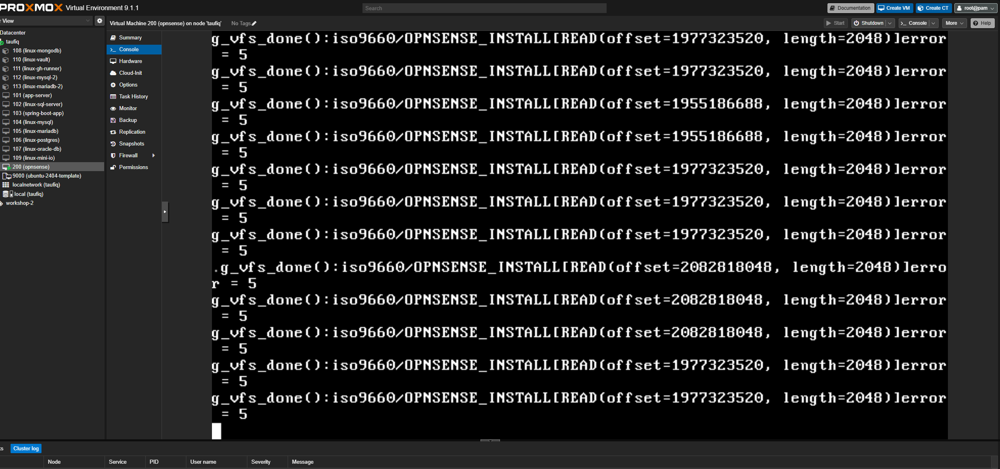
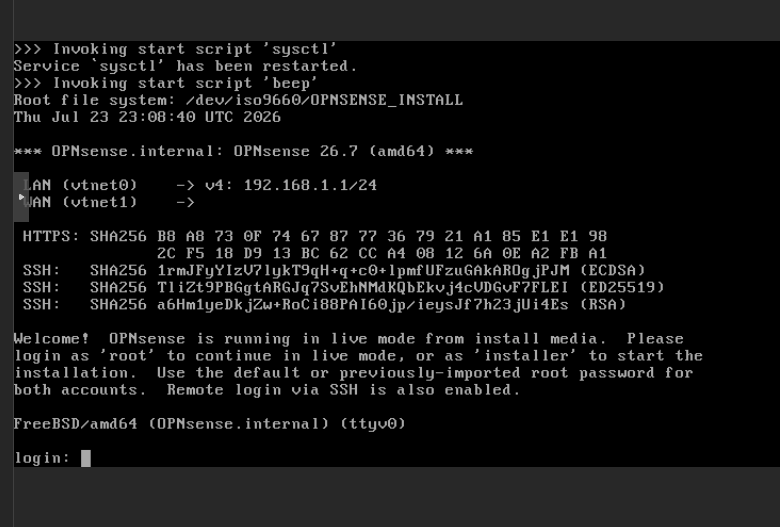

### 2. Installer refused to proceed at 2GB RAM

**Broke:**
- bsdinstall's UFS step warned that copying the live filesystem to disk wants at least 3000MB, with only `[Proceed anyway]` or `[Cancel]`.

**Found it:**
- Straightforward warning dialog, no digging required.

**Recovered:**
- Stopped the VM (safe — nothing had been written to disk yet), bumped RAM from 2GB to 4GB, reinstalled without the warning.

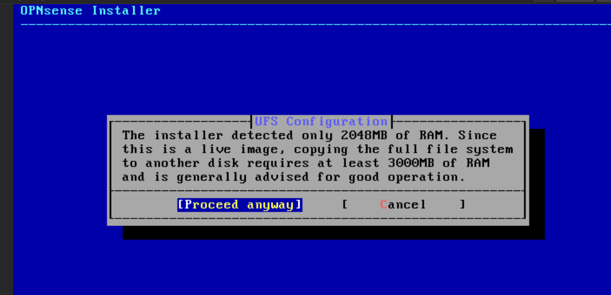

### 3. LAN interface kept defaulting to DHCP instead of static

**Broke:**
- At the console's "Configure IPv4 address LAN interface via DHCP?" prompt, muscle memory typed `y` twice in a row instead of `n` — leaving LAN trying to DHCP on a network with no DHCP server yet, instead of the static `10.0.10.1/24` the plan called for.

**Found it:**
- Visible immediately in the console's own confirmation output each time.

**Recovered:**
- Went through the console's interface-IP wizard a third time, deliberately slower, confirming each individual prompt before moving to the next, landing on the correct static config.

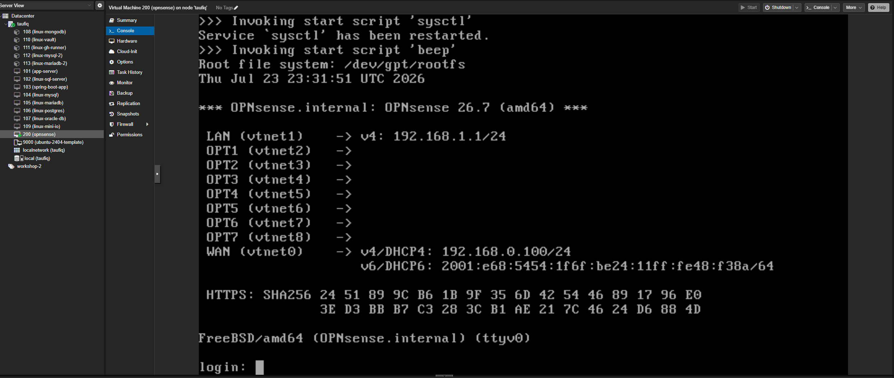

### 4. Kea DHCP got accidentally enabled on WAN

**Broke:**
- Clicking "Select All" while picking which interfaces Kea DHCP should serve also selected WAN — which would have started handing out DHCP leases onto the existing home LAN, directly conflicting with the home router's own DHCP.

**Found it:**
- Reviewed the selected-interfaces list before applying and spotted WAN sitting in there alongside the VLANs.

**Recovered:**
- Unchecked WAN, kept only LAN + the 7 VLAN interfaces, applied.

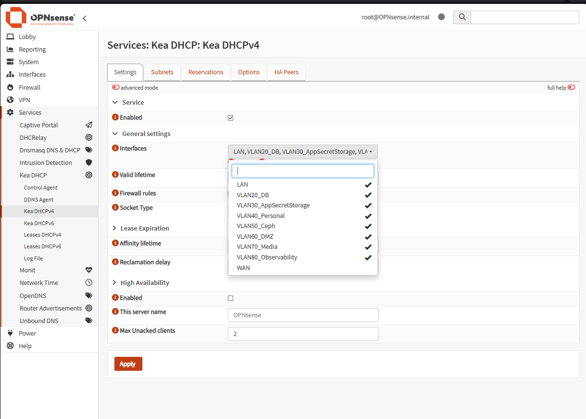
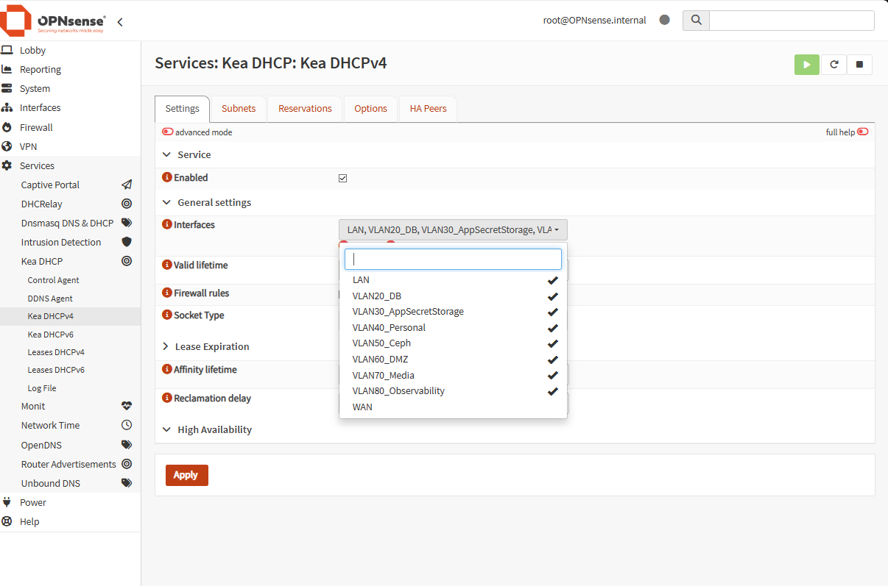

### 5. The firewall rule editor kept silently rejecting the destination port

**Broke:**
- Adding the Spring Boot → Oracle rule, the Destination Port field visibly showed `1521`, but Save kept failing with *"Please specify a valid portnumber, name, alias or range."*
- Including one detour where a stray edit ended up typed into the wrong field entirely.

**Found it:**
- Re-screenshotting after every single field change (rather than trusting that a visually-filled field was actually committed) eventually isolated the real cause: **Protocol was still set to `any`**, and OPNsense only accepts a Destination Port when Protocol is explicitly TCP or UDP.
- The error message was accurate the whole time, just easy to miss while chasing the port field itself.

**Recovered:**
- Set Protocol to `TCP` explicitly; the exact same port value that had been "invalid" for several attempts saved immediately.

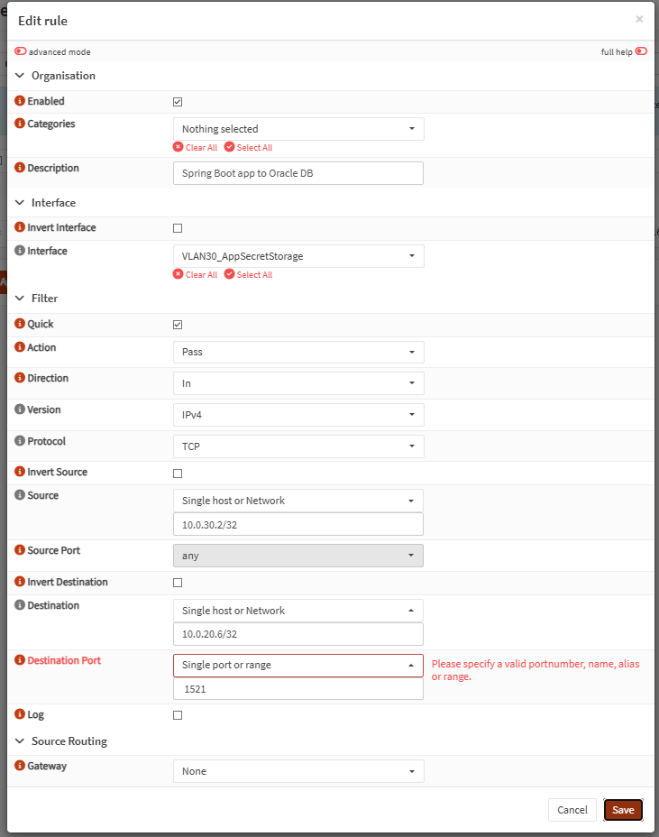
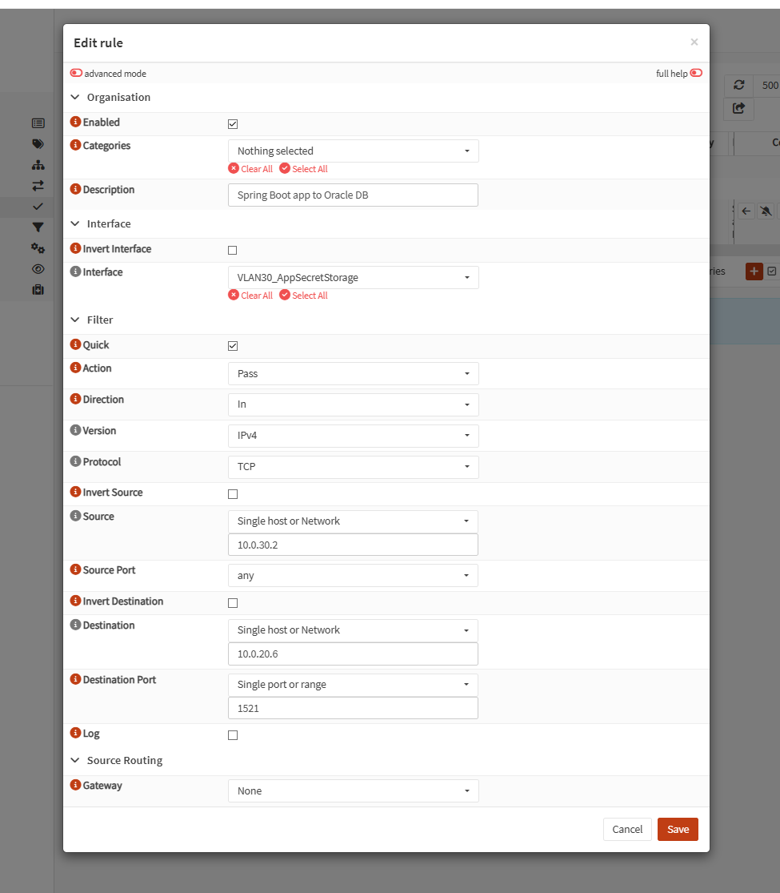

### 6. My own firewall rule design blocked OPNsense's own DNS resolver

**Broke:**
- After tagging every VM and applying the firewall rules, `linux-mysql` lost DNS resolution entirely (which in turn knocked its Tailscale offline, since Tailscale needs to resolve `controlplane.tailscale.com` to register) — even though plain ICMP ping to raw IPs worked fine.

**Found it:**
- `resolvectl status` on the VM showed its DNS server was `10.0.20.1` — OPNsense's own interface IP, exactly as the DHCP "auto collect option data" setting intended.
- The bug: my "internet access only" rule on each VLAN works by matching "destination is *not* in `10.0.0.0/8`" — and OPNsense's own interface addresses are *inside* `10.0.0.0/8`, so that same rule that correctly blocked cross-VLAN traffic was also, as a side effect, blocking every VM from reaching OPNsense's own resolver.

**Recovered:**
- Added one additional rule per VLAN — destination `This Firewall`, port 53, TCP/UDP — explicitly allowing DNS to OPNsense itself.
- This was a genuine gap in my rule design, not anything wrong on the VM side.

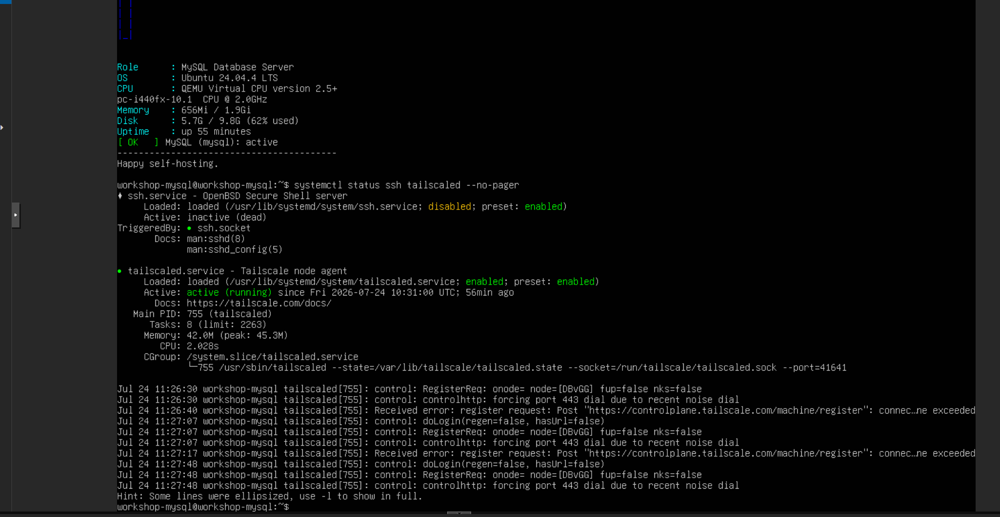
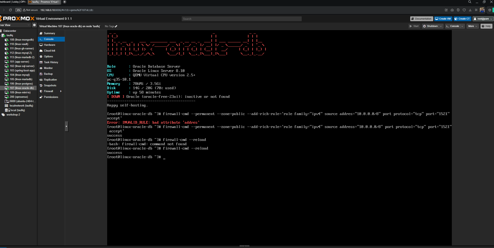
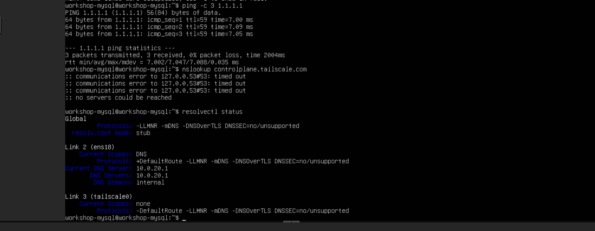

### 7. Oracle's own host firewall blocked the DB port regardless of any VLAN rule

**Broke:**
- Even after every network-level fix, Spring Boot → Oracle on 1521 still failed with "No route to host" — including when tested from the fully-open Management VLAN, which has no restrictions at all.

**Found it:**
- That specific error pattern (ICMP works, a specific TCP port doesn't, from *any* source) is characteristic of the destination host's own firewall rejecting the connection, not a network-level block.
- Checked directly on the Oracle VM: `firewalld` was active, and the DB was confirmed actually listening on `0.0.0.0:1521` — so the network path and the service were both fine; only the VM's own host firewall was in the way.

**Recovered:**
- Added a `firewalld` rich rule on the Oracle VM directly, allowing `10.0.0.0/8` to reach port 1521/tcp, then reloaded.

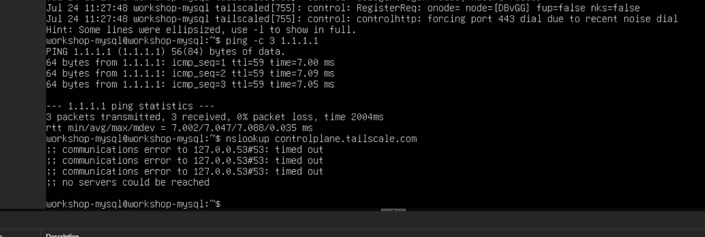

### 8. `gh-runner` couldn't SSH into other VLANs — even with a correct OPNsense rule

**Broke:**
- SSH from `linux-gh-runner` (and even from the fully-open Management VLAN) to `linux-mysql` or `app-server` timed out, despite the specific OPNsense allow-rule for it being configured correctly.

**Found it:**
- `ufw status verbose` on both target VMs revealed SSH (and MySQL, for `linux-mysql`) was deliberately scoped to `tailscale0` only, from specifically named Tailscale IPs — a pre-existing security posture from before today, completely unrelated to the VLAN work.

**Recovered:**
- No fix needed. `linux-gh-runner`'s real CD path already runs over Tailscale, which bypasses VLAN routing entirely by design (this lab's Tailscale-stays-everywhere decision) — so nothing was actually at risk.
- The OPNsense rule for LAN-based SSH access stays in place as harmless defense-in-depth; it just isn't the path anything actually uses today.

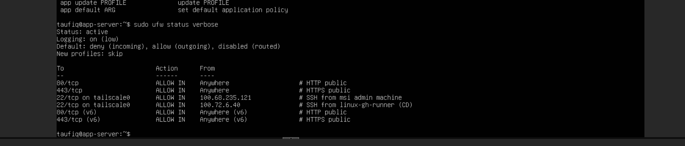
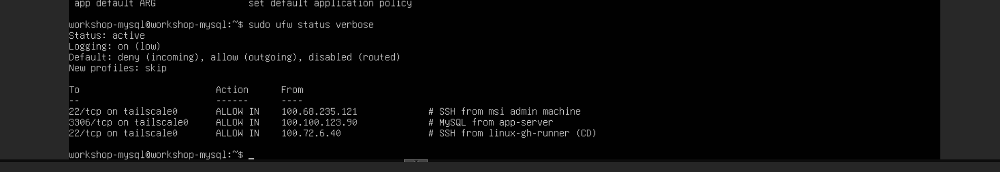

---

## VLAN 80 Activation — 26 July 2026 (Stage 6, Observability)

- Reserved since this plan's original build, VLAN 80 finally got a real guest — `linux-observability` (CT 114, Prometheus/Grafana/Loki/Alertmanager) — as part of `devops-practice-plan.md`'s Stage 6.
- Full stage write-up: [`docs/19-devops-practice/06-observability-prometheus-grafana-loki-alertmanager.md`](../devops-plan/06-observability-prometheus-grafana-loki-alertmanager.md).
- This section is specifically the VLAN/firewall side of that work.

**Broke:**
- The new CT got a real DHCP lease (`10.0.80.100`, gateway `10.0.80.1`) — confirming OPNsense's interface + Kea DHCP for VLAN 80 were already live from the original build — but had **zero internet egress**.
- Not slow, genuinely blocked: `ping 10.0.80.1` itself was 100% packet loss, so even the gateway was unreachable, let alone anything beyond it.

**Found it:**
- Exactly what "reserved but ruleless" (this doc's own §Where Things Stand, before this update) predicted — VLAN 80 had an interface and DHCP but had never had firewall rules written for it, unlike VLANs 20/30/40.
- Confirmed via `qm config 200 | grep net` that OPNsense's `net8` (VLAN 80, MAC `BC:24:11:DF:45:00`) already existed at the hypervisor level; the gap was entirely on the OPNsense rules side.

**Recovered:**
- Added the same two-rule pattern as every other active VLAN, via the OPNsense web GUI (reached through an SSH tunnel — `ssh -L 8443:10.0.10.1:443 proxmox`, since the GUI only lives on the Management VLAN and isn't reachable directly from a Windows client):
  1. **`VLAN 80 - internet only, block other VLANs`** — Pass, Interface `VLAN80_Observability`, Protocol any, Source `10.0.80.0/24`, Destination `10.0.0.0/8` with **Invert Destination** checked.
  2. **`VLAN 80 - DNS to OPNsense`** — Pass, Interface `VLAN80_Observability`, Protocol TCP/UDP, Source `10.0.80.0/24`, Destination `This Firewall`, port `53` — the exact same gap as bug #6 above (DNS to OPNsense itself), added proactively this time instead of rediscovering it the hard way.
- Both rules saved and applied; re-tested from the CT immediately after — `ping 8.8.8.8` succeeded, `getent hosts tailscale.com` resolved cleanly, and the Tailscale install (which had been hanging on `curl` this whole time) completed within seconds.


- One thing noticed, not a problem: a **pre-existing floating rule** (`TCP/UDP * → This Firewall :53`, bound to 3 interfaces) already covered DNS for the original 3 active VLANs.
- Adding VLAN 80's own interface-specific DNS rule alongside it is redundant but harmless — both simply match, no conflict.

## Where Things Stand

- All 13 VMs/CTs are tagged onto their correct VLAN, booted, and confirmed reachable at their reserved IPs.
- Firewall rules for the 4 active VLANs (20/30/40/80) are in place and tested end-to-end:
  - DB tier isolated from Personal.
  - Personal blocked from reaching App/Secrets and DB.
  - The one specific Spring Boot → Oracle path works.
  - Internet access works everywhere it should.
  - VLAN 80 has internet + DNS but no cross-VLAN reach.
  - Management stays unreachable from every VLAN except the Proxmox host itself.
- VLANs 50/60/70 stay reserved and ruleless until something actually gets deployed there.
- Independently reproduced afterward from my own terminal, not the same SSH session the original tests ran from — same results both times:

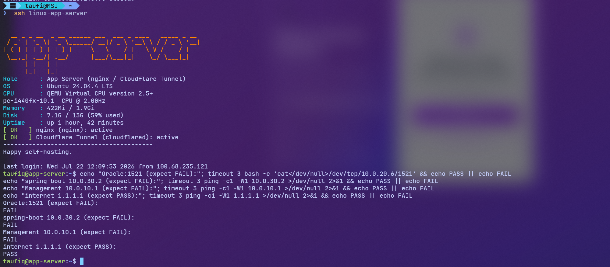


- Full step-by-step execution log (commands run, exact config) lives in [`homelab-network-segmentation-execution-plan.md`](../../plans/01-homelab-network-segmentation-execution-plan%20(executed).md)'s Execution Log section — this doc is the narrative version of the same work.
