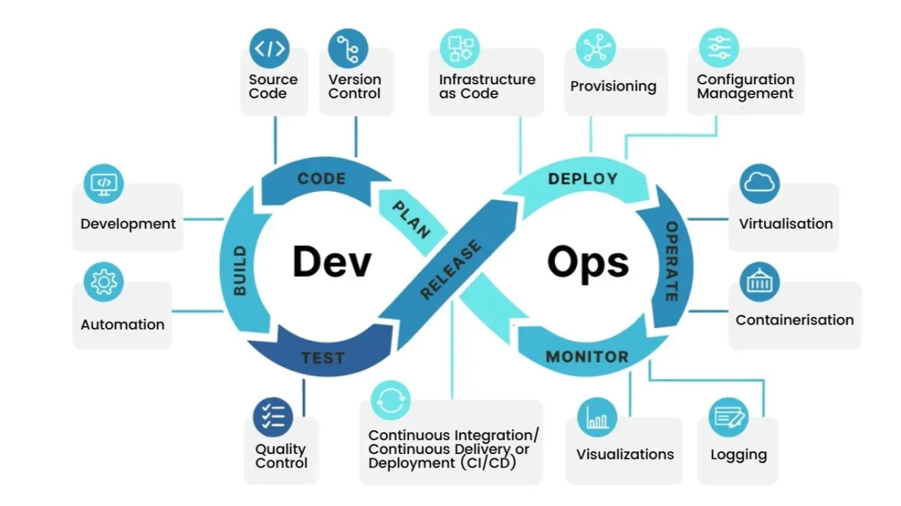

# Why This Series Exists

The classic devops "infinity loop" above is what this whole series is
structured around, even though nobody handed me this diagram before I
started. Dev-side phases (Plan, Code, Build, Test) sit on the left half,
ops-side phases (Release, Deploy, Operate, Monitor) on the right, and each
phase is fed by the ring of practice categories around the outside — Source
Code and Version Control into Code; Development and Automation into Build;
Quality Control into Test; CI/CD into Release; Infrastructure as Code,
Provisioning, and Configuration Management into Deploy; Virtualisation and
Containerisation into Operate; Visualizations and Logging into Monitor. The
table further down maps every doc in this series onto that loop.

- I was drawn to devops, and I want to break into it.
- Not just read about Terraform and Kubernetes, but actually run them
  against something real until they break and I have to fix them.

- [Animal Shelter Workshop](https://github.com/tttaufiqqq/Animal-Shelter-Workshop)
  had the potential to be exactly that something real.
- It's a genuinely big project: five modules covering a full shelter's
  workflow (stray reporting, rescue and caretaker check-in, vet and
  vaccination records, admin and adoption revenue reporting, and adopter
  booking), each with its own database connection across three engines, a
  real deployment pipeline, and a real Proxmox homelab underneath it,
  already more infrastructure than most tutorials ever touch.
- That size is exactly what made it useful here: five separate modules and
  five separate database connections meant there was always another piece
  of it that could be stretched to fit whatever the next devops stage
  needed, without running out of real surface area to practice on.
- So I picked it as the target, and planned a devops learning path around
  it (Terraform, Ansible, CI/CD, Docker, k3s, observability, GitOps, and a
  public cloud stretch goal) with Claude's help, working through it stage
  by stage.

- The plan itself lives in `plans/02-devops-practice-plan (executed).md`.
- This series is the writeup of actually doing it, stage by stage, in plan
  order, each doc written the same way every other doc in this repo is:
  what I built, why, what broke, how I found it, how I recovered.
- Some of it went in a different order than the plan originally laid out
  (the cloud stage, in particular, got pulled forward, gated by an Azure
  for Students credit with a real expiry date, not by curriculum order).
- The docs here are sequenced to match the plan's own structure regardless,
  not the order things actually happened in.

## What's in this series

Doc `01` covers the whole Terraform/IaC journey (Stage 1, in all its
iterations) — what was built, why, what broke, how it was found, and how
it was recovered, all in one place. Read that one first. Its full
narrative detail, stage by stage, previously lived across four separate
docs that are now folded into it rather than kept as separate reading.

| # | Doc | Stage |
|---|---|---|
| 01 | [Terraform: VM/CT creation, fleet import, and pipeline automation](01-terraform-vm-ct-creation-fleet-import-and-automation.md) | Stage 1, all iterations |
| 02 | [Ansible: roles, idempotency, Molecule, fleet expansion](02-ansible-roles-idempotency-molecule-vault-and-fleet-expansion.md) | Stage 2 |
| 03 | [Docker: multi-stage build and compose](03-docker-multi-stage-build-and-compose.md) | Stage 4 |
| 04 | [k3s: single-node deployment and Vault injector](04-k3s-single-node-deployment-and-vault-injector.md) | Stage 5 |
| 05 | [CI/CD: per-connection smoke test, pre-deploy backup, drift check](05-ci-cd-per-connection-smoke-test-pre-deploy-backup-terraform-drift.md) | Stage 3 |
| 06 | [Observability: Prometheus, Grafana, Loki, Alertmanager](06-observability-prometheus-grafana-loki-alertmanager.md) | Stage 6 |
| 07 | [GitOps: ArgoCD auto-sync and drift-revert](07-gitops-argocd-auto-sync-and-drift-revert.md) | Stage 7 |
| 08 | [Azure: offsite backup sync and budget guardrail](08-azure-cloud-backup-sync.md) | Stage 8, Steps 1-2 |
| 09 | [Azure: Functions reading Vault through Tailscale Funnel](09-azure-functions-vault-tailscale-funnel.md) | Stage 8, Step 3 |
| 10 | [Azure: Terraform talking to a second provider](10-terraform-azurerm-stretch-goal.md) | Stage 8, Step 4 (stretch) |
| 11 | [Terraform: bringing the rest of the fleet in](11-terraform-full-fleet-import.md) | Stage 1 (continued again) — full narrative detail behind doc 01 |
| 12 | [Terraform: proving CT creation, and the full loop end to end](12-terraform-ct-creation-and-full-loop-proof.md) | Stage 1 (continued once more) — full narrative detail behind doc 01 |

## Where each doc sits on the loop

Mapping the table above onto the infographic at the top — same eight
phases, same ring of practice categories, just with this series' actual
docs slotted into each one instead of generic labels:

| Loop phase | Practice categories | Covered by |
|---|---|---|
| Plan | — | `plans/02-devops-practice-plan (executed).md`, this doc |
| Code | Source Code, Version Control | Animal Shelter Workshop itself (the target app); every doc's git history |
| Build | Development, Automation | 01/11/12 (Terraform automation scripts), 04 (Docker multi-stage build) |
| Test | Quality Control | 02 (Molecule), 03 (per-connection smoke test) |
| Release | CI/CD | 03 (GitHub Actions pipeline, drift check) |
| Deploy | Infrastructure as Code, Provisioning, Configuration Management | 01/11/12 (Terraform), 02 (Ansible), 08-10 (Azure IaC stretch) |
| Operate | Virtualisation, Containerisation | 04 (Docker), 05 (k3s), 07 (GitOps/ArgoCD) |
| Monitor | Visualizations, Logging | 06 (Prometheus, Grafana, Loki, Alertmanager) |

A few docs straddle more than one phase on purpose — 07's GitOps auto-sync
is both a Deploy mechanism and an Operate-time drift guard, and the
Terraform docs (01/11/12) span Build (the automation around `apply`) and
Deploy (the actual provisioning) rather than fitting one box cleanly. The
loop is a simplification; the real work never lines up quite that neatly.
