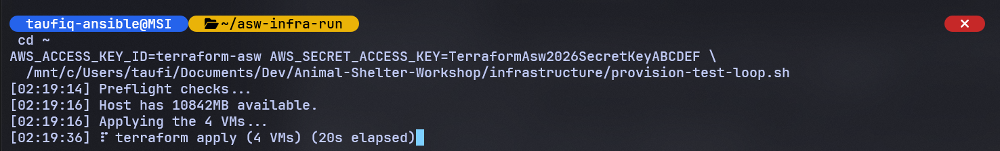
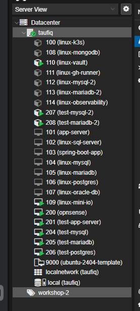
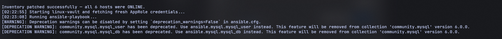
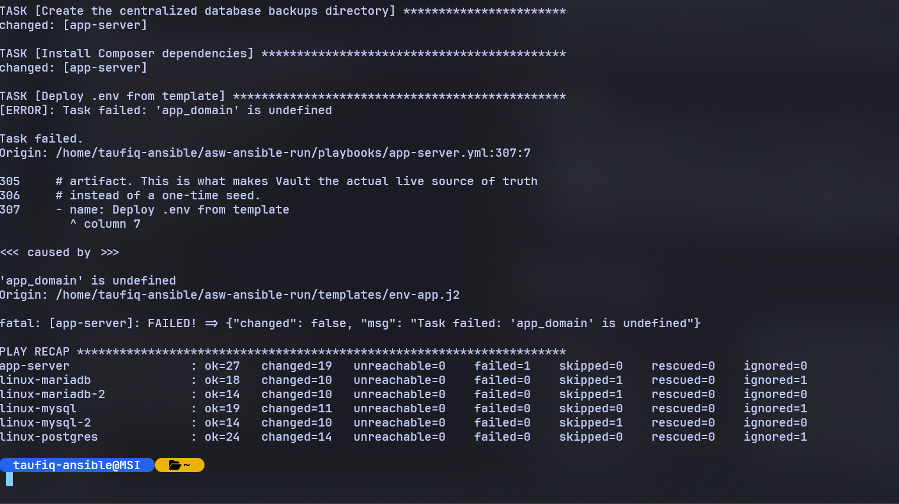

<!-- Not yet sequenced into a numbered docs/ folder, lives here in
     docs/19-devops-practice/ until the full devops-practice-plan.md is complete.
     Date below is provisional (the date this actually happened); revisit
     once final sequencing/dating is decided. -->

# Terraform: VM/CT Creation, Fleet Import, and Pipeline Automation

**Date:** 2026-07-26 through 2026-07-31
**Repo the actual code/infra changes live in:** `Animal-Shelter-Workshop`
(this write-up lives in the homelab meta-repo instead, alongside the devops
practice plan it's a stage of, see `devops-practice-plan.md`, Stage 1)

**A note on scope:** this doc replaces what used to be two separate files
(`01-terraform-first-real-loop.md` and `02-terraform-state-import-and-module.md`)
and folds their content in directly, rather than keeping five different
docs for one continuous stage. Docs `11` and `12` in this series still hold
full narrative prose for the two later iterations (full fleet import, CT
creation proof) if you want the blow-by-blow; everything that matters from
all of it is captured here.

---

## Why I built this

- I wanted real DevOps practice, not tutorial-following — something big
  enough to keep breaking in new ways as I went deeper into it.
- `Animal-Shelter-Workshop` fit: five modules, five separate database
  connections across three engines, a real deployment pipeline, a real
  Proxmox homelab underneath it.
- `infrastructure/terraform` looked real on paper — `bpg/proxmox`,
  cloud-init, a `for_each` module — but no `.tfstate` existed anywhere,
  and every real run so far had targeted the hand-configured production
  box, never a Terraform-created one. The loop had never actually been
  proven end to end.
- A claim I later wrote up for a public post — "no more manually clicking
  through GUI buttons for every machine, the .tf files handle it for me"
  — turned out to only be true for brand-new VMs, not the live fleet, and
  not CTs at all. Proving that claim honestly is what actually drove every
  iteration below: prove the VM loop, then bring the real fleet under
  management, then prove CTs too, then automate the whole thing so it
  doesn't depend on me remembering fifteen manual steps in the right order.

**The pipeline, in one picture:**


```
┌─────────────────────────────────────────────────────────────────────┐
│              TERRAFORM  →  PROXMOX  →  ANSIBLE                       │
│         three tools, three non-overlapping jobs, one pipeline        │
└─────────────────────────────────────────────────────────────────────┘

  ┌──────────────────────┐     defines CPU, RAM, disk, VLAN in .tf
  │ 1. Terraform           │▏    files, calls the Proxmox API — never
  └──────┬────────────────┘▔▔    touches software at all
         │
         ▼
  ┌──────────────────────┐     builds or updates the VM/CT to match
  │ 2. Proxmox             │▏    that spec — or, for most of this
  └──────┬────────────────┘▔▔    fleet, just tracks what already exists
         │  machine boots, joins Tailscale
         ▼
  ┌──────────────────────┐     SSHes in once it's actually reachable,
  │ 3. Ansible             │▏    installs/configures everything the
  └────────────────────────┘▔▔   app needs — a separate, manual handoff,
                                  never an automatic trigger from step 1
```

These three have completely non-overlapping jobs on purpose: changing
what's installed never touches Terraform; changing a machine's spec never
touches Ansible.

---

## What I built

- **Proved Terraform could create a VM from scratch** — `bpg/proxmox` +
  cloud-init, VLAN-tagged, joining Tailscale automatically on first boot,
  then handed off to `ansible-playbook` to become a genuinely working
  Laravel app server and 3 working databases. Disposable test VMs
  (201/204/205/206), deliberately separate from the real 101/104/105/106.
- **Moved state onto real infrastructure** — self-hosted MinIO on
  `linux-mini-io`, bucket-scoped credential, not root. Adopted the two
  hand-built LXCs (`linux-mysql-2`/`linux-mariadb-2`) into that same state
  via `terraform import`, and extracted the repeated VM resource block
  into a real reusable module (`modules/proxmox-vm/`).
- **Imported the entire rest of the real production fleet** — 10 more
  real hosts (`app-server`, `linux-mysql`, `linux-mariadb`,
  `linux-postgres`, `linux-mini-io`, `linux-k3s`, `linux-mongodb`,
  `linux-vault`, `linux-gh-runner`, `linux-observability`), one host at a
  time, proving zero drift on each before trusting it. Full story:
  `11-terraform-full-fleet-import.md`.
- **Proved Terraform could create a CT from scratch too** — not just
  adopt one via import, actually build one — and pushed the proof all the
  way through a real Ansible handoff into 5 fully working database hosts.
  Full story: `12-terraform-ct-creation-and-full-loop-proof.md`.
- **Split Terraform ownership** — `linux-mini-io`, `linux-k3s`,
  `linux-mongodb`, and `linux-observability` aren't ASW-specific (shared
  monitoring, general storage, general compute), so they moved to this
  meta-repo's own Terraform instead of living inside one app's repo. Full
  story: `docs/20-homelab-terraform/homelab-terraform-split.md`.
- **Automated the whole pipeline** — `provision-test-loop.sh` (bash
  orchestrator) + `resolve_tailscale_ips.py` (the one genuinely
  data-processing piece), covering everything from a capacity check
  through the CT Tailscale bridge to the final Ansible handoff, without
  needing to remember any of the manual steps below in the right order.

**What's actually managed by Terraform right now:**
- ASW's own Terraform: 5 DB connections (`linux-mysql`, `linux-mysql-2`,
  `linux-mariadb`, `linux-mariadb-2`, `linux-postgres`), `app-server`,
  `linux-vault`, `linux-gh-runner` — 8 resources, exactly what that app
  needs.
- The homelab meta-repo's own Terraform: `linux-mini-io`, `linux-k3s`,
  `linux-mongodb`, `linux-observability` — the 4 genuinely shared hosts.
- Deliberately outside Terraform everywhere: `opnsense` (the network's
  actual gateway) and the stopped legacy VMs (102/103/107, template 9000).

### Terraform's state backend: why MinIO, and the exact commands

Terraform needs somewhere to persist a `.tfstate` file — the record of
which resource address maps to which real Proxmox VMID, and what its
last-applied config looked like, so `plan`/`apply` know what "no change"
means without re-reading every field from Proxmox's own API as ground
truth on every run. The default is a local file next to the `.tf` files,
fine for a single-machine, single-person setup, but not what real
Terraform usage looks like — production setups almost always use a
remote, lockable backend instead. Since practicing the real thing was the
whole point of this stage, it uses this homelab's own self-hosted MinIO
(`linux-mini-io`, already running general-purpose S3 storage for
`Library-System-EDP`) as an S3-compatible remote backend instead of a
local file — same protocol, same locking semantics as a real cloud setup,
without paying for one.

**One-time setup, run on `linux-mini-io` itself:**
```bash
# A bucket dedicated to this one state file — never share a bucket
# between unrelated Terraform configs; a state mistake in one becomes a
# corruption risk to the other.
mc mb local/animal-shelter-workshop-tfstate

# A bucket-scoped credential, not the MinIO root account — same
# "scope the credential, not just the network" principle used everywhere
# else in this homelab (the Azure backup SAS token, the Vault AppRole
# secret_id). If this leaks, it can only touch this one bucket.
mc admin user add local terraform-asw <secret key>

# A policy granting exactly get/put/list/delete on that one bucket,
# nothing else in the MinIO instance, then attach it to the user.
mc admin policy create local terraform-asw-tfstate policy.json
mc admin policy attach local terraform-asw-tfstate --user terraform-asw
```

**In `main.tf`, read on every `init`:**
```hcl
backend "s3" {
  bucket = "animal-shelter-workshop-tfstate"
  key    = "terraform.tfstate"
  region = "us-east-1"   # required by the backend, meaningless to MinIO

  endpoints = {
    s3 = "http://100.73.172.85:9000"   # linux-mini-io, Tailscale IP
  }

  use_path_style              = true   # MinIO doesn't do virtual-hosted-style buckets
  skip_credentials_validation = true
  skip_region_validation      = true
  skip_requesting_account_id  = true
  skip_metadata_api_check     = true
  skip_s3_checksum            = true
}
```
Terraform's built-in `s3` backend talks to any S3-compatible endpoint, so
pointing it at MinIO needs no extra plugin — just these MinIO-specific
overrides so it stops assuming it's talking to real AWS (a real account
ID, virtual-hosted-style bucket URLs, AWS's actual region list).

**Every real run, before `terraform init`/`plan`/`apply`:**
```bash
export AWS_ACCESS_KEY_ID=terraform-asw
export AWS_SECRET_ACCESS_KEY=<the bucket-scoped secret>

terraform init    # downloads providers; opens the S3-backend connection to MinIO
terraform plan    # reads current state from the MinIO bucket, diffs against .tf files
terraform apply   # applies changes, then writes the new state back to MinIO,
                   # holding a lock on it for the duration so a second
                   # concurrent apply can't race and corrupt the file
```
The credential is passed as env vars only — never written into `main.tf`
or committed in `terraform.tfvars` — the same "no hardcoded secrets" rule
the automation script follows. `linux-mini-io` (VM 109) isn't part of the
always-on core fleet, so `qm start 109` first if a fresh `terraform init`
can't reach the backend at all — this is exactly the "very first proof"
gotcha listed above, not a hypothetical.

---

## What broke, how I found it, and how I recovered

Grouped by category below, not chronologically — every real thing found
and fixed across every iteration of this stage.

### The very first proof — bootstrapping a homelab automation identity from nothing
These only ever happen once per credential/environment, not every run —
but they were real, and blocked the very first `terraform apply` this
project ever attempted:
- The Terraform automation token (`root@pam!ansible`) had **zero Proxmox
  ACL grants** — `pveum acl list` came back completely empty even though
  the token existed. First `apply` failed with `Permission check failed`.
  Granted `PVEVMAdmin` + `PVEDatastoreAdmin` + `PVESDNAdmin` at path `/`,
  broad on purpose for a homelab automation token, not a least-privilege
  production credential.
- `bpg/proxmox`'s SSH connection (needed for cloud-init snippet upload,
  not a plain API call) resolves the node's address from Proxmox's own
  cluster config by default — the node's **LAN IP**, unreachable from a
  control node with only Tailscale connectivity. Fixed with an explicit
  `ssh.node` override in `main.tf` pointing at the same Tailscale IP the
  API endpoint already uses.
- The documented blocker going in: cloud-init only creates a `workshop`
  user, but `app-server.yml`'s deploy tasks assume `taufiq` already
  exists. Confirmed real, fixed by adding `taufiq` alongside `workshop` in
  `cloud-init.yml.tftpl`.
- **A costly red herring, worth remembering the shape of, not just the
  fix:** a fresh VM's `taufiq` account appeared to have a home directory
  dated a month old with no `workshop` user at all — looked exactly like
  a stale, never-cleaned template. The template itself was completely
  pristine (verified with `losetup` on a scratch clone). The real
  explanation: cloud-init's `--hostname=app-server` collided by substring
  with an already-online, unrelated device — the *real* hand-configured
  production `linux-app-server` was being read the entire time, not the
  VM just created. The lesson: verify by something unambiguous, not a
  hostname grep, when two devices could plausibly share a name fragment.
- The VM never got an IP at all — `vmbr0` is a VLAN-aware bridge, every
  production VM is tagged (`40` for the app role, `20` for the DB roles),
  but the Terraform config never set a `vlan_id`, so fresh VMs landed on
  the untagged default VLAN with no DHCP behind it.
- The Tailscale auth key in `terraform.tfvars` had actually expired by the
  time it was needed — reusable keys still expire on a schedule and need
  regenerating from the admin console periodically, not just once at
  setup.
- The MySQL/MariaDB root-auth bootstrap problem (see the Ansible section
  below) was first found here, on the *original* 3 DB VMs, not just the
  later `-2` CTs — every prior manual run had happened on a box already
  switched to password auth by hand, masking that a genuinely fresh
  install defaults to socket auth.
- `www-data` couldn't traverse into `/home/taufiq` at all, regardless of
  how correctly the app directory itself was owned underneath —
  cloud-init's default `/home/taufiq` is `0750`, group `taufiq`, and
  `www-data` is neither the owner nor a group member. Fixed with a single
  traverse-only `o+x`, not a permissive `chmod`.
- A seeder (`AnimalSeeder`) depended on `fakerphp/faker`, which was
  declared `require-dev` — production correctly runs
  `composer install --no-dev`, so this had never surfaced before because
  every prior manual seed run happened on a box with dev dependencies
  already present from an earlier, different install. Moved to `require`.
- **Verification discipline worth keeping, not just the bugs:** before
  pushing a fix that would trigger a real CI/CD run against production,
  the fix was tested against a full 363-test backend suite on the actual
  CI runner first, and only pushed once that came back clean. The
  resulting real production deploy (`Deploy #9`) succeeded end to end
  afterward — confirms the fixes were safe against the live fleet, not
  just the disposable test VMs they were built against.
- `linux-mini-io` (MinIO, Terraform's state backend) turned out to be
  **stopped** the first time it was actually needed — it's not part of
  the always-on core fleet. `qm start 109` first, or every Terraform
  command fails to reach the backend at all; `onboot: 1` was set on it
  once this dependency existed, so it survives a host reboot.

### Terraform/Proxmox provider quirks
- A CT's `operating_system.template_file_id` is never persisted by Proxmox
  after creation — always shows as a forced-replace unless added to
  `lifecycle.ignore_changes`.
- A CT's `initialization.user_account` (SSH keys) is **write-once at
  creation** — can't be read back *or* updated in place. Any diff forces a
  full destroy+recreate with no way to reconcile it; must be
  `ignore_changes`, not fixed by reapplying.
- A cloned VM's `disk.file_format` is never tracked correctly by Proxmox's
  clone operation — same category, same fix (`ignore_changes`).
- A `cdrom` block on a VM can never be read back on import — always shows
  as an "add" once. The provider's own default `interface` for an
  undeclared cdrom (`"ide3"`) doesn't match real hosts' actual `"ide2"`,
  so it must be declared explicitly or a second, unrelated cdrom device
  gets added.
- `on_boot` and `started` both silently default to `true` on the VM
  resource if left undeclared — real hosts without `onboot` set would get
  auto-start enabled as a side effect of the very first `apply`.
- `scsi_hardware` defaults to `"virtio-scsi-pci"`; every real host here
  uses `"virtio-scsi-single"`.
- `device_passthrough` on a CT maps to Proxmox's newer `devN:` mechanism,
  **not** the legacy raw `lxc.*` config lines these containers actually
  use for the Tailscale TUN device — declaring it adds a second, redundant
  passthrough path instead of managing the real one. Correct answer: leave
  it undeclared entirely.
- A child module doesn't inherit the root module's provider source alias
  automatically — needs its own `required_providers` block naming
  `bpg/proxmox`, or Terraform assumes the default registry namespace.
- Applying VMs and CTs together in one `terraform apply` can hit a Proxmox
  lock timeout on the CT `start` task (`can't lock file
  '/run/lock/lxc/pve-config-<id>.lock'`) — 4 concurrent VM clones are
  I/O-heavy enough on a 4-core host to starve the CT's lock acquisition.
  The container is usually created fine underneath regardless; Terraform
  just marks it "tainted" from the error, which would destroy and
  recreate a healthy container for nothing. Fix: apply VMs and CTs as two
  **separate** `terraform apply` commands, not by lowering
  `-parallelism` (that slows down VM-to-VM parallelism too, for no
  reason — they never actually collide with each other).
- The "vmid drift" between the disposable test loop's `linux-mysql` (vmid
  204) and the real `linux-mysql` (vmid 104) was never an actual bug —
  they're different Terraform resources entirely (module instance vs.
  root resource). The real fix was just naming clarity: the test loop's
  keys are `test-`-prefixed so `terraform state list` reads unambiguously.

### VM vs. CT: structurally different, not just configured differently
- VMs get Tailscale automatically via cloud-init's first-boot script
  mechanism. **CTs have no equivalent** — there is no "run this script on
  first boot" mechanism for Proxmox containers at all. This is why CTs
  need a manual (or scripted) bridge and VMs don't.
- A fresh CT's `initialization.user_account` only ever sets up SSH keys
  for `root` — there's no CT-side equivalent of cloud-init creating
  additional users (`workshop`, `taufiq`) the way VMs do.
- A fresh CT's vztmpl image doesn't even have `curl` preinstalled —
  needed `apt-get install curl` before Tailscale's own install script
  could run.
- The TUN device workaround for Tailscale inside an unprivileged CT (the
  two raw `lxc.cgroup2.devices.allow` / `lxc.mount.entry` lines) has to be
  applied by hand (or script) after creation, then the container rebooted
  before it takes effect.

### Networking / Tailscale
- `terraform destroy` does **not** deregister a machine from Tailscale.
  Recreating a VM/CT with the same hostname collides with its own stale
  "offline" device entry, and MagicDNS appends a `-N` suffix to
  disambiguate — this compounds across repeated destroy+recreate cycles
  (`test-mysql`, `test-mysql-1`, `test-mysql-2`, ... coexisting as
  separate stale devices). Never assume a plain hostname still points at
  the current machine after a recreate.
- The fix that actually works: `tailscale status --json` gives structured
  fields (`Online`, `LastSeen`) to reliably identify the *current* device
  for a given hostname prefix. The human-readable table alone isn't
  reliable once several stale devices with the same prefix exist — this
  bit us for real trying to read it by eye.
- WSL cannot resolve Tailscale MagicDNS hostnames at all — needs raw
  Tailscale IPs in any Ansible inventory used from WSL (same reason
  `.scratch-inventory-ip-override.yml` already existed for the real
  production hosts, extended to the test loop's own
  `.scratch-inventory-test-loop.yml`).
- WSL has its own **separate** `~/.ssh/config` from Windows, normally with
  none of the same `Host` aliases (`proxmox`, `linux-vault`, etc.)
  defined at all. A script meant to run from WSL shouldn't depend on
  aliases that may only exist on the Windows side — use explicit
  `user@ip` targets instead.

### Ansible / environment
- Running `ansible-playbook` from WSL against files on `/mnt/c` makes it
  distrust `ansible.cfg` entirely (a WSL/NTFS "world writable" permission
  quirk, not a real security issue) — silently drops `roles_path`,
  `remote_user`, and `private_key_file` all at once, not just role
  lookup. Fix: copy the `ansible/` directory to WSL's native filesystem
  and run from there — which also matches how the real pipeline works
  anyway (production Ansible runs on `linux-gh-runner`, a native Linux
  VM, never a Windows/WSL hybrid mount).
- `playbooks/*.yml` hardcode `hosts: linux-mysql` etc. — a scoped
  inventory has to keep those exact names and only override
  `ansible_host`, or the playbook silently never targets the test loop at
  all (and would instead re-run, harmlessly but pointlessly, against real
  production).
- `mysql_family_bootstrap_root_auth` is hardcoded `false` in the `-2`
  playbooks specifically because the *real* `linux-mysql-2`/
  `linux-mariadb-2` were already hand-configured with password auth
  before Ansible ever touched them. Correct for those two real hosts,
  wrong for a genuinely fresh clone of that same role — needs
  `-e '{"mysql_family_bootstrap_root_auth": true}'` for the test loop
  (real JSON, not a bare string — Ansible rejects a string result in a
  `when:` boolean context).
- **Deliberate, not a bug:** `app-server.yml` fails at rendering `.env`
  because `app_domain`/`certbot_email` are undefined — those gate a real
  certbot TLS run against a real public DNS record. Faking a domain for a
  disposable test VM would mean pointing real DNS at a throwaway host.

### PowerShell (Windows control node)
- PowerShell mangles an **unquoted** `-target` value containing a dot
  before it ever reaches `terraform.exe` — `-target=module.vm` arrives as
  just `module`, even though `Get-History` shows the full, correct text
  was typed. Not an autocomplete issue; specific to invoking native
  executables from PowerShell with this argument shape. Fix: wrap the
  entire value in double quotes — `-target="module.vm"`. Bash/WSL never
  hits this.
- Force-cancelling (Ctrl+C twice) a `terraform apply` mid-flight can leave
  real, running resources completely untracked by Terraform state — a
  genuine orphan, not a rollback. Recovery: `terraform import` them back
  in (see the `user_account` gotcha above for what happens next).

---

## The automation script

**Files** (`Animal-Shelter-Workshop/infrastructure/`):
- `provision-test-loop.sh` — bash orchestrator: preflight checks, staged
  `terraform apply` (VMs, then CTs), the CT Tailscale bridge (idempotent),
  waits for all 6 hosts online, fetches fresh Vault AppRole credentials,
  hands off to `ansible-playbook`.
- `resolve_tailscale_ips.py` — the one piece that's a genuine
  data-processing problem, not a command sequence: parses
  `tailscale status --json`, matches each target hostname (handling the
  `-N` suffix collision correctly via `Online`/`LastSeen`, not a guess),
  and patches `ansible_host` values directly into
  `.scratch-inventory-test-loop.yml`.
- `destroy-test-loop.sh` — the teardown counterpart: `terraform destroy`
  on the 6 test-loop resources, then deletes every matching Tailscale
  device via the Tailscale API (`resolve_tailscale_ips.py
  --list-all-device-ids` finds current *and* stale `-N` leftovers).
  `terraform destroy` alone never touches Tailscale at all — see the
  `-N` suffix collision bug below — so without this step every recreate
  after a destroy would immediately collide with its own stale device
  again.

**How it works, and which pain point each stage solves:**

```
┌─────────────────────────────────────────────────────────────────────┐
│              provision-test-loop.sh — WHAT IT ACTUALLY DOES          │
│   every stage below automates a step that was done by hand first,    │
│   and broke at least once doing it that way                          │
└─────────────────────────────────────────────────────────────────────┘

  ┌──────────────────────┐     Proxmox reachable? state backend
  │ 0. Preflight           │▏    up? enough RAM? running from WSL
  └──────┬────────────────┘▔▔    native, not /mnt/c? — solves: every
         │                        silent-failure surprise hit this session
         ▼
  ┌──────────────────────┐     terraform apply -target="module.vm"
  │ 1. Apply the 4 VMs     │▏    (alone, first)
  └──────┬────────────────┘▔▔
         │
         ▼
  ┌──────────────────────┐     a SEPARATE apply command — solves:
  │ 2. Apply the 2 CTs     │▏    the Proxmox lock-timeout bug from
  └──────┬────────────────┘▔▔    applying VMs + CTs together
         │
         ▼
  ┌──────────────────────┐     TUN device fix, reboot, install,
  │ 3. CT Tailscale bridge │▏    join — idempotent, skips if already
  └──────┬────────────────┘▔▔    done — solves: CTs have no cloud-init
         │                        equivalent, unlike the VMs
         ▼
  ┌──────────────────────┐     tailscale status --json, matched on
  │ 4. Resolve real IPs    │▏    Online/LastSeen — solves: the "-N"
  └──────┬────────────────┘▔▔    suffix collision from stale devices
         │                        that made eyeballing the table unreliable
         ▼
  ┌──────────────────────┐     fresh secret_id generated every run,
  │ 5. Vault credentials   │▏    never persisted — solves: having to
  └──────┬────────────────┘▔▔    manually SSH + regenerate one by hand
         │                        each time
         ▼
  ┌──────────────────────┐     runs from WSL's native filesystem,
  │ 6. ansible-playbook    │▏    never /mnt/c — solves: ansible.cfg
  └────────────────────────┘▔▔   being silently distrusted (roles_path,
                                  remote_user, private_key_file all at once)
```

**Design decisions, and why:**
- Bash for command orchestration (matches everything already proven by
  hand); Python only for the Tailscale-JSON-parsing + YAML-patching step,
  since that part is genuinely fragile as shell text-processing and much
  more reliable as structured data handling.
- No hardcoded secrets: the Tailscale authkey is read from
  `terraform.tfvars` (already gitignored there) at runtime; the Vault
  AppRole `secret_id` is generated fresh every single run via SSH to
  `linux-vault`, never persisted anywhere.
- Every SSH target is an explicit `user@ip`, not an alias — the script
  doesn't assume anything about the machine it's run from beyond having
  the right SSH key.
- Idempotent throughout: the CT bridge checks `tailscale ip -4` first and
  skips entirely if already done; `terraform apply` is naturally
  idempotent once state matches reality (which is exactly why every
  `ignore_changes` fix above matters — without them, "idempotent" isn't
  true).
- Fails fast with a clear diagnosis (`qm list`/`pct list`/
  `terraform state list` dumped automatically) rather than leaving a
  silent partial state to reverse-engineer by hand.
- Deliberately **not** automated: the capacity check prompts for
  confirmation rather than silently stopping production — that's a
  judgment call, not a mechanical step.
- A spinner + elapsed-timer wraps every stage that goes genuinely silent
  for minutes at a time (both `terraform apply`s, the CT boot-wait loop) —
  a real percentage isn't available since neither tool exposes a
  completion fraction, so proof-of-life plus elapsed time is the honest
  substitute. `ansible-playbook` is deliberately left unwrapped since it
  already streams per-task output live, strictly better feedback than a
  spinner would add.

### Running it

**To provision the test loop** (must run from a WSL-native directory, not
`/mnt/c` — the preflight check rejects that, see the Ansible/environment
section above):
```bash
cd ~
AWS_ACCESS_KEY_ID=terraform-asw AWS_SECRET_ACCESS_KEY=<the bucket-scoped secret> \
  /mnt/c/Users/taufi/Documents/Dev/Animal-Shelter-Workshop/infrastructure/provision-test-loop.sh
```









**To tear it back down** — `terraform destroy` alone is not enough, since
it never deregisters a machine from Tailscale (see the `-N` suffix
collision bug below); `destroy-test-loop.sh` does both halves:
```bash
cd ~
AWS_ACCESS_KEY_ID=terraform-asw AWS_SECRET_ACCESS_KEY=<the bucket-scoped secret> \
  TAILSCALE_API_KEY=<a Tailscale API access token, generated at
  https://login.tailscale.com/admin/settings/keys — a different
  credential class from the reusable device-join authkey> \
  /mnt/c/Users/taufi/Documents/Dev/Animal-Shelter-Workshop/infrastructure/destroy-test-loop.sh
```
It runs `terraform destroy` scoped to exactly the 6 test-loop resources,
then calls `resolve_tailscale_ips.py --list-all-device-ids` (current *and*
stale `-N` leftovers) and `DELETE`s each one through the Tailscale API —
so the next provision run starts from zero instead of colliding with its
own leftovers.

**How it's actually been verified so far:**

```
┌─────────────────────────────────────────────────────────────────────┐
│                  AUTOMATION SCRIPT — VERIFICATION STATUS              │
├─────────────────────────────────────────────────────────────────────┤
│ [x] bash -n syntax check ................................ PASS      │
│ [x] python3 -m py_compile ................................ PASS      │
│ [x] resolve_tailscale_ips.py --check-only, run against       PASS    │
│     real live `tailscale status --json` data ......                  │
│     (correctly reported all 6 targets NOT FOUND, since               │
│     no test resources existed at the time — proves the               │
│     JSON parsing/matching logic, not a fake/mocked run)               │
│ [x] full script, start to finish, one real run ........... PASS      │
│     (2026-08-01) — see screenshots above; first attempt hit a real   │
│     bug (below), fixed, this run is the one that proved the fix      │
│ [x] destroy-test-loop.sh, full teardown of that same run .. PASS     │
│     — all 6 Proxmox resources + all 6 Tailscale devices gone         │
└─────────────────────────────────────────────────────────────────────┘
```

Every individual *stage* the script automates (staged apply, the CT
bridge, `tailscale status --json` resolution, fresh Vault credentials,
the WSL-native Ansible handoff) had already been proven working by hand,
repeatedly, across the iterations documented above, before the script
itself ever ran unattended start to finish. The first real unattended run
did surface one genuine bug the manual runs never hit: `resolve_current_ip()`
let `test-mysql`'s own "-N suffix" regex swallow `test-mysql-2` (a
different, intentionally-named host, not a stale suffix of the first one),
sending the `linux-mysql` Ansible play to the wrong box and failing SSH
auth (`Permission denied` — the CT only has `root`, not the VM's
cloud-init `workshop` user). Fixed by excluding any hostname that's itself
one of the other reserved target names from being treated as a collision
candidate. The run captured in the screenshots above is the one that
proved the fix, end to end, for real.

---

## Verification

- All 5 DB hosts (`linux-mysql`, `linux-mysql-2`, `linux-mariadb`,
  `linux-mariadb-2`, `linux-postgres`) completed the full Ansible run with
  **zero real failures** — real MySQL/MariaDB/PostgreSQL installed,
  configured, database + user created, UFW firewall rules applied.
- `app-server` reached 27 successful tasks before the deliberate
  `app_domain` boundary — PHP 8.3, Nginx, Composer, Node.js installed, the
  real repo cloned, permissions set, Composer dependencies installed.
- `qm config`/`pct config` diffed byte-for-byte before vs. after on every
  host across every iteration — identical every time, including the disk
  `file_format` and CT schema fixes.
- `terraform plan` shows `0 to change, 0 to destroy` on every real
  resource in both Terraform configs (ASW's 8, the homelab repo's 4).
- The automation script: all three files pass syntax validation (`bash -n`,
  `python3 -m py_compile`), and `provision-test-loop.sh` has now been run
  unattended, start to finish, for real (2026-08-01) — 4 VMs + 2 CTs
  provisioned, the CT Tailscale bridge applied, all 6 hosts resolved and
  patched into the inventory, and the Ansible handoff completed with the
  same "5 DB hosts zero failures, app-server stops at the deliberate
  `app_domain` boundary" result documented above. `destroy-test-loop.sh`
  then tore the same run back down completely — all 6 Proxmox resources
  and all 6 Tailscale devices gone, verified against both `qm list`/
  `pct list` and the Tailscale admin console directly.
- Everything collapsed after every proof: test resources destroyed,
  `linux-vault` stopped back down, host capacity back to baseline. None of
  this was ever meant to be a second permanent environment.

---

## Where things live

| Piece | Path |
|---|---|
| Automation script | `Animal-Shelter-Workshop/infrastructure/provision-test-loop.sh` |
| Teardown script | `Animal-Shelter-Workshop/infrastructure/destroy-test-loop.sh` |
| Tailscale IP resolver | `Animal-Shelter-Workshop/infrastructure/resolve_tailscale_ips.py` |
| Test-loop inventory (gitignored) | `Animal-Shelter-Workshop/infrastructure/ansible/.scratch-inventory-test-loop.yml` |
| Disposable test loop + 2 test CTs | `Animal-Shelter-Workshop/infrastructure/terraform/vms.tf` |
| ASW's real production Terraform | `infrastructure/terraform/containers.tf` + `production-vms.tf` |
| Homelab meta-repo's own Terraform (shared infra) | `proxmox-homelab-taufiq/infrastructure/terraform/` |
| Full narrative detail per stage | `11`, `12` in this series; `docs/20-homelab-terraform/` |
