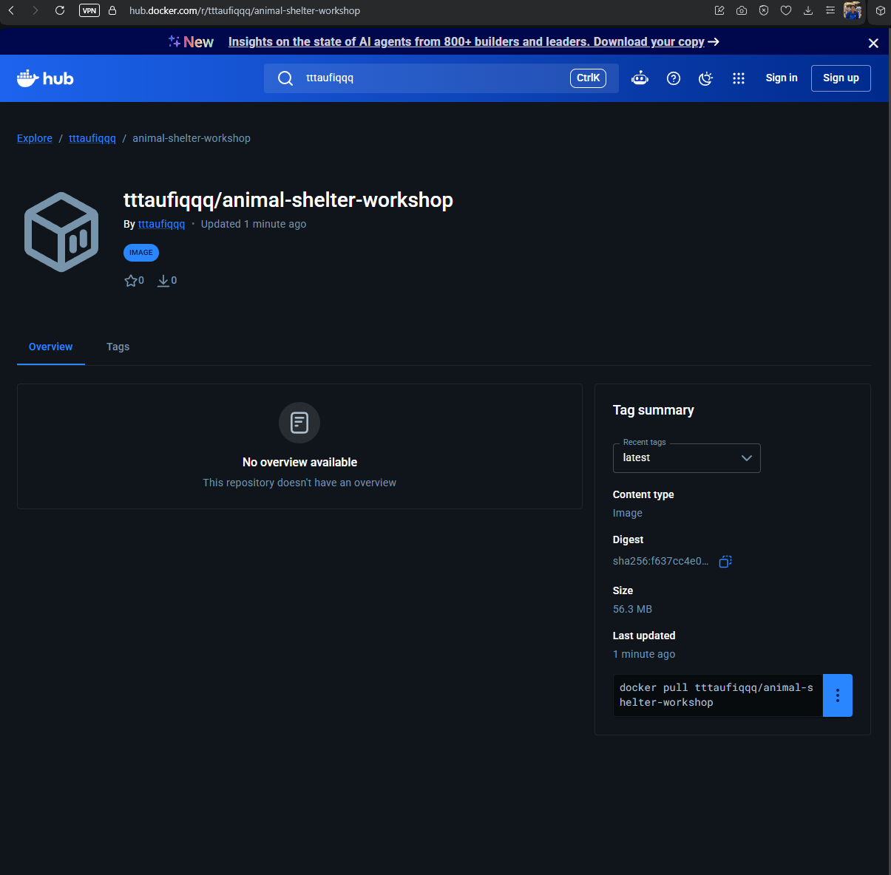

<!-- Not yet sequenced into a numbered docs/ folder, lives here in
     docs/19-devops-practice/ until the full devops-practice-plan.md is complete.
     Date below is provisional (the date this actually happened); revisit
     once final sequencing/dating is decided. -->

# Stage 4, Containers: Docker

**Date:** 2026-07-26
**Repo the actual code/infra changes live in:** `Animal-Shelter-Workshop`
(this write-up lives in the homelab meta-repo instead, alongside the devops
practice plan it's a stage of, see `devops-practice-plan.md`, Stage 4's
checklist, all 4 items)

## Why I built this

No dependency on Stages 1-3, genuinely new ground. Before this, the app
only ever ran one way: `app-server.yml` installing PHP 8.3 + Nginx straight
onto a VM, by hand, every time. The goal was to package the app itself
(code + PHP runtime + built frontend assets) into one portable image, and
prove it actually runs, including talking to a real database, without
needing that whole Ansible checklist re-run on every new machine.

## Concept: where Docker sits next to Terraform and Ansible

These three tools do three different, non-overlapping jobs. Terraform and
Ansible already existed in this repo (Stages 1-2); Docker is a new, fourth
layer that doesn't replace either of them, it replaces **PHP's own
presence directly on the VM**.

```
┌────────────────┐     ┌────────────────┐     ┌────────────────┐
│   TERRAFORM     │ ──▶ │    ANSIBLE      │ ──▶ │     DOCKER      │
│                 │     │                 │     │                 │
│  builds the     │     │  furnishes      │     │  is the moving  │
│  empty house    │     │  the house:     │     │  box you carry  │
│  (the VM/CT      │     │  installs PHP,  │     │  in, doesn't   │
│  itself exists)  │     │  nginx, wires   │     │  care whose     │
│                 │     │  up Vault       │     │  house it is    │
└────────────────┘     └────────────────┘     └────────────────┘
   "there is a             "the house is          "the app itself,
    house now"               livable"              sealed, portable"
```

Concretely, once a VM runs this container instead of bare PHP, Ansible's job
on it shrinks from "install PHP 8.3 + 10 extensions + build assets" down to
just "make sure Docker is installed", the image carries everything else.
Terraform is untouched either way; it never knew PHP existed in the first
place.

**Databases stay completely outside the box, on purpose.** This app talks to
5 separate real database servers (`reporting`/`shelter`/`animals`/`booking`/
`users`, see `config/database.php`), each still its own Terraform-built,
Ansible-configured host on the Tailscale-connected Proxmox fleet. Docker
doesn't containerize any of them, it just needs the app container to have
network reachability to call out to them, same as the bare-metal deployment
already does. Stateful services (real data, Vault-backed credentials,
nightly backups already proven in Stage 3) are the wrong candidate for
"disposable, rebuild from scratch" containers; the app itself is exactly
the right candidate.

```
┌────────────────────────┐
│   📦 APP BOX (Docker)    │
│   Animal-Shelter-Workshop│
└───────────┬────────────┘
            │  network calls (same as today)
   ┌────────┼────────┬────────┬────────┐
   ▼        ▼        ▼        ▼        ▼
┌──────┐┌──────┐┌──────┐┌──────┐┌──────────┐
│MySQL ││MySQL ││MySQL ││MySQL ││ Postgres  │
│animals││booking││shelter││report││  users   │
└──────┘└──────┘└──────┘└──────┘└──────────┘
   each one: still its own Terraform-built host,
   still configured by Ansible, untouched by Docker
```

This also set the honest scope for the local `docker-compose.yml` below:
wire the container to **one** local test database, not all 5, the other 4
stay unreachable from a laptop's Docker network on purpose (see "What I
found" below for what that actually looks like at runtime).

## Flow

```
┌────────────────────────────────────┐
│         STAGE 4, DOCKER           │▏
└────────────────────────────────────┘▔▔

┌────────────────────────────────┐     done, composer builder + node/vite
│ 1. Multi-stage Dockerfile        │▏    builder + php:8.3-fpm-alpine runtime,
│    (build once, ship a slim box) │▏    extension list matches app-server.yml
└────────────────────────────────┘▔▔    exactly
              │
              ▼
┌────────────────────────────────┐     done, app + nginx + one local
│ 2. docker-compose.yml            │▏    MySQL wired to the 'shelter'
│    (one local test DB)          │▏     connection only
└────────────────────────────────┘▔▔
              │
              ▼
┌────────────────────────────────┐     done, v1.0.0 and latest,
│ 3. Image tagging/versioning      │▏    same digest, both pushed
└────────────────────────────────┘▔▔
              │
              ▼
┌────────────────────────────────┐     done, docker.io/tttaufiqqq/
│ 4. Push to a registry            │▏    animal-shelter-workshop, Harbor
│    (Docker Hub)                 │▏     deferred per the plan's own
└────────────────────────────────┘▔▔    capacity note
```

## What I built

### 1. Multi-stage `Dockerfile`

Three stages, each throwing away what the next one doesn't need:

- **`vendor` (composer:2)**, `composer install --no-dev --optimize-autoloader`.
  Split into two `RUN` layers (install without the app code, then
  `dump-autoload` after copying it) so `vendor/` stays cached across app-code
  changes that don't touch `composer.json`/`composer.lock`.
- **`frontend` (node:20-alpine)**, `npm ci && npm run build` (Vite). Doesn't
  need PHP or Composer at all.
- **`runtime` (php:8.3-fpm-alpine)**, the only stage that ships. Extension
  list copied 1:1 from `infrastructure/ansible/playbooks/app-server.yml`'s
  own "Install PHP 8.3 and required extensions" task: `mbstring`, `curl`,
  `zip`, `bcmath`, `pdo_mysql`, `pdo_pgsql`, `gd`, `intl`, `opcache`, plus
  `redis` via PECL (`xml`/`pdo`/core curl support ship built into the
  official image already). Alpine's dev headers (`icu-dev`,
  `postgresql-dev`, `libzip-dev`, etc.) are installed as a `.build-deps`
  virtual package and purged in the same layer once the extensions are
  compiled, final image is **254MB / 59MB actual content**, not the
  700MB+ a kitchen-sink dev image (Laravel Sail's own `runtimes/8.3/Dockerfile`,
  already vendored in this repo, is the reference point for "what NOT to
  copy", it's Ubuntu-based, ships Xdebug/Imagick/Playwright/Swoole, and is
  built for local `artisan serve`, not a production-shaped image).

Final stage copies `vendor/` from the `vendor` stage, `public/build/` from
`frontend`, runs as `www-data`, and `EXPOSE 9000` for `php-fpm` (no built-in
web server, Nginx is a separate container, see below).

### 2. `docker-compose.yml`, one local test DB, not five

Three services: `app` (this image), `webserver` (`nginx:alpine`, proxies
`.php` requests to `app:9000` over TCP, config in `docker/nginx/default.conf`,
adapted from the production `nginx-locations.conf.j2` template), and `db`
(`mysql:8.0`, a **local, disposable** database, nothing like the real
fleet).


**A note on terminology, since this list is easy to misread**: Docker
Desktop's *Containers* tab (above) lists running **containers**, live
instances, not **images**. The *Image* column just names which image each
container was started from. The separate *Images* tab is where the actual
image list lives (one entry each for `animal-shelter-workshop:latest`,
`mysql:8.0`, `nginx:alpine`, not 4, and not one per container).

These 3 containers connect in a straight line, each only aware of the next
one by its Compose service name (Docker's internal DNS resolves `app`/`db`/
`webserver` automatically, no hardcoded IPs anywhere in this stack):

```
   your browser
        │  http://localhost:8080
        ▼
┌─────────────────┐
│   webserver-1    │   nginx, serves static files directly,
│   (nginx:alpine) │   forwards *.php requests onward
└────────┬─────────┘
         │  fastcgi, port 9000
         ▼
┌─────────────────┐
│      app-1       │   our built image, runs PHP-FPM,
│ (animal-shelter-  │   the actual Laravel app logic
│  workshop:latest) │
└────────┬─────────┘
         │  DB2_HOST=db, port 3306
         ▼
┌─────────────────┐
│      db-1        │   local test database only,
│   (mysql:8.0)    │   the 'shelter' connection, nothing else
└─────────────────┘
```

Only the `shelter` connection (`DB2_*` env vars) points at this local `db`
service. `DB1`/`DB3`/`DB4`/`DB5` are left at `config/database.php`'s own
defaults, the real Tailscale IPs, which are simply unreachable from a
laptop's Docker network. This was a deliberate choice, not an oversight:
every one of this app's migrations calls `Schema::connection('reporting')`/
`'animals'`/`'booking'`/`'users'` directly inside the migration file itself
(confirmed by reading `database/migrations/0001_01_01_000000_create_users_table.php`,
even the base `users` table lives on the Postgres `users` connection, not
Laravel's own default). A real `php artisan migrate` would immediately try
to reach all 5 and fail on the first unreachable one. So this compose setup
deliberately never runs a full migrate; instead:

- `app`'s own default connection is a persistent `sqlite` file (baked into
  the image, `database/database.sqlite`), this is what already holds
  Laravel's own framework tables (cache/sessions/migrations ledger) even in
  production, per `config/database.php`'s `'default' => env('DB_CONNECTION',
  'sqlite')`.
- The `/up` health route (built into this app via
  `bootstrap/app.php`'s `health: '/up'`) needs no database at all.
- `php artisan db:show --database=shelter` proves the one wired connection
  actually reaches the local `db` container, without touching schema.

### 3 & 4. Tagging and push

```
tttaufiqqq/animal-shelter-workshop:v1.0.0
tttaufiqqq/animal-shelter-workshop:latest
```
Both tags point at the same image (`sha256:f637cc4e...`), pushed to Docker
Hub. Harbor stays deferred, per the plan's own capacity note, the homelab
host has too little free RAM right now for Harbor's core+Postgres+Redis+
registry+trivy stack.



## What I found

**Bug: stale `bootstrap/cache/*.php` baked into the image.** The first
build's `COPY . .` picked up this Windows dev machine's own
`bootstrap/cache/packages.php`/`services.php`, generated locally *with*
dev dependencies installed (`laravel/pail` among them). The image's
`vendor/` is `--no-dev` and doesn't have Pail at all. First `docker compose
up` produced a real HTTP 500:
```
Class "Laravel\Pail\PailServiceProvider" not found
```
This is the exact same class of bug the Stage 1 writeup already hit once with
`fakerphp/faker` (a dev-only package a production/no-dev environment
silently assumed was there). Fixed two ways together: added
`bootstrap/cache/*.php` to `.dockerignore` (so a stale host-generated cache
manifest can never ship again), and added `RUN php artisan package:discover
--no-interaction` to the runtime stage, right after `vendor/` and the app
code are both in place, regenerating that cache fresh, against the exact
`vendor/` the image actually ships.

**Confirmed: the app's own graceful-degradation handling covers this
exact scenario for real.** With only `shelter` reachable and the other 4
connections genuinely down, hitting the homepage still returns
**HTTP 200** (not a 500), `HandleDatabaseFailures`/`InjectDatabaseStatus`
middleware (already in `bootstrap/app.php`'s middleware stack) already
handle a database being unreachable. `/api/database-status` shows exactly
what you'd expect:
```json
{
  "shelter":   {"connected": true,  "connection": "shelter"},
  "reporting": {"connected": false, "connection": "reporting"},
  "animals":   {"connected": false, "connection": "animals"},
  "booking":   {"connected": false, "connection": "booking"},
  "users":     {"connected": false, "connection": "users"}
}
```
This is also the honest answer to "will containerizing this multi-database
app be smooth": Docker doesn't make multi-DB wiring easier by itself, it
just relocates the same problem (5 sets of credentials need to reach the
app somehow) into env vars/Secrets instead of `.env` on a VM. Wiring the
real 5-connection setup into a container platform is explicitly **not**
this stage's job, it's flagged in the plan itself as a harder step that
belongs to Stage 5 (k3s ConfigMaps/Secrets).

## How to independently verify each item

**1. Multi-stage Dockerfile**
```bash
docker compose build app
docker images animal-shelter-workshop
```
Expect a successful build and a final image around 250MB total / ~60MB
actual content (`docker images --format` shows both).

**2. docker-compose.yml, one local test DB**
```bash
docker compose up -d
curl -o /dev/null -w "%{http_code}\n" http://localhost:8080/up
# expect: 200

docker compose exec app php artisan db:show --database=shelter
# expect: Host db, Database workshop_2_docker, Tables 0 (fresh, no migrate run)

curl http://localhost:8080/api/database-status
# expect: "shelter":{"connected":true,...}, the other 4 connections false
```

**3. Image tagging**
```bash
docker images tttaufiqqq/animal-shelter-workshop
# expect: v1.0.0 and latest, same IMAGE ID
```

**4. Registry push**
```bash
docker pull tttaufiqqq/animal-shelter-workshop:v1.0.0
```
Or check https://hub.docker.com/r/tttaufiqqq/animal-shelter-workshop directly.

## What carries forward to Stage 5 (k3s), not all 3 containers

Worth being explicit about, since it's easy to assume "containerize the app"
means the whole `docker-compose.yml` stack moves into Kubernetes as-is. It
doesn't. Only one of the 3 containers is a real Stage 4 deliverable, the
other two were local testing aids, scoped to this stage only:

```
STAGE 4 (docker-compose, all local)          STAGE 5 (k3s, opening move)
┌───────────┐┌───────────┐┌───────────┐      ┌───────────────────┐
│webserver-1 ││  app-1     ││   db-1     │      │        Pod          │
│  (nginx)   ││ (our box)  ││ (mysql)    │  ──▶ │  (our image, same   │
└───────────┘└───────────┘└───────────┘      │  box, now scheduled │
      only     only carries       only       │  by k3s instead of  │
   local dev    forward           local        │  docker compose)    │
                                  dev            └──────────┬─────────┘
                                                             │ same network
                                                             │ calls as always
                                                       real Tailscale DB fleet
```

- `db-1` was only ever a Stage 4 proof ("can the box reach a database at
  all"), it was never going anywhere near production, let alone k3s. The
  real 5 databases stay exactly where they already are.
- `webserver-1` (nginx), in Kubernetes, routing traffic in from outside is
  normally a cluster-level concern (a `Service`/`Ingress`), not a sidecar
  container you hand-run per app. Whether nginx comes back as its own piece
  is a later decision, not Stage 5's opening move.
- `app-1` is the one that matters, Stage 5's own plan starts with
  *"Get Stage 4's `Animal-Shelter-Workshop` image running manually as one
  Pod via `kubectl run`,"* then wraps it in a real `Deployment` + `Service`,
  then kills that Pod on purpose to prove it self-heals via replicas, the
  actual reason to move to Kubernetes at all: `docker compose` restarts what
  you told it to run, but a Kubernetes `Deployment` replaces a dead
  container with a fresh one automatically, across a whole cluster, not
  just one host.

## Where things live

| Piece | Path (in `Animal-Shelter-Workshop` unless noted) |
|---|---|
| Dockerfile | `Dockerfile` (repo root) |
| Nginx config | `docker/nginx/default.conf` |
| PHP tuning | `docker/php/local.ini` |
| Compose file | `docker-compose.yml` (repo root) |
| Build-context excludes | `.dockerignore` |
| Registry | `docker.io/tttaufiqqq/animal-shelter-workshop` (`v1.0.0`, `latest`) |
| This write-up | `proxmox-homelab-taufiq/docs/19-devops-practice/05-docker-multi-stage-build-and-compose.md` (homelab meta-repo) |

### Screenshots

- `images/stage4-docker-desktop-containers.png` and
  `images/stage4-dockerhub-repo.png`, added above.
- **Still to add: `images/stage4-database-status-partial.png`**, browser
  screenshot of `http://localhost:8080/api/database-status` while
  `docker compose up` is running, showing `shelter: connected: true`
  alongside the other 4 `connected: false`, the clearest single artifact
  of "one local DB wired, four correctly unreachable, app still up." Save
  to `docs/19-devops-practice/images/`.
