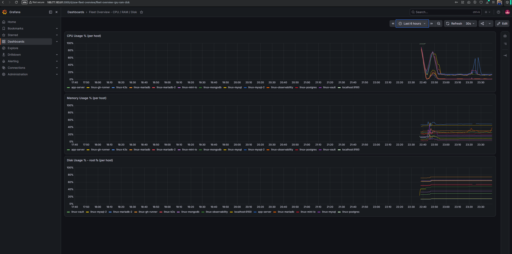
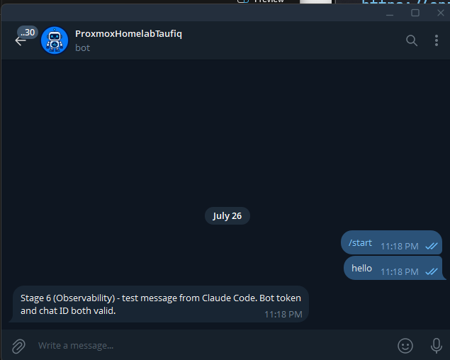
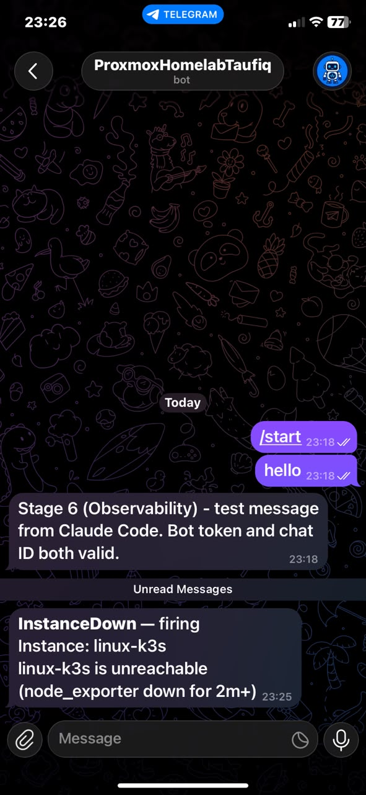
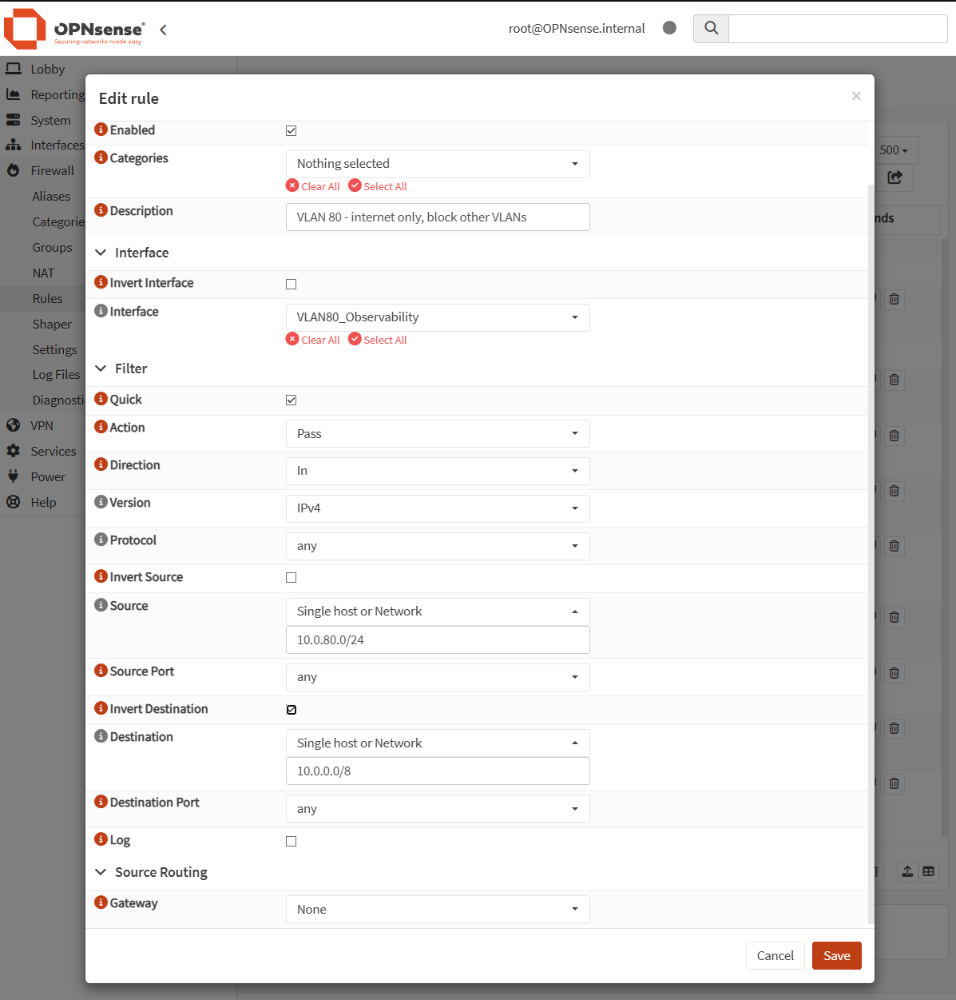
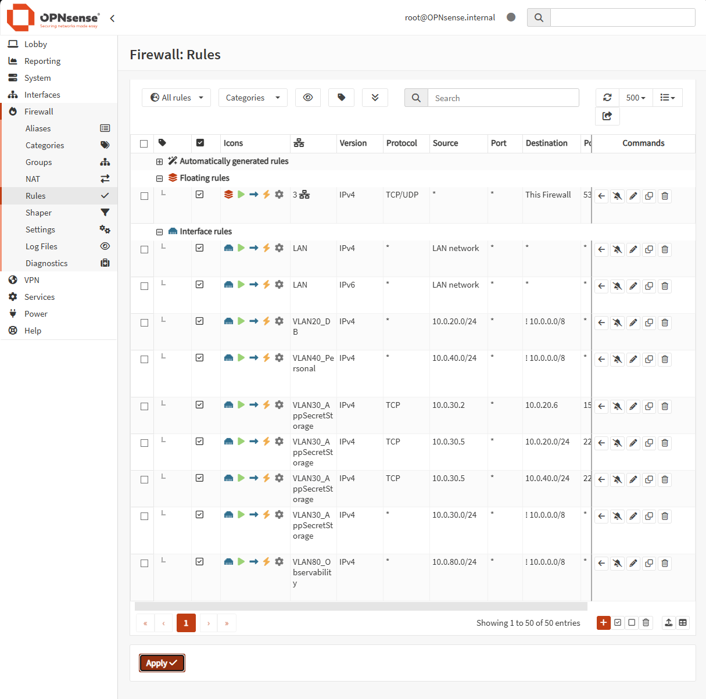
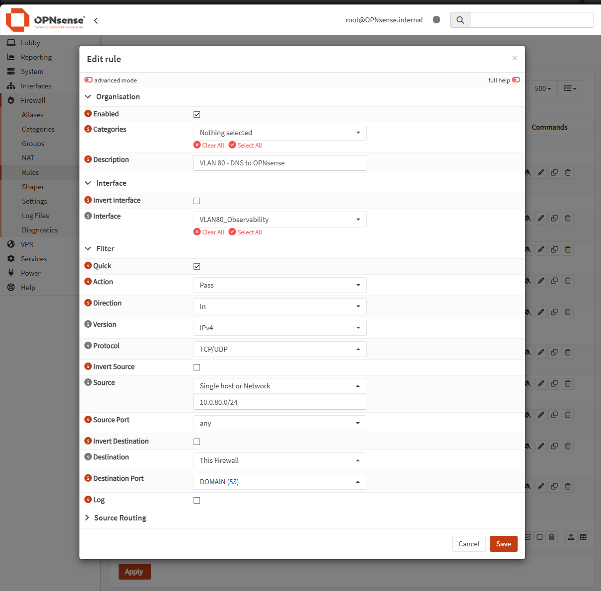

<!-- Not yet sequenced into a numbered docs/ folder, lives here in
     docs/19-devops-practice/ until the full devops-practice-plan.md is complete.
     Date below is provisional (the date this actually happened); revisit
     once final sequencing/dating is decided. -->

# Stage 6, Observability (Prometheus, Grafana, Loki, Alertmanager)

**Date:** 2026-07-26
**Repo the actual code/infra changes live in:** `Animal-Shelter-Workshop`
(`infrastructure/ansible/roles/node_exporter`, `roles/promtail`,
`playbooks/linux-observability.yml`, `playbooks/node-exporter-fleet.yml`,
`playbooks/promtail-fleet.yml`), this write-up lives in the homelab
meta-repo instead, alongside the devops practice plan it's a stage of
(`devops-practice-plan.md`, Stage 6's checklist, all 6 items).

## Why I built this

Every earlier stage produced something running, but "running" was only ever
confirmed by hand, `curl`, `kubectl get pods`, SSHing in and reading a log
file. There was no fleet-wide view of CPU/RAM/disk, no central place to search
logs across 12 different hosts, and no way to find out about a problem except
by looking for it. Stage 6's job is to close that gap: metrics, logs, and
alerting that watch the fleet even when nobody's looking, in the reserved
VLAN 80 the network segmentation plan set aside for exactly this.

## Flow

```
┌────────────────────────────────────┐
│  STAGE 6, OBSERVABILITY            │▏
└────────────────────────────────────┘▔▔

┌────────────────────────────────┐     done, VLAN 80 had no OPNsense
│ 0. VLAN 80 firewall rules        │▏    firewall rules yet (reserved,
└────────────────────────────────┘▔▔    never used), added them for real
              │
              ▼
┌────────────────────────────────┐     done, new LXC CT 114, VLAN 80,
│ 1. linux-observability CT        │▏    1 core/1.5GB, started small
└────────────────────────────────┘▔▔    like Stage 5's k3s CT
              │
              ▼
┌────────────────────────────────┐     done, new roles/node_exporter,
│ 2. node_exporter fleet-wide       │▏    all 12 live hosts, UFW-scoped
└────────────────────────────────┘▔▔    to tailscale0 only
              │
              ▼
┌────────────────────────────────┐     done, Prometheus scraping all
│ 3. Prometheus + Grafana           │▏    12 targets, Grafana dashboard
└────────────────────────────────┘▔▔    with CPU/RAM/disk per host
              │
              ▼
┌────────────────────────────────┐     done, new roles/promtail, Loki
│ 4. Promtail fleet-wide + Loki     │▏    on the CT, all 12 hosts shipping
└────────────────────────────────┘▔▔    journalctl output
              │
              ▼
┌────────────────────────────────┐     done, real CPU load test,
│ 5. Correlate metrics ↔ logs      │▏    marker log lines bracketed a
└────────────────────────────────┘▔▔    clean 100% CPU spike
              │
              ▼
┌────────────────────────────────┐     done, Alertmanager, Telegram
│ 6. Alertmanager → Telegram        │▏    receiver, InstanceDown +
└────────────────────────────────┘▔▔    HighDiskUsage rules
              │
              ▼
┌────────────────────────────────┐     done, stopped node_exporter on
│ 7. Real fire-drill test          │▏    linux-k3s, alert fired in ~2.5m,
└────────────────────────────────┘▔▔    diagnosed blind via Loki, resolved
```

## Prometheus vs. Grafana, they're stacked, not overlapping

Worth spelling out since both have a web UI and it's easy to assume they
compete: they don't, they're two different layers of the same stack.

- **Prometheus** (`:9090`, no login) is the collector + database. It
  scrapes `node_exporter` on all 12 hosts every 15s, stores the
  time-series data, and evaluates the alert rules, the thing that
  *knows the numbers*. Its own web UI is a debugging tool (raw PromQL,
  `/targets`, `/alerts`), not something you'd build a dashboard in.
- **Grafana** (`:3000`, `admin`/`qwertY@1612`) is the visualization layer.
  It collects nothing itself, it queries Prometheus and Loki as
  datasources and renders what comes back. This is where the actual
  `asw-fleet-overview` dashboard lives, and where Loki logs get browsed
  (Explore view) and correlated against the same graphs, the thing that
  *makes the numbers readable*.

If Prometheus went down, the data would be gone. If Grafana went down,
the data would still be queryable directly through Prometheus's own
`:9090` UI, just without the nice graphs. Day-to-day, Grafana is where
you'd actually look; Prometheus's UI only gets touched when debugging a
scrape or alert issue directly.



## What I built

### 0. VLAN 80 activation, the reserved VLAN finally got firewall rules

`plans/01-homelab-network-segmentation-execution-plan (executed).md` set VLAN 80
(`10.0.80.0/24`) aside for exactly this stage back in July, but it had never
actually been used, OPNsense had a NIC and Kea DHCP live on it (confirmed:
the new CT got a real lease, `10.0.80.100`/gw `10.0.80.1`), but **zero
firewall rules**, same "reserved but empty" state as VLANs 50/60/70. First
attempt at reaching the internet from the new CT hung indefinitely, not
slow, genuinely blocked, confirmed via `ping 10.0.80.1` itself failing
(100% loss) before even trying an external address.

Fixed with the same two-rule pattern every other active VLAN already uses
(`docs/18-network-segmentation/network-segmentation-execution.md`):

1. **Internet access, not other VLANs**, Pass, protocol any, source
   `10.0.80.0/24`, destination `10.0.0.0/8` with **Invert Destination**
   checked.
2. **DNS to OPNsense itself**, Pass, TCP/UDP, source `10.0.80.0/24`,
   destination `This Firewall`, port `53`. This is the specific gap that
   broke `linux-mysql`'s DNS the first time VLAN rules were written
   (bug #6 in the network segmentation doc), added proactively this time
   instead of rediscovering it.

Both added via the OPNsense web GUI (reached through an SSH tunnel,
`ssh -L 8443:10.0.10.1:443 proxmox`, since the GUI only lives on the
Management VLAN), confirmed correct against the spec, saved, and applied.
Re-tested from the CT immediately after: `ping 8.8.8.8` succeeded,
`getent hosts tailscale.com` resolved cleanly. See the network segmentation
doc's own new section for the full before/after and screenshots.

### 1. `linux-observability`, new CT, VLAN 80

New unprivileged LXC CT (`114`, `linux-observability`), 1 core / 1.5GB RAM /
512MB swap, started deliberately small, same reasoning as Stage 5's k3s CT
(host had only 174Mi free / 4.0Gi available at the start of this session, not
the plan's originally-scoped 2-3GB). `/dev/net/tun` passthrough for
Tailscale, same pattern as every other CT here. Joined Tailscale at
`100.77.185.81`.

Unlike the other hand-built CTs (`linux-vault`, `linux-gh-runner`, etc.),
this one was created via a raw `pct create` from the cached Ubuntu 24.04
template rather than Terraform cloud-init, meaning it started with **no
non-root SSH user at all**. Fixed to match the established convention: a
`linux-observability` user, sudo, the same shared SSH key
(`iphone-11-taufiq`) as every other host, added to `~/.ssh/config` and
`/etc/dnsmasq.conf` on `proxmox` (the DNS gap existed for `linux-k3s` too,
Stage 5 never added it, fixed both in the same pass, full restart of
`dnsmasq` since `reload` doesn't pick up new `address=` lines, per this
repo's own `docs/02-dns/dns-setup.md` §12b finding).

### 2. `node_exporter`, every live host in the fleet

New Ansible role, `roles/node_exporter`: installs the Ubuntu-packaged
`prometheus-node-exporter`, enables the service, and adds a UFW rule
restricting `:9100` to the `tailscale0` interface only, same
minimal-exposure pattern this repo already uses for SSH/Vault API. Applied
via a new `playbooks/node-exporter-fleet.yml` against a new `monitoring_targets`
inventory group (every host `app`/`databases`/`homelab_hosts` group, plus
the new `linux_k3s` and `linux_observability` groups), 12 hosts total:

`app-server`, `linux-mysql`, `linux-mysql-2`, `linux-mariadb`,
`linux-mariadb-2`, `linux-postgres`, `linux-vault`, `linux-gh-runner`,
`linux-mini-io`, `linux-mongodb`, `linux-k3s`, `linux-observability`.

Deliberately excluded: `opnsense` (FreeBSD, not Ansible-managed here) and
the Proxmox host itself (not a guest).

Ran from WSL against `inventory-ip.yml` (the IP-based inventory, not the
hostname one), this control node hits the same `app-server` bare-hostname/
MagicDNS ambiguity already documented in this repo, and `inventory-ip.yml`
exists specifically to route around it.

### 3. Prometheus + Grafana

Both installed on `linux-observability` via a new
`playbooks/linux-observability.yml`. Prometheus (Ubuntu universe package)
gets its `scrape_configs` fully rendered from a Jinja template
(`templates/prometheus.yml.j2`) that loops `groups['monitoring_targets']`,
add a host to the inventory group and it's scraped, no manual target list
to maintain. Grafana isn't in Ubuntu's own repos, added Grafana Labs' apt
repo (same signed-key pattern this repo already uses for HashiCorp's repo
in `roles/vault_agent`), which conveniently also carries Loki and Promtail.

Both services locked to `tailscale0` only via UFW (`:9090` Prometheus,
`:3000` Grafana), same pattern as everything else.

Grafana's admin password needed a manual `grafana-cli` reset after install,
the Ubuntu package's actual data directory is `/var/lib/grafana`
(`/etc/default/grafana-server`), not `grafana-cli`'s own default
`/usr/share/grafana/data`; the first attempt silently wrote to the wrong
SQLite file. Fixed by passing `--configOverrides
'cfg:default.paths.data=/var/lib/grafana'` explicitly.

Prometheus datasource + a fleet-wide dashboard (`asw-fleet-overview`,
CPU/RAM/disk panels, one series per host) added via Grafana's HTTP API.
Verified live: all 13 targets (12 hosts + Prometheus itself) `up`, real
CPU/RAM data flowing for every instance.

### 4. Promtail + Loki

Loki installed on `linux-observability` (filesystem storage, `tsdb` index,
168h retention) via the same Grafana apt repo, config rendered from
`templates/loki-config.yml.j2`. New `roles/promtail` applied fleet-wide
(same 12 hosts, new `playbooks/promtail-fleet.yml`): ships `journalctl`
output to Loki's push API over Tailscale, `promtail` user added to the
`systemd-journal` group for read access to `/var/log/journal`.

Both `roles/node_exporter` and `roles/promtail` hit the same snag on first
run: the Debian/Ubuntu `.deb` packages create their service users (`loki`,
`promtail`) with primary group `nogroup` (65534), not a same-named group,
`chgrp failed: failed to look up group loki` on the very first `template:`
task. Fixed by using `group: nogroup` instead of assuming a same-named
group exists.

Verified: `curl .../loki/api/v1/label/host/values` returns all 12 hostnames,
confirming every host is actually shipping logs, not just running the
service.

### 5. Correlating a metrics spike with logs

Real exercise, not simulated: on `linux-gh-runner`, logged a `STARTING CPU
load test` marker, launched a 90-second single-core `dd if=/dev/zero
of=/dev/null` loop, then logged an `ENDING` marker. Prometheus shows a
textbook spike, 11-25% baseline, jumps to a sustained 100% for ~75 seconds,
drops back to ~11-14%, and both marker log lines land in Loki exactly
bracketing that window (`STARTING` at the load's start, `ENDING` shortly
after it naturally timed out). Confirmed by querying both APIs directly for
the same time range and comparing timestamps, not just eyeballing a
dashboard.

### 6. Alertmanager → Telegram

Alertmanager (Ubuntu-packaged `prometheus-alertmanager`, v0.26, the version
that added native `telegram_configs` support, no separate webhook shim
needed) configured with a single Telegram receiver. Bot (`@FantazMonitorBot`)
and chat ID came from the user; both verified independently before wiring
in, `getMe` confirmed the token, and the first `sendMessage` attempt
correctly failed with `chat not found` until the user actually messaged the
bot once (a real Telegram requirement: a bot can't push to a chat that's
never messaged it first).

The bot token and chat ID are **not** in any committed file, patched into
the existing `secret/animal-shelter-workshop` Vault path (same one-time
admin-token pattern Stage 2 used for `mysql_root_password`), referenced in
the Ansible template as `{{ asw_secrets.telegram_bot_token }}` /
`{{ asw_secrets.telegram_chat_id }}`.

Two alert rules, `/etc/prometheus/rules/fleet.yml`:

```yaml
- alert: InstanceDown
  expr: up{job="node"} == 0
  for: 2m
  labels: { severity: critical }

- alert: HighDiskUsage
  expr: (1 - (node_filesystem_avail_bytes{mountpoint="/",fstype!="rootfs"}
        / node_filesystem_size_bytes{mountpoint="/",fstype!="rootfs"})) * 100 > 90
  for: 5m
  labels: { severity: warning }
```

### 7. Fire-drill test, real, not simulated

Stopped `prometheus-node-exporter` on `linux-k3s` for real
(`systemctl stop`), then watched it through the whole pipeline:

- Prometheus rule state: `inactive` → `pending` (at the 2-minute mark) →
  `firing`, exactly on schedule (`activeAt` 15:22:38, fired 15:24:38).
- Telegram message arrived, confirmed by the user, screenshot below.
- **Diagnosed blind**, using only Loki (not prior knowledge of what broke):
  queried `{host="linux-k3s"}` for the alert's time window and found the
  exact root cause in the journal,
  `linux-k3s : ... COMMAND=/usr/bin/systemctl stop prometheus-node-exporter`,
  followed by the service's own `Stopping`/`Deactivated successfully`/
  `Stopped` lines. This is real evidence the logs alone are enough to
  diagnose a fleet incident, not just a health check.
- Restarted the service, watched the alert clear on its own (Alertmanager
  polled clean within one more scrape+evaluation cycle), confirmed via
  `/api/v2/alerts` returning empty for `InstanceDown`, and a second,
  resolved Telegram message (`send_resolved: true`).

## Screenshots

The `asw-fleet-overview` dashboard itself is embedded above, in the
Prometheus vs. Grafana section.

**Telegram bot verification**, the test message, confirming the bot token
+ chat ID pairing worked before wiring it into Alertmanager:



**The real fire-drill alert**, as it arrived in Telegram, `InstanceDown`
firing for `linux-k3s`, timestamped 23:25, matching the drill's own
timeline exactly:



**VLAN 80's firewall rules being added in OPNsense** (see the network
segmentation doc's own VLAN 80 section for the full narrative):





**Not yet captured:** a screenshot of the Loki Explore view, straightforward
to grab next time the Grafana UI (`http://100.77.185.81:3000`,
Tailscale-only) is open in a browser.

## How to independently verify each item

```bash
# 0. VLAN 80 has internet + DNS
ssh proxmox "pct exec 114 -- bash -c 'ping -c2 8.8.8.8; getent hosts tailscale.com'"

# 1. linux-observability is up and on Tailscale
ssh linux-observability "hostname; tailscale status | grep observability"

# 2. node_exporter live on every fleet host
ssh linux-observability "for ip in 100.115.237.93 100.112.41.113 100.109.241.125; do curl -s -o /dev/null -w '%{http_code}\n' http://$ip:9100/metrics; done"

# 3. Prometheus scraping all targets, Grafana healthy
ssh linux-observability "curl -s http://localhost:9090/api/v1/targets | grep -o '\"health\":\"[a-z]*\"' | sort | uniq -c"
ssh linux-observability "curl -s http://localhost:3000/api/health"

# 4. Loki has logs from every host
ssh linux-observability "curl -s -G http://localhost:3100/loki/api/v1/label/host/values"

# 5. (historical, re-run the same load test to reproduce)

# 6. Alertmanager config + rules loaded
ssh linux-observability "curl -s http://localhost:9093/api/v2/status | grep -o 'receiver: [a-z]*'"
ssh linux-observability "curl -s http://localhost:9090/api/v1/rules | grep -o '\"name\":\"[A-Za-z]*\"'"

# 7. Fire-drill, repeatable
ssh linux-k3s "sudo systemctl stop prometheus-node-exporter"
# wait ~2.5 minutes, check Telegram + ssh linux-observability "curl -s http://localhost:9093/api/v2/alerts"
ssh linux-k3s "sudo systemctl start prometheus-node-exporter"
```

## What carries forward to Stage 7, and what doesn't

Stage 7 (GitOps/ArgoCD) installs into Stage 5's k3s cluster, not this
observability stack, no direct dependency either way. What Stage 6 *does*
leave behind for later: a place to actually watch what ArgoCD's automatic
syncs do to the cluster (the plan's own Stage 6 goal notes this
explicitly), and a working alert path if an ArgoCD-driven change ever
breaks something silently.

## Where things live

- **This CT:** `linux-observability`, Proxmox CT 114, VLAN 80
  (`10.0.80.0/24`), Tailscale `100.77.185.81`.
- **Ansible:** `Animal-Shelter-Workshop/infrastructure/ansible/`,
  `roles/node_exporter/`, `roles/promtail/`, `playbooks/linux-observability.yml`,
  `playbooks/node-exporter-fleet.yml`, `playbooks/promtail-fleet.yml`,
  `templates/prometheus.yml.j2`, `templates/loki-config.yml.j2`,
  `templates/promtail-config.yaml.j2`, `templates/alertmanager.yml.j2`,
  `files/prometheus-alert-rules.yml`.
- **Grafana:** `http://100.77.185.81:3000` (Tailscale-only), admin
  credentials, see Credentials section below.
- **Telegram bot:** `@FantazMonitorBot`, token/chat ID in Vault
  (`secret/animal-shelter-workshop`), not in git.

## Credentials created this session (not in git, keep track here)

- **Grafana admin password:** `qwertY@1612` (same shared password used
  elsewhere in this homelab, for consistency, reset via `grafana-cli`
  after install, since the Ubuntu package ships with no admin password
  set by default beyond `admin`/`admin`).
- **Telegram bot token + chat ID:** patched into
  `secret/animal-shelter-workshop`'s existing Vault KV path as
  `telegram_bot_token` / `telegram_chat_id`, alongside `mysql_root_password`.
  Not written to any file in either repo.

Stage 6's plan checklist is checked off in `plans/02-devops-practice-plan (executed).md`
(left uncommitted, per this repo's own convention).

**Next up per the plan:** Stage 7, GitOps (ArgoCD inside Stage 5's k3s
cluster).
