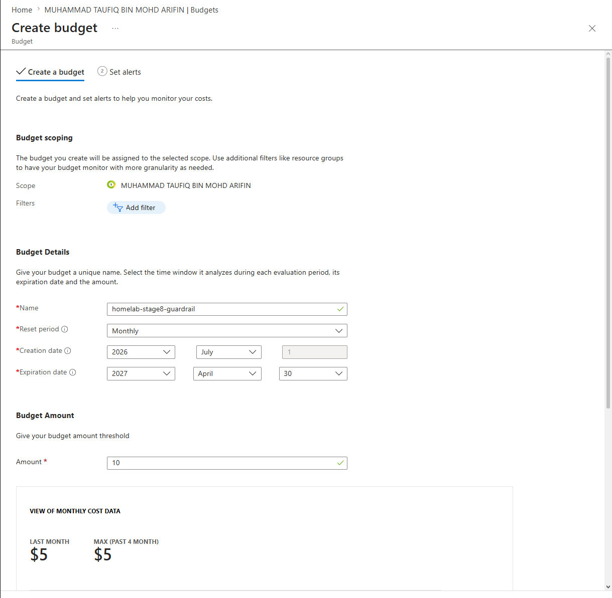
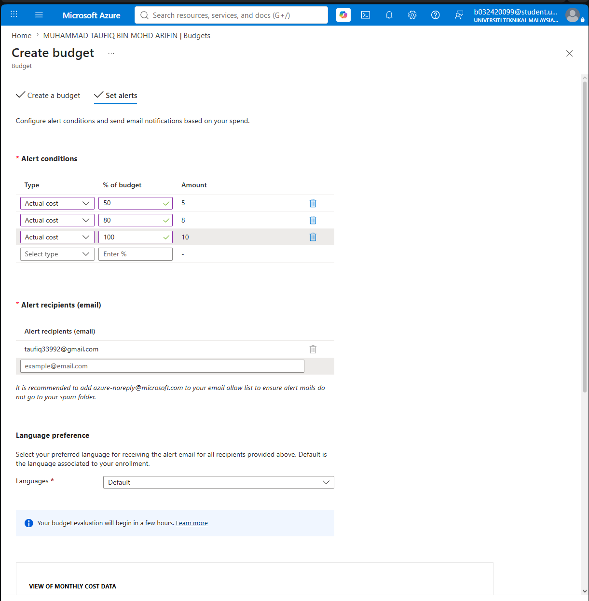
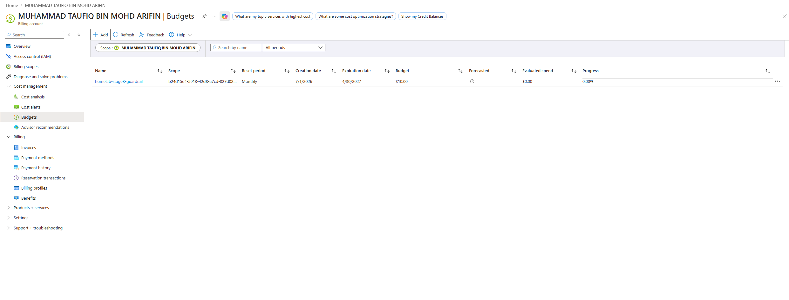
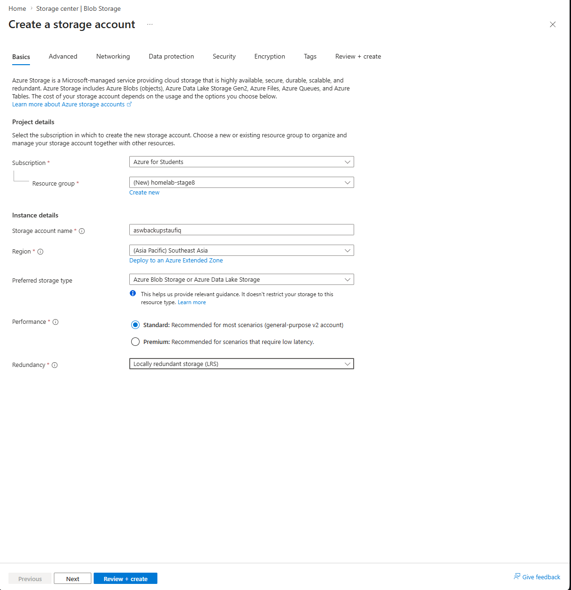
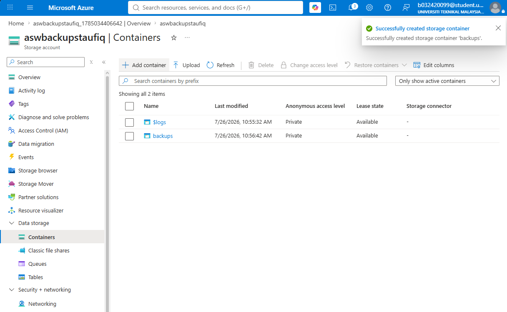
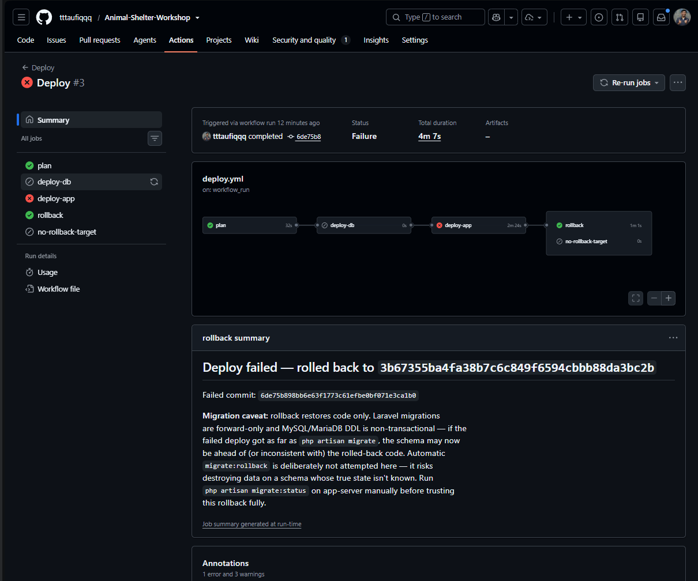
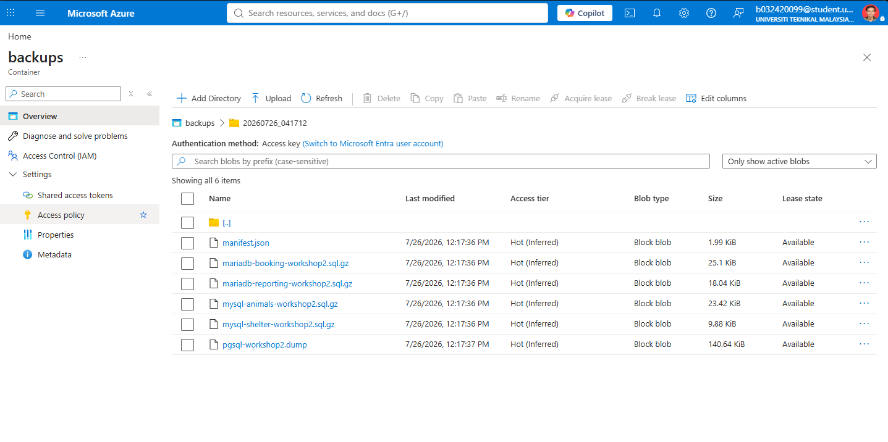

<!-- Not yet sequenced into a numbered docs/ folder, lives here in
     docs/19-devops-practice/ until the full devops-practice-plan.md is complete.
     Date below is provisional (the date this actually happened); revisit
     once final sequencing/dating is decided. -->

# Azure Cloud: Offsite Backup Sync + Budget Guardrail

**Date:** 2026-07-26
**Repo the actual code/infra changes live in:** `Animal-Shelter-Workshop`
(this write-up lives in the homelab meta-repo instead, alongside the devops
practice plan it's a stage of, see `devops-practice-plan.md`, Stage 8)

## Why I built this

- `Animal-Shelter-Workshop/docs/10-backups.md` already flagged the gap:
  nightly backups were centralized on `app-server`, but never left the
  Proxmox host.
- Losing that one VM would have taken the backups down with it, the exact
  "off-VM backup copies" item that doc's own restore-drill section listed
  as still open.
- Separately, an Azure for Students subscription was sitting there with
  $87.61 of $100 credit unused, expiring March 2027.
- Rather than let it lapse, it became the offsite target, genuine
  hybrid-cloud exposure instead of a second on-prem copy sitting on the
  same LAN.


## What I built

**Budget guardrail first, before touching anything billable.**
- $87.61 over ~8 months of runway works out to ~$10.95/month.
- Set up a monthly Azure Cost Management budget (`homelab-stage8-guardrail`,
  $10, expiring 4/30/2027 to match the credit) with alerts at 50/80/100% of
  spend, emailing an address actually checked.
- Did this first, not as an afterthought: nothing else below draws more
  than pennies against it, but a stretch-goal VM later in the same plan
  (Terraform → Azure) very much could if left running.





**Storage:**
- One Storage Account (`aswbackupstaufiq`, Standard/LRS, its own
  `homelab-stage8` resource group) with a private `backups` Blob container.
- Scoped access to a **container-scoped SAS token**, Read/Write/List/Create
  only, no Delete, so a leaked token still can't destroy offsite copies,
  rather than the full account key.
- Left public network access enabled (from all networks): `app-server`
  reaches Azure over the public internet, not from inside an Azure VNet,
  and pinning to a home IP would break the sync the next time the ISP
  rotates it.
- The actual access control being relied on is the scoped credential, not
  the network boundary.





**Reused the existing credential-delivery pipeline instead of adding a new
one.**
- `secret/animal-shelter-workshop` in Vault already held 14 fields (DB
  password, `APP_KEY`, Cloudinary, mail, ToyyibPay), and the `asw-deploy`
  AppRole already had read access to exactly that path.
- Added two more fields, `azure_backup_sas_token`,
  `azure_backup_container_url`, to the same secret rather than standing up
  a new AppRole/policy.
- Added two more entries to `env-app.j2` and `vault-agent.hcl.j2` (both in
  `Animal-Shelter-Workshop`), alongside Cloudinary/mail.
- No new Vault plumbing, just two more lines in a pattern that already
  existed.

**Put the sync inside the existing backup command, not beside it.**
- Wrote `App\Services\Backup\AzureBackupSync` (`Animal-Shelter-Workshop`)
  to upload over the Blob REST API directly (a SAS token already grants
  everything a plain HTTP `PUT` needs, no SDK dependency).
- Called it from `BackupDatabases::handle()` right after the manifest is
  written, wrapped so a sync failure is logged and never fails the backup
  command itself or blocks retention pruning, the local backup is already
  valid regardless of whether the offsite copy succeeds.
- Didn't need a new schedule entry: this rides inside the
  already-scheduled `db:backup` (`Animal-Shelter-Workshop/routes/console.php`,
  `dailyAt('02:00')`).

## Architecture

```
                                    Vault (secret/animal-shelter-workshop)
                                    azure_backup_sas_token
                                    azure_backup_container_url
                                              │
                                    Vault Agent (scheduler config)
                                              │ injects into env
                                              ▼
  02:00 nightly ──▶ Laravel scheduler ──▶ php artisan db:backup
                                              │
                            ┌─────────────────┼─────────────────┐
                            ▼                 ▼                 ▼
                    dump 5 databases   write manifest.json   AzureBackupSync
                    (existing, see     (existing)            .sync(), NEW
                    ASW's docs/10-
                    backups.md)
                                                                   │
                                                                   ▼
                                              Azure Blob container "backups"
                                              (aswbackupstaufiq), one folder
                                              per run-id, independent of the
                                              Proxmox host entirely
```

## What broke, how I found it, how I recovered

- Two real, pre-existing bugs surfaced while getting this working, neither
  caused by the new code.
- Both worth recording because they'd have kept biting silently otherwise.

### 1. The CD pipeline's own smoke test could fail a healthy deploy

**What broke:**
- The first deploy of this feature (`Deploy #3`, commit `6de75b8`) failed
  its "Smoke test, app health" step and auto-rolled back to the previous
  commit.
- Nothing about the new code touched that check.

**How I found it:**
- Pulled the failing step's own printed output straight from the run's
  log instead of guessing.
- It showed `Database status: 5/5 online` immediately followed by:
```
line 6: echo: write error: Broken pipe
```
- The script was `echo "$OUTPUT" | grep -q '5/5 online'`.
- `grep -q` exits the instant it finds a match, before `echo` finishes
  writing the rest of the (long) migration listing.
- Under `set -euo pipefail`, `echo`'s resulting `SIGPIPE` fails the whole
  step, even though the health check had already found exactly what it
  was looking for.
- Reproduced the identical command by hand on `app-server` right
  afterward and confirmed the health check itself was fine; the pipe was
  the only thing broken.



**How I recovered:**
- Replaced both occurrences (the deploy smoke test and the rollback smoke
  test, in `Animal-Shelter-Workshop/.github/workflows/deploy.yml`) with a
  pure bash substring match, `[[ "$OUTPUT" == *"5/5 online"* ]]`, no
  subprocess, no pipe, no race.
- Verified it by pushing again: `Deploy #4`, commit `b55b624`, succeeded
  cleanly, no rollback.


### 2. A grant fix I'd already made had silently reverted

**What broke:**
- When manually testing the actual backup command, it aborted immediately:
```
mysqldump: workshop_2_prod has insufficient privileges to SHOW CREATE PROCEDURE `sp_image_create`!
```

**How I found it:**
- `Animal-Shelter-Workshop/docs/10-backups.md` already documented this
  exact class of problem, fixed once during the 2026-07-20 restore drill:
  the routine-viewing grant MySQL 8 needs (`SHOW_ROUTINE`) and MariaDB
  needs (`SELECT ON mysql.proc`) so `mysqldump --routines` can read a
  routine's body when the connecting user isn't its `DEFINER` (every
  routine is still `DEFINER=workshop_2`, the pre-split shared credential).
- Checked `SHOW GRANTS` directly on all 4 MySQL/MariaDB hosts and
  confirmed the grant was **missing everywhere**, despite the doc
  recording it as fixed five days earlier.
- Also checked the `SECURITY_TYPE` fix from the separate `DEFINER`-outage
  incident, and that was still correctly in place (`INVOKER` on every
  routine).
- This was a different, narrower gap: the grant that lets `mysqldump`
  *view* a routine at all, not the one that controls *executing* it.
- Traced the root cause: `community.mysql.mysql_user`'s default
  `append_privs: false` revokes any grant not listed in its `priv` string
  on every run.
- The 2026-07-20 fix had been applied by hand, outside Ansible's managed
  state entirely.
- The next ordinary re-provisioning run silently reverted every one of the
  4 accounts back to just `ALL PRIVILEGES ON workshop_2_prod.*`, with no
  error, no log, nothing to notice until a backup tried to run.

**How I recovered:**
- Re-applied the grant on all 4 hosts immediately to unblock testing.
- Fixed it properly: folded the extra grant into the *same* managed
  `priv` string in all 4 playbooks
  (`Animal-Shelter-Workshop/infrastructure/ansible/playbooks/linux-mysql{,-2}.yml`/
  `linux-mariadb{,-2}.yml`) rather than a separate task, since a separate
  `mysql_user` task with a narrower `priv` would just flip-flop against
  this one on alternating runs.
- Verified it live: ran `site.yml` against all 4 real hosts twice.
- Both runs reported `changed=0`, confirming the grant now survives
  re-provisioning instead of silently reverting again.

## Verification

- Ran a real, manual `php artisan db:backup` (`20260726_041712`) that
  completed successfully post-fix: all 5 dumps, a clean logical
  foreign-key audit, `Synced to Azure Blob Storage.` printed.
- Confirmed it independently two ways: a direct Blob List Containers API
  call, and the Azure portal.
- Confirmed all 6 files (`manifest.json` + 5 dumps) actually exist in
  `backups/20260726_041712/`.



## Where things live

| Piece | Path (all in `Animal-Shelter-Workshop` unless noted) |
|---|---|
| Azure config | `config/azure_backup.php` |
| Upload logic | `app/Services/Backup/AzureBackupSync.php` |
| Wired into the backup command | `app/Console/Commands/BackupDatabases.php` |
| Vault Agent injection (scheduler, php-fpm, etc.) | `infrastructure/ansible/templates/vault-agent.hcl.j2` |
| Plaintext-fallback env rendering | `infrastructure/ansible/templates/env-app.j2` |
| CD pipeline smoke-test fix | `.github/workflows/deploy.yml` |
| Routine-grant fix (all 4 DB playbooks) | `infrastructure/ansible/playbooks/linux-{mysql,mysql-2,mariadb,mariadb-2}.yml` |
| Vault secret (2 new fields on the existing path) | `secret/animal-shelter-workshop` (`azure_backup_sas_token`, `azure_backup_container_url`) |
| Azure resources | Resource group `homelab-stage8`; Storage Account `aswbackupstaufiq`; container `backups`; budget `homelab-stage8-guardrail` |
| This write-up | `proxmox-homelab-taufiq/docs/19-devops-practice/08-azure-cloud-backup-sync.md` (homelab meta-repo) |
