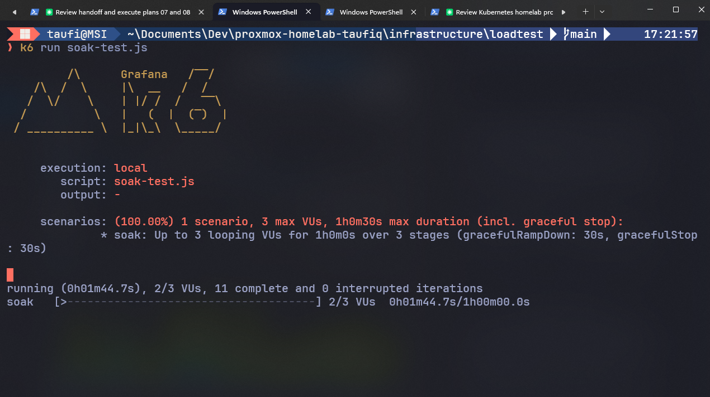
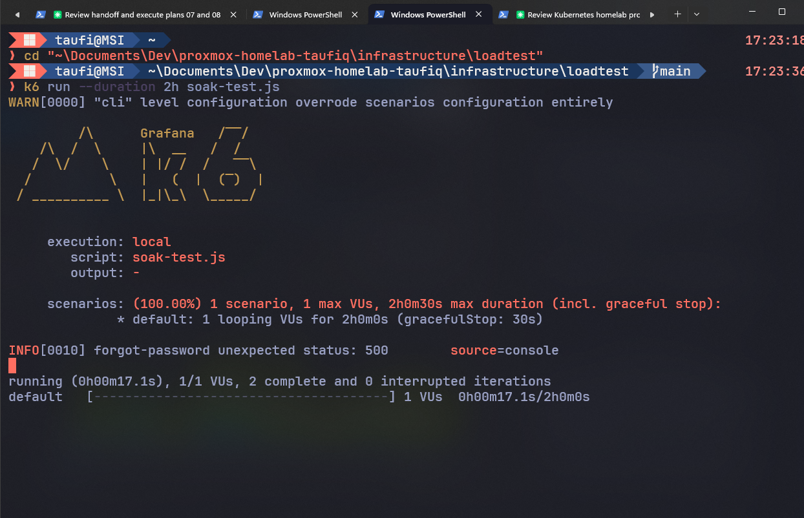
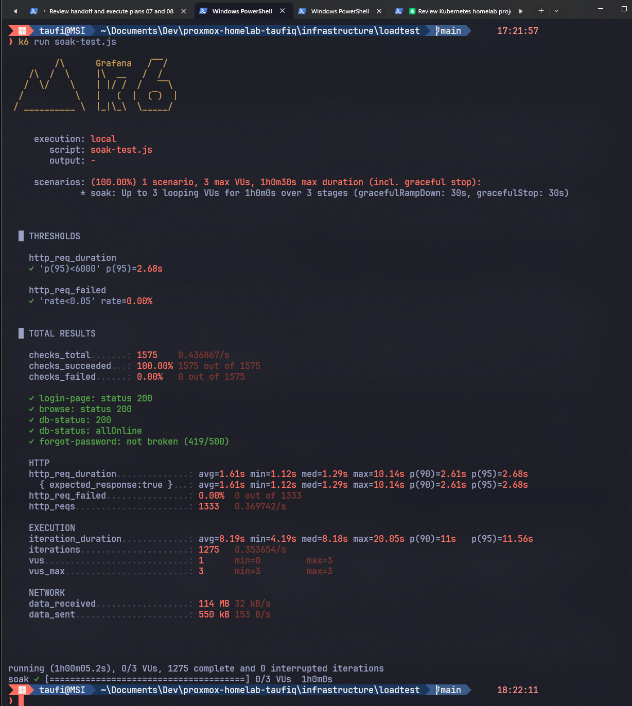
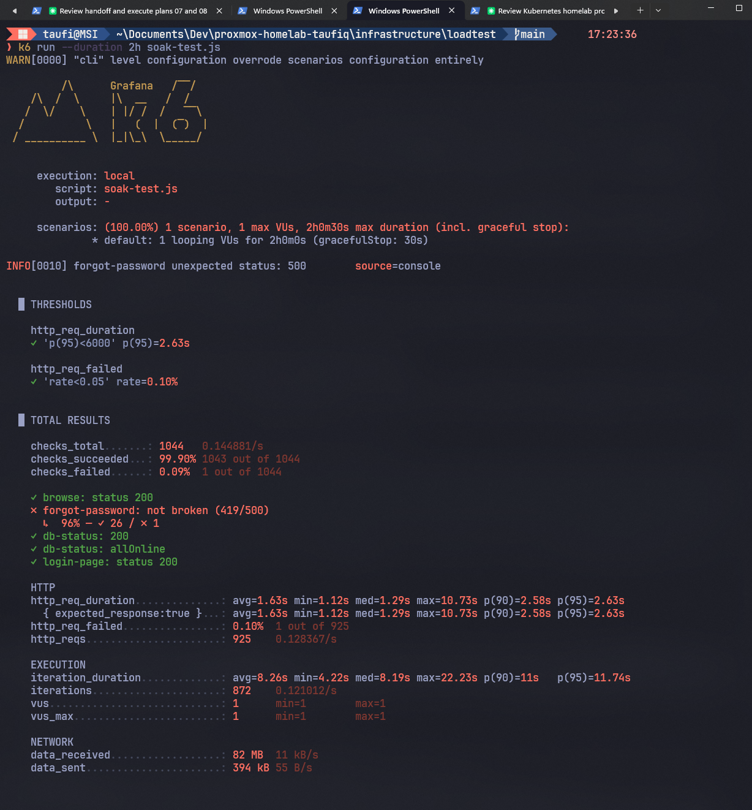
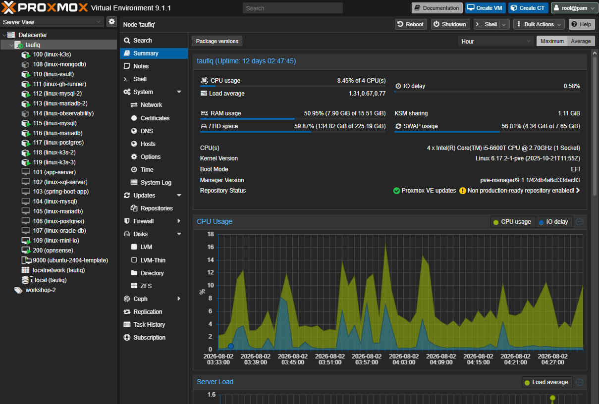

# k3s Production Cutover: a 3rd Node, the Rest of the Secrets, and a Real Soak Test

**Date:** 2026-08-02
**Plan:** `plans/07-k3s-production-cutover-plan.md`

## Why I built this

- Plan 06 got k3s to a genuine 2-node, GitOps-automated cluster, but left
  two things deliberately open: where ArgoCD should live once real
  traffic existed, and whether the app pods were actually wired up with
  everything they'd need for real production use, not just DB passwords.
- This plan closes both gaps, then proves the result under sustained
  synthetic load before treating the cutover as done.

## Stage 1 — a 3rd node, dedicated to ArgoCD

- Plan 06 left ArgoCD unpinned, sitting on node 1 (`linux-k3s`) purely by
  scheduling accident — the same node running the k3s control-plane
  process *and* all 3 `asw-app` replicas.
- Pinning ArgoCD to node 1 (the original idea) would've just formalized
  the contention, not fixed it.
- New node instead: `linux-k3s-3` (CT 119), same "start small" sizing as
  CT 118 — 1 core/2GB/8GB disk, plain `k3s agent` role, same
  `KubeletInUserNamespace` feature-gate fix nodes 1 and 2 both needed.

**What broke:**

- The Terraform provider can't set LXC feature flags other than
  `nesting` on create (same restriction CT 118 hit) — TUN device
  passthrough (`lxc.mount.entry`/`lxc.cgroup2.devices.allow`, needed for
  Tailscale) and `keyctl` both had to be added post-creation via direct
  `.conf` edits on the Proxmox host.
- `terraform plan` surfaced *unrelated* pre-existing drift: the live
  config already had `linux_k3s`'s `started` set to `false` and
  `linux_observability`'s to `true`, backwards from their real running
  state. A plain `terraform apply` would have powered off the running
  control-plane node and powered on a VM that was deliberately stopped.
- Fixed with `terraform apply -target` to touch only the new resource —
  the drift is still there, untouched, not this plan's problem.

**Pinning ArgoCD:**

- ArgoCD itself was installed imperatively (`kubectl apply` of upstream
  `install.yaml`, see doc 07), not through the GitOps loop it manages —
  so pinning it used the same imperative channel it was installed
  through:

```
kubectl patch deployment <each of 7 argocd components> -n argocd \
  --type=merge -p '{"spec":{"template":{"spec":{"nodeSelector":{"kubernetes.io/hostname":"linux-k3s-3"}}}}}'
```

- Confirmed fully rescheduled off node 1, all 7 pods `Running` on node 3.

```
┌─────────────────────────────────────────────────────────────────────────┐
│                     K3S CLUSTER — 3-NODE LAYOUT                          │▏
└─────────────────────────────────────────────────────────────────────────┘▔▔

┌───────────────────────────┐  ┌───────────────────────────┐  ┌───────────────────────────┐
│ NODE 1: linux-k3s (CT 100) │▏ │ NODE 2: linux-k3s-2 (CT118)│▏ │ NODE 3: linux-k3s-3 (CT119)│▏
│ control-plane               │▏ │ agent — public edge         │▏ │ agent — cluster tooling     │▏
├───────────────────────────┤▔▔ ├───────────────────────────┤▔▔ ├───────────────────────────┤▔▔
│ k3s server process          │▏ │ asw-nginx ×3                │▏ │ argocd (7 pods)             │▏
│ asw-app ×3 (backend)        │▏ │ cloudflared                 │▏ │                              │▏
│ asw-redis ×1 (see Stage 3) │▏ │  (public ingress)           │▏ │                              │▏
│ vault-agent-injector        │▏ │                              │▏ │                              │▏
│ kube-system core             │▏ │                              │▏ │                              │▏
└───────────────────────────┘▔▔ └───────────────────────────┘▔▔ └───────────────────────────┘▔▔
```

## Stage 2 — the rest of `asw_secrets`, not just DB passwords

- `k8s/app-secret.yaml` only ever held a dummy `APP_KEY`;
  `k8s/app-configmap.yaml` had no Cloudinary, mail, ToyyibPay, or
  Azure-backup config at all.
- Real consequences of leaving this alone: uploads would break (no
  Cloudinary), password reset would silently fall back to Laravel's
  `log` mailer instead of sending (no SMTP), `TOYYIBPAY_BASE_URL` unset
  defaults to the **live** payment gateway (not the sandbox), and
  offsite backup sync would silently stop.
- Extended the existing Vault Agent Injector template — one Vault read
  already returns every `asw_secrets` field, so this was more `export`
  lines in the same file, not a new Vault policy:

```
export CLOUDINARY_URL="{{ .Data.data.cloudinary_url }}"
export CLOUDINARY_CLOUD_NAME="{{ .Data.data.cloudinary_cloud_name }}"
export CLOUDINARY_API_KEY="{{ .Data.data.cloudinary_api_key }}"
export CLOUDINARY_API_SECRET="{{ .Data.data.cloudinary_api_secret }}"
export TOYYIBPAY_KEY="{{ .Data.data.toyyibpay_key }}"
export TOYYIBPAY_CATEGORY="{{ .Data.data.toyyibpay_category }}"
export MAIL_PASSWORD="{{ .Data.data.mail_password }}"
export AZURE_BACKUP_SAS_TOKEN="{{ .Data.data.azure_backup_sas_token }}"
export AZURE_BACKUP_CONTAINER_URL="{{ .Data.data.azure_backup_container_url }}"
```

- `TOYYIBPAY_BASE_URL` pinned explicitly to the sandbox in the ConfigMap
  — this one isn't secret, but its Laravel default
  (`config/toyyibpay.php`) is the live gateway, so leaving it unset would
  have been the dangerous choice, not the safe one.

## Stage 3 — verifying the real thing found two real bugs

- `/api/database-status` returning `5/5` is necessary but not
  sufficient. Actually exercising the app live caught something Stage
  2's own config review never would have.

**Bug 1 — sessions weren't actually shared:**

- `asw-app` runs 3 stateless replicas behind a Service with
  `sessionAffinity: None`, but `SESSION_DRIVER` was `file` — local disk
  per pod.
- A user's GET (CSRF token written to pod A's disk) and their following
  POST (validated against pod B's disk) could land on different pods.
- Confirmed live against the production domain: 5 real password-reset
  submissions, only 2 succeeded (302), 3 failed with 419 Page Expired —
  a ~2/3 real-world failure rate on *every* form submission, not just
  this one flow.
- Fixed by adding Redis as a shared session/cache store — a new
  lightweight in-cluster pod (`k8s/redis-deployment.yaml`), no new
  LXC/VM — and switching `SESSION_DRIVER`/`CACHE_STORE` to `redis`.

**Bug 2 — the Redis fix immediately surfaced a second bug:**

- `config/session.php` defaults `SESSION_CONNECTION` to `'users'` — a
  leftover from the database-session driver's own default, matching
  `DB_CONNECTION`'s name — instead of `'default'`.
- With the redis driver that resolves to a nonexistent Redis connection,
  and every single request started 500ing:

```
production.ERROR: Redis connection [users] not configured.
```

- Fixed by pinning `SESSION_CONNECTION: "default"` explicitly.
- After both fixes: 8/8 repeated password-reset submissions succeeded,
  and `storage/logs/laravel.log` stayed empty across all 3 pods
  afterward (no SMTP auth failure — `MAIL_PASSWORD` from Vault genuinely
  works).

**A gotcha worth remembering:**

- Checking whether a Vault-injected value actually reached the running
  process is *not* as simple as `kubectl exec ... env` or reading
  `/proc/1/environ` — a fresh `kubectl exec` process doesn't inherit
  whatever PID 1's own shell sourced from `/vault/secrets/db.env` at
  startup, and php-fpm overwrites the memory region `/proc/1/environ`
  lives in with its own process title (a common daemon trick), so that
  file reads back as garbage.
- The only reliable way to check:
  `kubectl exec ... -- sh -c '. /vault/secrets/db.env && php whatever.php'`,
  replicating the exact sourcing PID 1 did.

## Stage 3, continued — simulating traffic that doesn't exist yet

- Nobody had actually hit this deployment — no real users, so no organic
  evidence the app held up under sustained concurrent use.
- Built a `k6` script (`infrastructure/loadtest/soak-test.js`, this
  repo) to manufacture "close to real" traffic from a laptop instead:
  low concurrency (3 virtual users, ramping), think-time between actions
  (3-10s, not back-to-back), weighted toward realistic browsing (55%
  browse public pages, 23% DB status check, 19% view login page, 3%
  forgot-password).
- Deliberately light — `linux-k3s` is a single-core CT already running
  the control plane and 3 app replicas; the goal was realistic load, not
  a self-inflicted DoS.

**What broke, twice, running it:**

1. Running **two instances at once** with the original script (a single
   hardcoded test email) exposed a real race: Laravel's password-reset
   token repository does delete-then-insert without a transaction, so
   two concurrent requests for the *same* email both raced past the
   delete and both tried to insert, and Postgres correctly rejected the
   second with a `23505` unique-violation, surfacing as a `500`. Not a
   reason to worry (two real distinct users would use different
   emails), but a genuine minor bug in the app's own token repository
   worth knowing about. Fixed the test script to pick from 5 real emails
   instead of one.
2. Passing `--duration 2h` on the CLI **silently overrode the script's
   own `scenarios` block entirely** (a `WARN`, easy to miss) — instead
   of the intended 3-VU ramp, it fell back to k6's bare default (1 VU,
   no ramp). To change the soak duration, edit the `stages` array
   inside the script directly, don't pass execution flags on the
   command line alongside a scenarios-based script.





**Results:**

- Full 1-hour run (3 VUs ramping 0→3→0): 1575/1575 checks passed
  (100%), 1333 HTTP requests, p95 latency 2.68s, `http_req_failed` 0.00%
  — clean.



- The other window's 2-hour run (1 VU, the `--duration` override above):
  1043/1044 checks passed (99.90%), 925 HTTP requests, p95 latency
  2.63s, `http_req_failed` 0.10% (1 out of 925) — the single failure was
  exactly the known email-collision race from Bug 1 above, not a new
  issue.
- Both runs combined: ~3 hours of continuous synthetic traffic against
  the live production domain, only one non-2xx response the whole time,
  and it was already understood before it happened.



## Stage 5 — already done

- The original plan called for powering off `app-server` (VM 101, the
  rollback safety net) as its own final stage, once soak testing gave
  enough confidence.
- In practice this got pulled forward to the *end of plan 06* instead,
  at the time `deploy.yml`'s `app-server`-targeting jobs were removed —
  `qm stop` (not destroy), confirmed the public domain still returned
  200 with it off.
- By the time this plan's own soak testing happened, Stage 5 was
  already true, not pending.

## What this proxmox host looked like mid-soak

- For reference — the whole 3-node k3s cluster (plus the rest of the
  15-host fleet) fits comfortably on one physical box.



## How to independently verify each item

| # | Command | Expected |
|---|---------|----------|
| 1 | `kubectl get nodes` | 3 `Ready` nodes |
| 1 | `kubectl get pods -n argocd -o wide` | all 7 pods on `linux-k3s-3` only |
| 2 | `kubectl exec deploy/asw-app -c app -- cat /vault/secrets/db.env` | every `asw_secrets` field, real values |
| 3 | `curl .../api/database-status` | `"allOnline":true` |
| 3 | 8 repeated live password-reset submissions | all succeed, no 419/500 |
| 3 | k6 soak run | 100% (or near-100%) check pass rate, `http_req_failed` under the 5% threshold, p95 under 6s |
| 5 | `qm list` | `app-server` (101) `stopped`, not destroyed |

## What's still open

- A real Cloudinary upload and a real ToyyibPay sandbox payment through
  the actual browser UI weren't scripted end-to-end (would need a real
  login session) — config resolution is confirmed correct
  (`config("filesystems.disks.cloudinary.url")`/`config("toyyibpay.key")`
  both resolve to real Vault-sourced values inside the running pod), but
  a manual click-through of those two flows is still worth doing.
- The password-reset-token race condition (Bug 1 above) is real but low
  severity — only fires if two requests for the *same* email land
  within milliseconds of each other. Not fixed in the app itself yet,
  just documented.
- Pre-deploy DB backup step still has no home (open since plan 06 —
  used to run from `app-server`, removed along with its deploy jobs).

## Where things live

- **Terraform for `linux-k3s-3`:**
  `infrastructure/terraform/homelab-infra.tf` (this repo).
- **The Vault Agent Injector template + Redis Deployment + session-fix
  ConfigMap changes:** `Animal-Shelter-Workshop`'s `k8s/deployment.yaml`,
  `k8s/redis-deployment.yaml`, `k8s/app-configmap.yaml`.
- **The soak-test script:** `infrastructure/loadtest/soak-test.js` (this
  repo).
- **This write-up + all screenshots:** this doc,
  `docs/19-devops-practice/images/plan07-*.png`.
