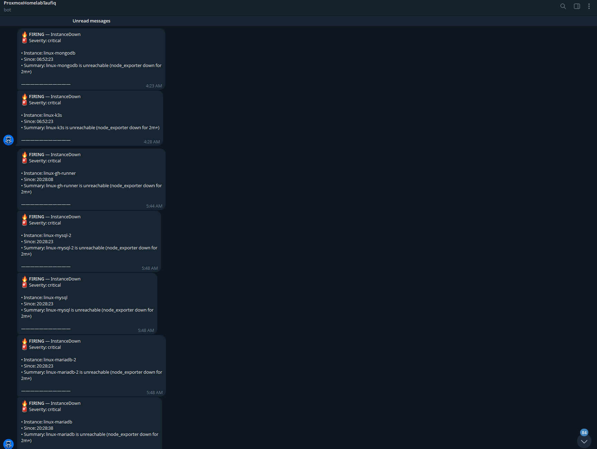

# Bringing k3s Into Fleet-Wide Monitoring (Not a Second Monitoring Stack)

**Date:** 2026-08-02

## Why I built this

- Once the app started running inside k3s for real (docs 04, 13), its
  logs lived nowhere but each pod's own ephemeral container filesystem —
  `storage/logs/laravel.log`, gone the moment a pod restarts, and only
  reachable one pod at a time via `kubectl exec`.
- No history, no easy UI, and no metrics view of how the 3 k3s nodes
  themselves were doing under load.
- The fleet already solved exactly this problem once, for the other 12
  hosts — Prometheus, Grafana, Loki, and Alertmanager, all running on
  `linux-observability` (CT 114), built in Stage 6 (doc 06).
- The obvious next step was extending that, not building a second
  monitoring stack.

## Why reuse CT 114 instead of a fresh in-cluster stack

- The instinct was to put Grafana/Loki on the new 3rd k3s node
  (`linux-k3s-3`, already hosting ArgoCD, doc 13's Stage 1) — but that's
  actually the wrong call.
- Monitoring infrastructure should generally live outside the system it
  monitors: if Loki/Grafana only ran inside the k3s cluster and the
  cluster itself had a bad day (a node down, a network partition), the
  dashboards and logs needed to diagnose it would go down at exactly the
  moment they're needed most.
- CT 114, sitting outside the cluster entirely, doesn't have that
  failure mode — it can show what happened *even if k3s is unhealthy*.
- The only thing that actually needs to run near the logs is the
  **collector** (a Kubernetes-aware Promtail/Alloy) — because it needs
  filesystem/API access to where logs live. Everything downstream of
  that (storage, querying, the UI) stays on CT 114, reused as-is.
- No new Loki, no new Grafana, no duplicate stack to maintain.

## What got built

- **CT 114 was off** (deliberately, since an earlier session — no real
  users, no reason to keep 15 hosts running when only some are needed).
  Powered back on:

```
pct start 114
```

- All 4 services (`prometheus`, `grafana-server`, `loki`,
  `prometheus-alertmanager`) came back up cleanly on their own — nothing
  had actually broken, it had just been off.
- **The 3 k3s hosts joined the existing fleet monitoring**, same pattern
  as the other 12 — added to `infrastructure/ansible/inventory.yml` /
  `inventory-ip.yml` (`Animal-Shelter-Workshop` repo) under new
  `linux_k3s_2`/`linux_k3s_3` groups (host 1, `linux-k3s`, was already
  there from Stage 6, just never actually had `node_exporter` running —
  found and fixed as part of this), then the existing fleet-wide roles
  ran against all 3:

```
ansible-playbook -i inventory-ip.yml playbooks/node-exporter-fleet.yml --limit linux_k3s,linux_k3s_2,linux_k3s_3
ansible-playbook -i inventory-ip.yml playbooks/promtail-fleet.yml --limit linux_k3s,linux_k3s_2,linux_k3s_3
ansible-playbook -i inventory-ip.yml playbooks/linux-observability.yml   # re-render prometheus.yml with the 3 new targets
```

**What broke along the way:**

- CTs 118/119 had no automation-accessible user at all. Unlike
  `linux-k3s` (CT 100), which was set up by hand early on with a
  matching named Linux user, CTs 118/119 were pure Terraform/cloud-init
  creations — only `root`, no authorized keys, no automation identity.
  Had to `pct exec` in directly from the Proxmox host (no network SSH
  needed for this step) to add the same deploy key (`secret/asw-cd` →
  `ssh_private_key` in Vault) used everywhere else.
- CT 119 had Tailscale SSH enabled (`tailscale up --ssh`, from when it
  first joined the tailnet in doc 13) — which intercepts port 22 with
  its *own* approval flow, separate from regular OpenSSH key auth. A
  brand-new Tailscale identity (this session ran Ansible from WSL,
  which has its own separate Tailscale identity from the Windows host)
  hit Tailscale SSH's "additional check" and just hung waiting for a
  browser approval that would never come. Fixed with
  `tailscale set --ssh=false --accept-risk=lose-ssh` — back to plain
  OpenSSH, which the deploy key already worked with.
- `linux-observability.yml`'s Alertmanager task failed (a Vault AppRole
  lookup needing `VAULT_ROLE_ID`/`VAULT_SECRET_ID`, not just the SSH
  become-password this run had) — unrelated to what was actually needed
  here (Prometheus's scrape config), but it meant the play died *before*
  flushing its `Restart prometheus` handler. Config file had the 3 new
  targets; the running process didn't, until it got a manual
  `systemctl restart prometheus`. A reminder that Ansible handlers only
  fire if the play reaches its flush point — a later unrelated task
  failing can silently strand an already-rendered config.

- Confirmed working: all 3 k3s hosts show `"health":"up"` in
  Prometheus's own targets API, and all 3 show up in Loki's `host` label
  values — metrics and (host-level) logs both flowing.

## Pod-level logs — closing the gap left above

- Host-level `journalctl` output (above) never covered what pods
  actually print — `asw-app`, `asw-nginx`, ArgoCD, none of it.
- Laravel's own application log wasn't even reaching that far: it
  defaulted to `storage/logs/laravel.log`, a file inside each pod's own
  ephemeral container layer, invisible to `kubectl logs` and to any log
  collector without an app-side change first.

**Two things closed this:**

1. `LOG_STACK: stderr` (`k8s/app-configmap.yaml`) — the `stack`
   channel's own default (`LOG_STACK=single`, unset) writes to a file;
   pointing it at `stderr` instead means Laravel's logs land in the
   container's normal stdout/stderr stream, the same place `kubectl
   logs` already reads from, no file to lose on pod restart.
2. A Kubernetes-aware collector.

**First attempt — Promtail, abandoned:**

- Same tool as the host-level setup above, `kubernetes_sd_configs`,
  `role: pod`.
- Deployed cleanly, RBAC checked out, but its service discovery
  reported **zero** targets — not filtered to zero, genuinely zero at
  the raw discovery level, with no errors even at debug log level.
- Proved it wasn't an RBAC/network problem by spinning up a throwaway
  debug pod with the *same* ServiceAccount and a real HTTP client,
  which listed pods via the API just fine.
- Rather than keep chasing an opaque bug in a tool Grafana has already
  deprecated, switched approach entirely.

**Second attempt — Grafana Alloy, worked immediately:**

- Alloy is Promtail's actively-maintained replacement, and arguably the
  more correct choice at this point anyway.
- Its `loki.source.kubernetes` component pulls pod logs straight from
  the Kubernetes API (the same mechanism `kubectl logs` uses), so
  there's no `hostPath` mount or `/var/log/pods` glob-path guessing
  involved at all — simpler than the Promtail approach it replaced.
- Within seconds of deploying, `alloy`'s own logs showed it opening a
  log stream for every container across every namespace (`argocd`,
  `default`, `kube-system`).
- Real `asw-app` container output — actual php-fpm startup notices —
  was queryable in Loki moments later:

```
curl -G http://100.77.185.81:3100/loki/api/v1/query_range \
  --data-urlencode 'query={pod=~"asw-app.*",container="app"}'
```

- Still the same Loki on CT 114, no second log store, just a second,
  pod-aware collector feeding it (`k8s/alloy-daemonset.yaml`,
  `Animal-Shelter-Workshop` repo).

## GUI links (Tailscale-only, same as every other fleet service)

| Tool | URL | What it's for |
|---|---|---|
| Grafana | `http://100.77.185.81:3000` | The actual "click to view" UI — dashboards for CPU/RAM/disk per host, and **Explore** for querying logs (LogQL) across every host and every pod |
| Prometheus | `http://100.77.185.81:9090` | Raw metrics/targets view — `/targets` to confirm what's being scraped and its health |
| Alertmanager | `http://100.77.185.81:9093` | Where firing alerts and **silences** live (see below) |

- Loki itself has no standalone UI — it's queried through Grafana's
  Explore view, not visited directly.

## Stopping the Telegram spam on planned shutdowns

- The existing `InstanceDown` alert (`up{job="node"} == 0` for 2m+)
  doesn't distinguish "the host actually crashed" from "I turned it off
  on purpose" — every host that goes down fires the same critical alert
  to Telegram.
- Since the Proxmox host sometimes gets fully shut down on purpose (to
  free resources for other experiments, not because anything broke),
  that produces a wall of `FIRING` messages every time:



- The fix: **Alertmanager Silences** — built for exactly this ("planned
  maintenance window", not "suppress alerting forever"). A silence
  matches on labels, has a duration, and auto-expires — no need to
  remember to turn alerting back on.

**Before shutting things down, either:**

- Click-based (Alertmanager UI, `http://100.77.185.81:9093` → **New
  Silence**): matcher `alertname = InstanceDown`, set a duration
  covering however long the shutdown will last, add a comment ("planned
  Proxmox-host shutdown"), confirm. Every `InstanceDown` alert is
  suppressed fleet-wide until it expires — no more spam, and it turns
  itself back on without having to remember.
- One command (`amtool`, already installed on CT 114):

```
ssh linux-observability "amtool silence add alertname=InstanceDown \
  --alertmanager.url=http://127.0.0.1:9093 \
  --duration=4h --comment='planned shutdown' --author=taufiq"
```

Adjust `--duration` to how long the shutdown is expected to last.

- `HighDiskUsage` (the other existing alert rule) is left untouched by
  the `alertname=InstanceDown` matcher — it doesn't fire for a
  powered-off host anyway (no metrics to evaluate), so there's nothing
  to suppress there.

## How to independently verify each item

| # | Command | Expected |
|---|---------|----------|
| 1 | `curl http://100.77.185.81:9090/api/v1/targets` | `linux-k3s`, `linux-k3s-2`, `linux-k3s-3` all `"health":"up"` |
| 1 | `curl http://100.77.185.81:3100/loki/api/v1/label/host/values` | includes all 3 k3s hostnames (host-level journal logs) |
| 2 | `curl http://100.77.185.81:3100/loki/api/v1/label/pod/values` | every pod across `argocd`/`default`/`kube-system` (pod-level logs, via Alloy) |
| 2 | `curl -G http://100.77.185.81:3100/loki/api/v1/query_range --data-urlencode 'query={pod=~"asw-app.*",container="app"}'` | real php-fpm/Laravel output from the actual running app pods |
| — | Grafana Explore, host filter, any of the 3 k3s hosts | real log lines visible |

## Where things live

- **Fleet inventory + Ansible roles:**
  `Animal-Shelter-Workshop`'s `infrastructure/ansible/inventory.yml` /
  `inventory-ip.yml`, `playbooks/node-exporter-fleet.yml`,
  `playbooks/promtail-fleet.yml`, `playbooks/linux-observability.yml`
  (all pre-existing from Stage 6, extended here).
- **The Alloy DaemonSet:** `Animal-Shelter-Workshop`'s
  `k8s/alloy-daemonset.yaml`, GitOps-synced by ArgoCD like everything
  else in that repo's `k8s/`.
- **Prometheus/Grafana/Loki/Alertmanager themselves:**
  `linux-observability` (CT 114), unchanged location from Stage 6.
