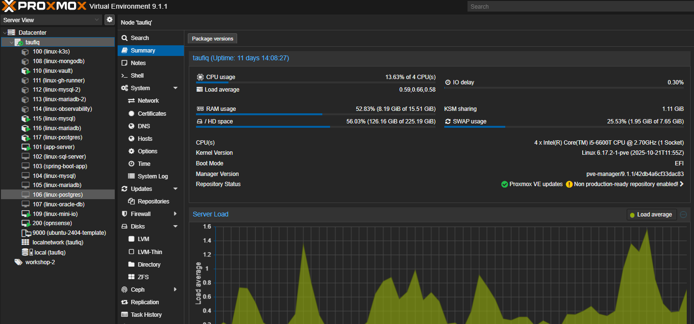

# Animal-Shelter-Workshop DB VMs → CTs Migration

**Date:** 2026-08-01/02
**Plan:** [`plans/04-asw-db-vms-to-ct-migration-plan (executed).md`](../../plans/04-asw-db-vms-to-ct-migration-plan%20(executed).md)
**Repo the actual infra changes live in:** `Animal-Shelter-Workshop` (this
write-up lives in the homelab meta-repo instead, same split as every other
ASW-infra doc here — see `docs/20-homelab-terraform/homelab-terraform-split.md`)

## Why

The Proxmox host (`taufiq` — 4 cores, 15.51 GiB RAM, no cluster) is RAM-bound,
not CPU-bound, and the three DB VMs backing Animal-Shelter-Workshop
(`linux-mysql` VM 104, `linux-mariadb` VM 105, `linux-postgres` VM 106) were
the single biggest lever for reclaiming RAM: Proxmox VMs here have no balloon
device, so their declared memory is pinned/reserved by KVM regardless of
actual use, while CTs share the host kernel and are only cgroup-limited —
idle daemons actually give RAM back. The motivating idea was freeing enough
room to self-host Jenkins as a later experiment (not stood up in this pass).

## Plan

```
┌──────────────────────────────────────┐
│ STAGE 0 — capacity baseline           │▏  ssh proxmox "free -h/qm list/pct list" —
│    (done above)                       │▏  records the pre-migration numbers so the
└──────────────────────────────────────┘▔▔  RAM-reclaim is verified, not assumed
                    │
                    ▼
        ┏━━━━━━━━━━━━━━━━━━━━━━━━━━━━━━━━━━━━━━━━━━━━━━━━━┓
        ┃  PER-DATABASE LOOP — mysql → mariadb → postgres  ┃
        ┃  one at a time, never in parallel                ┃
        ┗━━━━━━━━━━━━━━━━━━━━━━━━━━━━━━━━━━━━━━━━━━━━━━━━━┛
                    │
                    ▼
┌──────────────────────────────────────┐
│ 1. Terraform: new CT block            │▏  copy linux_mysql_2's shape into
│    (containers.tf, own apply)         │▏  containers.tf — own terraform apply, not
└──────────────────────────────────────┘▔▔  combined w/ VM changes (known lock-timeout bug)
                    │
                    ▼
┌──────────────────────────────────────┐
│ 2. TUN passthrough + tailscale up     │▏  raw LXC conf lines + pct reboot, then
│    (needs YOUR browser login)         │▏  `tailscale up` — interactive OAuth, I'll
└──────────────────────────────────────┘▔▔  hand you the login URL when we hit this
                    │
                    ▼
┌──────────────────────────────────────┐
│ 3. Ansible provision                  │▏  copy of linux-mysql.yml retargeted at the
│    (role copy, drop legacy_backup)    │▏  new CT — proven pattern from the -2 pair
└──────────────────────────────────────┘▔▔
                    │
                    ▼
┌──────────────────────────────────────┐
│ 4. Fresh dump → grants → restore →    │▏  dump taken NOW (not stale — see the
│    verify row counts + smoke test     │▏  DEFINER= outage doc), verify BEFORE
└──────────────────────────────────────┘▔▔  touching the old VM
                    │
                    ▼
┌──────────────────────────────────────┐
│ 5. Cutover                            │▏  old VM logs out of Tailscale, new CT
│    (hostname reclaim, .env untouched) │▏  claims same MagicDNS name → zero config
└──────────────────────────────────────┘▔▔  edits needed in app's .env
                    │
                    ▼
┌──────────────────────────────────────┐
│ 6. inventory-ip.yml ansible_user      │▏  new CTs use plain hostname-matching
│    + power off old VM (qm stop only)  │▏  usernames; old VM kept as rollback net,
└──────────────────────────────────────┘▔▔  re-run smoke tests once CT-only
                    │
                    ▼
        ┌ ─ ─ ─ ─ ─ ─ ─ ─ ─ ─ ─ ─ ┐
              loop back for
          mariadb, then postgres
        └ ─ ─ ─ ─ ─ ─ ─ ─ ─ ─ ─ ─ ┘
```

## Execution

Everything below happened in one working session. High-level punch list —
each step verified before moving to the next, per the plan's "cutover before
cleanup, always" rule:

```
┌──────────────────────────────────────┐
│ mysql/mariadb/postgres → CTs 115-117  │▏  data verified (row counts, routine/
│   fully migrated + cut over           │▏  trigger checksums, app-user smoke
└──────────────────────────────────────┘▔▔  tests all matched the old VMs exactly
                    │
                    ▼
┌──────────────────────────────────────┐
│ Hostnames reclaimed via full          │▏  simple logout+set didn't free the
│ tailscaled state wipe + re-register   │▏  name (sticky per node identity) —
└──────────────────────────────────────┘▔▔  fresh machine identity did
                    │
                    ▼
┌──────────────────────────────────────┐
│ Old VMs 104/105/106 stopped           │▏  kept, not destroyed — rollback net,
│ (not destroyed)                       │▏  reachable via *-old ssh aliases
└──────────────────────────────────────┘▔▔
                    │
                    ▼
┌──────────────────────────────────────┐
│ ssh config / inventory-ip.yml /       │▏  linux-mysql/mariadb/postgres now
│ CLAUDE.md / docs updated              │▏  point at the new CTs everywhere
└──────────────────────────────────────┘▔▔
```

### Per-DB result

| DB | Old VM | New CT | New IP | Data verification |
|---|---|---|---|---|
| MySQL 8.0 | `linux-mysql` (VM 104) | `linux-mysql` (CT 115) | `100.78.80.42` | Row counts (`audit_log=738, category=54, inventory=0, section=18, slot=369`) + 16 routines + 15 triggers (identical `DEFINER`/`SECURITY` checksums) + app-user stored-procedure call, all matched exactly |
| MariaDB | `linux-mariadb` (VM 105) | `linux-mariadb` (CT 116) | `100.112.107.1` | Row counts (`image=2784, report=602, rescue=958`) + routine/trigger checksum match + app-user smoke query, all matched exactly |
| PostgreSQL 15 | `linux-postgres` (VM 106) | `linux-postgres` (CT 117) | `100.72.187.124` | Row counts matched exactly across all 10 tables; one harmless ignorable `pg_restore` GRANT error (unused legacy `workshop_2` role — app only ever uses `workshop_2_prod`); app-user query against real migrated data confirmed |

Postgres got the most verification care since, unlike mysql/mariadb, it had
no existing `-2` CT precedent in this fleet to derisk the CT shape ahead of
time.

### What broke / had to be worked around

- **Terraform S3 backend credential (MinIO `terraform-asw` user) had no
  recorded secret anywhere** — MinIO doesn't let you retrieve an existing
  secret key, only rotate it. Root MinIO creds on `linux-mini-io` let the
  secret be rotated safely (low-risk, bucket-scoped, lab credential).
- **Fresh CTs only ever get a `root` account** (same gotcha
  `docs/19-devops-practice/12` already documented for the disposable test
  loop) — fixed by creating real `linux-mysql`/`linux-mariadb`/
  `linux-postgres` users (sudo group, `NOPASSWD`, same SSH keys) matching
  the `-2` CT pair's existing convention, rather than leaving Ansible
  running as `root`.
- **Reclaiming a Tailscale hostname from an offline-but-undeleted device
  doesn't work with `tailscale logout` alone** — an offline device still
  reserves its MagicDNS name (same underlying gotcha as the
  `terraform destroy` ghost-entries `docs/19-devops-practice/12` already
  found). Needed a `TAILSCALE_API_KEY` to `DELETE` the stale device via
  API, matching the pattern `infrastructure/destroy-test-loop.sh` already
  uses.
- **Even after deleting the stale device, `tailscale set --hostname=X` and
  a plain `down`/`up` cycle kept the CT on its old suffixed name
  (`linux-mysql-3`)** — the MagicDNS name assignment turned out to be
  sticky per **node identity**, not re-evaluated once a conflicting name
  frees up. Fixed by fully wiping `/var/lib/tailscale` and re-registering
  with a **fresh** machine identity (a temporary reusable auth key,
  generated and revoked via the API, avoided three more interactive
  browser logins).
- **`app-server.yml`'s `.env` template needs `app_domain` even with
  `use_certbot=false`** (used for `APP_URL`/`MAIL_FROM_ADDRESS`) — pulled
  the real value (`animal-shelter-workshop.tttaufiqqq.com`) from the
  already-deployed `.env` on `app-server` rather than guessing.
- **The "Run database migrations" task hung for 15+ minutes with zero
  output or remote CPU usage on the first two deploy attempts.** Root
  cause: `VAULT_AGENT_ROLE_ID`/`VAULT_AGENT_SECRET_ID` (a distinct AppRole
  from the `VAULT_ROLE_ID`/`VAULT_SECRET_ID` already exported for the
  `asw_secrets` lookup) were never set on the control node, so the
  `role_id` file the `vault_agent` role deploys was rendered **empty**.
  `vault agent -config=agent-migrate.hcl` then looped forever on
  `error="role ID file empty and no cached role ID known"` with growing
  exponential backoff — invisible from the outside since Ansible was just
  waiting on the child process to exit. Confirmed live with
  `timeout 30 vault agent -config=... ` reproducing the exact same auth
  loop and exiting 124. Fixed by exporting all four Vault env vars
  together before re-running.
- **A background WSL command launched via `wsl.exe -e bash -lc "cmd &
  disown"` does not survive** — Windows tears down the whole WSL interop
  session (and everything in it, `setsid`/`nohup` included) once the
  launching `wsl.exe` process exits, silently killing the "backgrounded"
  job before it produces any output. The two deploy attempts that
  "hung with zero output" were actually this, not the Vault Agent bug —
  the job never even started. The reliable pattern is to let the calling
  tool's own background/timeout mechanism own the process (i.e. just run
  the command directly and let it get moved to background if it's slow),
  not to background-and-detach manually inside the WSL invocation.

### Cosmetic: oh-my-posh + figlet MOTD on the 3 new CTs

Added the same visual-host-identity pattern documented in
`docs/17-custom-ssh-motd/` to all three new CTs, with a blue→yellow theme
instead of the old VMs' single-accent-color style:

- **oh-my-posh**: blue (`#1e3a8a`) session segment, yellow (`#facc15`) path
  segment, light-blue (`#38bdf8`) git segment — installed via
  `ohmyposh.dev/install.sh` (needed `unzip` first; not on the base
  vztmpl image).
- **MOTD figlet banner**: instead of the old VMs' flat per-host accent
  color, the new CTs' hostname banner renders as a genuine blue→yellow
  **gradient**, truecolor-interpolated line-by-line across the figlet
  output (`\e[38;2;R;G;Bm`), falling back to a flat color if `figlet` were
  ever missing.
- Ubuntu's stock `00-header`/`10-help-text`/etc. `/etc/update-motd.d/`
  scripts were disabled (`chmod -x`) on all three so the banner is the
  first thing shown on login, not buried under the generic Ubuntu welcome
  text.

Login now looks like this on all three new CTs (`linux-mysql` shown):

*(figlet gradient banner + role/OS/CPU/memory/disk/uptime/service-health
stat block, blue→yellow, no Ubuntu boilerplate above it)*

### App-server wiring

`env-app.j2` already renders `DB1_HOST=linux-mariadb` / `DB2_HOST=linux-mysql`
/ `DB5_HOST=linux-postgres` — Tailscale MagicDNS hostnames, not IPs — so once
the hostname cutover above landed, **zero `.env` edits were needed**. Started
`app-server` (VM 101, was stopped) and re-ran `playbooks/app-server.yml`
(full run, not just `--tags deploy`) to redeploy the app end-to-end against
the migrated databases: fresh `.env` render, `php artisan migrate`, cache
rebuild, all against the new CTs.

**Result:** `PLAY RECAP: ok=57 changed=8 failed=0`. Verified for real, not
just "no Ansible errors" — `curl localhost` returned `HTTP 200`, every
pending migration applied cleanly (including several `Ran` rows that hadn't
run on this host before), and the app's own health check
(`vault agent -config=agent-verify.hcl` wrapping `php artisan migrate:status
&& php artisan db:refresh-status --fail-on-down && php artisan
about --only=environment`) reported:

```
Database status: 5/5 online
```

All five Laravel DB connections (`shelter`/`animals` on the migrated
mysql/mysql-2, `reporting`/`booking` on migrated mariadb/mariadb-2,
`users` on migrated postgres) confirmed live through the real application
stack, not just direct DB-level pings.

## Resource impact — exact numbers

**The DB hosts themselves — VM declared/pinned memory vs CT actual live
usage** (the core thesis of this migration, measured directly rather than
assumed):

| Host | As a VM (declared, pinned by KVM regardless of use) | As a CT (actual live usage, measured post-migration) |
|---|---|---|
| mysql | 2048 MB | 423 MB |
| mariadb | 2048 MB | 131 MB |
| postgres | 2048 MB | 81 MB |
| **Total** | **6144 MB (6 GiB) permanently reserved** | **635 MB actually used** |

Converting these three hosts to CTs didn't just make them *smaller* — it
changed the accounting entirely: 6 GiB was **unconditionally locked away**
from the rest of the host the whole time those VMs were running, no matter
how idle they were, purely because KVM VMs here have no balloon device. The
CTs give back everything they aren't using, in real time.

**Whole-host `free -h`, before vs immediately after cutover** (old VMs
stopped, new CTs running, before `app-server` was started back up):

| | Before (Stage 0 baseline — DB VMs powered off) | After (DB VMs stopped for good, DB **CTs** running) |
|---|---|---|
| Used | 6.3 GiB | 7.1 GiB |
| Available | 9.2 GiB | 8.5 GiB |

The "before" snapshot had the DB VMs *off* (not a fair like-for-like), yet
running all three DBs live as CTs only cost ~0.7 GiB of availability versus
that already-idle baseline — a real, load-bearing proof that the CTs are
giving RAM back rather than just moving the same pinned cost around.



*(Post-migration Proxmox tree showing CTs 115/116/117 alongside the
stopped old VMs 104/105/106 kept as a rollback net; host at 52.83% RAM
with `app-server` also running.)*

No exact **pre-migration** `free -h` exists for "all three DB VMs actually
running" specifically (the very first baseline this session captured
already had them powered off), so the VM-declared-vs-CT-actual table above
is the precise, apples-to-apples number for this migration's core claim —
the whole-host snapshot is directional/corroborating, not the exact figure.

## Verification

- Per DB: row counts on new CT matched the pre-migration dump exactly;
  routine/trigger checksums identical; app-level DB user could run a real
  query/stored-procedure call against real migrated data.
- MagicDNS confirmed resolving `linux-mysql`/`linux-mariadb`/
  `linux-postgres` to the new CTs' IPs after cutover.
- `qm list`/`pct list` confirmed the old VMs are `stopped` (not destroyed)
  and the new CTs `running` after cutover.
- `app-server.yml` redeployed clean against the migrated DBs with zero
  `.env` edits — `ok=57 changed=8 failed=0`, `curl localhost` → `HTTP 200`,
  and the real app-level health check reported `Database status: 5/5
  online` through all five Laravel connections.

## Not done in this pass (deferred, per the plan)

- **Jenkins CT** — the RAM this migration frees was the whole point, but
  standing up Jenkins itself is a separate, later `terraform apply`
  whenever the experiment is actually wanted (same on-demand pattern as
  `linux-gh-runner`).
- **`terraform destroy` on the old VMs** — kept powered off indefinitely
  for now as a rollback net (`production-vms.tf`'s "do not destroy"
  comment is untouched); revisit once the three new CTs have run stable
  for a while.

## Known gap: this migration only ever carried `workshop_2_prod`

Found while wiring `docker-compose.yml`'s local dev environment to all 5
real DB connections (`docs/19-devops-practice/04`): this migration's
per-database dump/restore only ever moved `workshop_2_prod` — the
separate `workshop_2_dev` database/user each of these 3 hosts also
carried (used by local development, see `Animal-Shelter-Workshop/.env`)
was never part of the plan's scope and didn't come along. `animals`/
`booking` (the 2 real connections on hosts this migration never touched)
still had their dev accounts intact the whole time; only the 3 migrated
hosts (`linux-mysql`, `linux-mariadb`, `linux-postgres`) were missing
theirs.

Not a bug in this migration — `workshop_2_dev` was simply never in scope
for a migration whose entire point was reclaiming RAM from the production
path — but worth recording as a gap this kind of migration should check
for next time: **when moving a database host, verify every account on it
that matters, not just the one the migration was scoped around.**

Fixed by creating `workshop_2_dev` fresh on the 3 CTs and running the
app's own migrations against them (full detail in
`docs/19-devops-practice/04`, since that's where the actual work
happened) — recovering the *shape* of the old dev schema via the
migrations that built it originally, not a dump/restore of the old VMs'
actual dev data (the old VMs' Tailscale identities had already been
deleted as part of this migration's own hostname-reclaim step, and reviving
one for a raw LAN/console recovery wasn't worth it for schema-only, no-real-data
dev databases in a lab with no production users).
