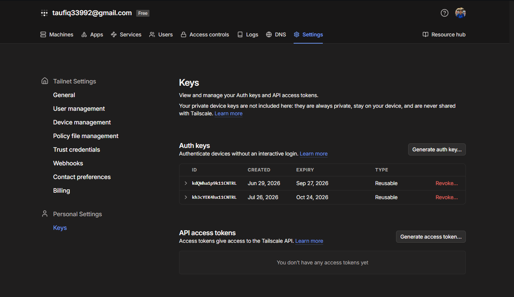
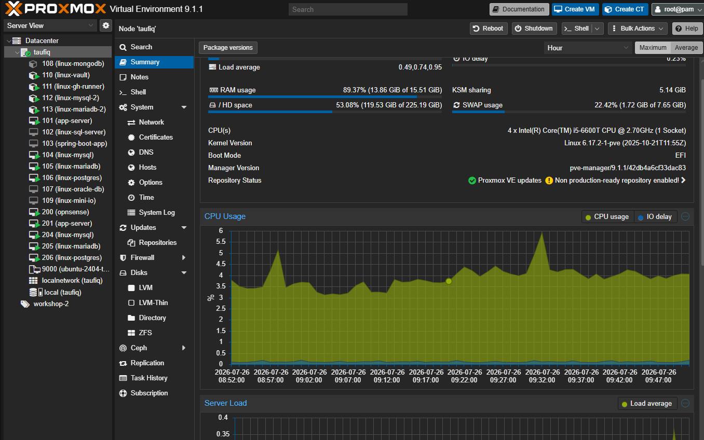

<!-- Not yet sequenced into a numbered docs/ folder — lives here in
     docs/devops-plan/ until the full devops-practice-plan.md is complete.
     Date below is provisional (the date this actually happened); revisit
     once final sequencing/dating is decided. -->

# Terraform: Proving the Loop for the First Time Ever

**Date:** 2026-07-26
**Repo the actual code/infra changes live in:** `Animal-Shelter-Workshop`
(this write-up lives in the homelab meta-repo instead, alongside the devops
practice plan it's a stage of — see `devops-practice-plan.md`, Stage 1)

## Why I built this

`infrastructure/terraform` looked real — `bpg/proxmox`, cloud-init, a
`for_each` module, several genuine bugs already documented and fixed in
`docs/07-terraform.md` (wrong storage pool, cloud-init datastore
defaulting to `local-lvm`, wrong node name, an SSH key mismatch). But no
`.tfstate` existed, and `docs/09-production-hardening.md` said outright
that every real run so far had targeted the existing hand-configured box.
The one documented blocker: a fresh Terraform VM's cloud-init only creates
a `workshop` user, but `app-server.yml`'s deploy tasks assume `taufiq`
already exists.

That turned out to be true, but it was nowhere near the only thing
standing between "the code looks right" and "the loop actually works."
Eight separate things broke, in sequence, each only visible once the
previous one was fixed. That's the real finding of this stage — not any
one bug, but that a plan built by reading code instead of running it can
look completely done and still never have worked once.

## Where I started

The plan going in, before any of this was attempted — eight steps, one
known blocker:

```
┌─────────────────────────────────────────────────────────────────────┐
│                    STAGE 1 GOAL: Prove Terraform loop                │
│         "Can we spin up a working app server from scratch?"          │
└─────────────────────────────────────────────────────────────────────┘

  ┌──────────────┐
  │ 0. Check room │  ssh proxmox "free -h"
  │  on the host  │  (only ~1.1 GiB free last check — may need to
  └──────┬────────┘   bring VMs up one at a time)
         │
         ▼
  ┌──────────────────────┐
  │ 1. FIX THE BLOCKER    │  Terraform's cloud-init only makes a
  │  (do this first!)     │  "workshop" user, but Ansible expects
  │  add "taufiq" user    │  a "taufiq" user to already exist.
  └──────┬────────────────┘  → add to cloud-init.yml.tftpl, OR
         │                     → add an Ansible bootstrap task
         ▼
  ┌──────────────────────┐
  │ 2. terraform init     │
  │    terraform plan     │  review before touching anything real
  └──────┬────────────────┘
         │
         ▼
  ┌──────────────────────┐
  │ 3. terraform apply    │  creates VMs 201/204/205/206
  │                        │  (test VMs — NOT prod 101/104/105/106)
  └──────┬────────────────┘
         │
         ▼
  ┌──────────────────────┐
  │ 4. VMs join Tailscale │
  └──────┬────────────────┘
         │
         ▼
  ┌──────────────────────┐
  │ 5. ansible-playbook   │  deploy the app onto the fresh VMs
  │    site.yml            │
  └──────┬────────────────┘
         │
         ▼
  ┌──────────────────────┐
  │ 6. PROVE IT WORKS     │  curl the app, check migrate:status
  │                        │  — not just "packages installed"
  └──────┬────────────────┘
         │
         ▼
  ┌──────────────────────┐
  │ 7. Decide & document  │  tear VMs down (recommended) OR keep
  │                        │  as second env — either is fine, just
  │                        │  choose deliberately
  └──────┬────────────────┘
         │
         ▼
  ┌──────────────────────┐
  │ 8. Write it up        │  update devops-practice-plan.md's
  │                        │  Stage 1 checklist, Stage-8-style
  └────────────────────────┘
```

Steps 0, 2-6 (minus the one known blocker in step 1) all looked like they
should just work — the code was already written and partially bug-fixed on
paper. In practice, step 3 alone (`terraform apply`) surfaced 4 of the 9
things below before a single VM even finished booting, and step 5
(`ansible-playbook`) surfaced 3 more. The "prove it works" step at the end
is exactly where this plan and reality diverged hardest — see below.

## What I built / fixed

Working through the loop end-to-end, in the order each blocker appeared:

### 1. The Terraform automation token had zero permissions

`pveum acl list` came back completely empty for `root@pam!ansible` — the
token existed (created at some point, `privsep: 1`) but had never actually
been granted anything. The very first `apply` failed with `Permission
check failed (/storage/local, Datastore.Audit|Datastore.AllocateSpace)`.
Granted `PVEVMAdmin` + `PVEDatastoreAdmin` + `PVESDNAdmin` (the last one
needed for `SDN.Use` on the bridge during clone) at path `/` — broad,
deliberately, since this is a homelab automation token, not a
least-privilege production credential.

### 2. bpg/proxmox's SSH connection resolved the wrong address

Cloud-init snippet upload isn't a plain API call in this provider — it
needs SSH to the node. By default it resolves the node's address from
Proxmox's own cluster config, which is the node's **LAN IP**
(`10.0.10.2`) — unreachable from a control node that only has Tailscale
connectivity to the host. `terraform apply` failed with a raw `dial tcp
10.0.10.2:22` timeout. Fixed with an explicit `ssh.node` override in
`main.tf` pointing at the same Tailscale IP already used for the API
endpoint.

### 3. The documented `taufiq`-user blocker, confirmed real

Added `taufiq` alongside `workshop` in `cloud-init.yml.tftpl`, same sudo
config, same SSH key. This is the one gap `docs/09-production-hardening.md`
already knew about.

### 4. A promising red herring: it looked like the template was stale

Once app-server booted, SSH worked and a `taufiq` account was already
there — but with a home directory dated **a month old**, and no `workshop`
user at all. Every sign pointed at a dirty, never-cleaned template. I
cloned the template to a scratch VM and mounted its disk directly with
`losetup` to check — completely pristine, no `/var/lib/cloud`, empty
`machine-id`, hostname still `ubuntu`. The actual explanation: cloud-init's
`--hostname=app-server` collided by substring with an unrelated,
already-online device — I'd been reading the real hand-configured
production `linux-app-server` (Tailscale IP `100.100.123.90`) the entire
time, not the VM I'd just created. Worth recording since it's exactly the
kind of false trail that costs the most time — the fix was to verify by
something less ambiguous than a hostname grep, not to "fix" a template
that was never broken. No code change here; cleaned up the scratch clone
and moved on.

### 5. The VM never actually got an IP

With the real test VM isolated, it plainly had no IPv4 address — no DHCP
lease, nothing in the host's ARP table. `vmbr0` turned out to be a
VLAN-aware bridge (`vlan_filtering 1`), and every production VM on this
host is tagged (`tag=40` for the app server, `tag=20` for the three DB
roles) — but `vms.tf`'s `network_device` block never set a `vlan_id` at
all, so the Terraform VMs landed on the untagged default VLAN with no
DHCP or routing behind it. Added `vlan_id` to `locals.vms`, matching the
production VM on the same role.

### 6. The Tailscale auth key had actually expired

`tailscale up` failed with `backend error: invalid key: unable to
validate API key`. `handoff.md` had already flagged this as a real risk
(the key in `terraform.tfvars` was about 4 weeks old). Generated a fresh
reusable key from the Tailscale admin console and updated
`terraform.tfvars` (gitignored, not part of the commits below).



### 7. MySQL/MariaDB root auth: fresh installs don't match the playbook's assumption

`linux-mysql.yml`/`linux-mariadb.yml` authenticate as root via
`login_password: "{{ mysql_root_password }}"`. A fresh `apt install`
leaves root on `auth_socket`/`unix_socket` (no password, OS-user-matched
login only) — every real run so far had targeted a box where this had
already been switched over by hand. Added a bootstrap task that connects
via the socket first and switches root to `mysql_native_password`. It's
allowed to fail on re-runs (the socket stops accepting the instant the
switch succeeds once, by design) — if root auth were genuinely broken,
the very next task, which needs `login_password`, would fail loudly
instead of this one failing silently.

### 8. `www-data` couldn't even reach the app directory

Everything under `Animal-Shelter-Workshop/` was correctly owned
(`taufiq:www-data`, setgid, `rwX`) — and it still couldn't be read.
cloud-init's default `/home/taufiq` is mode `0750`, group `taufiq`.
`www-data` is neither the owner nor in that group, so it couldn't
traverse into the home directory at all, regardless of how the app
directory itself was configured underneath. Added a single `o+x` task
(traverse only, not read) before the deploy tasks that need it.

### 9. A seeder depended on a dev-only package in production

`db:seed` got through 6 of 7 seeders — roles, users, 200 reports with
real Cloudinary uploads, rescues, shelter categories/slots, clinics/vets —
then died on `AnimalSeeder` with `Call to undefined function
...AnimalSeeder\fake()`. `fakerphp/faker` was declared under
`require-dev`, and `app-server.yml` correctly runs
`composer install --no-dev` in production. Every previous manual seed run
had happened on a box where dev dependencies were already present from
some earlier non-`--no-dev` install, masking this completely. Moved
`fakerphp/faker` to `require` and regenerated `composer.lock`.

## Architecture

```
terraform apply
      │
      ▼
┌─────────────────────────────────────────────────────────┐
│  cloud-init snippet uploaded via SSH (node override)     │
│  VM cloned from template 9000, VLAN-tagged (40 or 20)    │
│  users: workshop + taufiq, both with sudo + SSH key       │
└───────────────────────┬───────────────────────────────────┘
                         │ boots, DHCP, joins Tailscale
                         ▼
          ansible-playbook playbooks/site.yml
                         │
        ┌────────────────┼────────────────┬──────────────┐
        ▼                ▼                ▼              ▼
  linux-mysql      linux-mariadb    linux-postgres   app-server
  (root-auth        (root-auth       (peer auth,      (PHP/Nginx,
   bootstrap)         bootstrap)      no change        Vault Agent,
                                      needed)           git clone,
                                                         composer,
                                                         migrate, seed)
        │                │                │              │
        └────────────────┴────────────────┴──────────────┘
                         │
                         ▼
              curl http://app-server/ → HTTP 200
              real Laravel homepage, real seeded data
```

## Verification



- `curl -H 'Host: <test-domain>' http://localhost/` on the test app-server
  returned `HTTP 200` with a genuine rendered Laravel homepage — not an
  error page with a 200 status.
- `db:seed --force` completed with **zero errors** end to end (roles,
  users, 200 reports with 785 real Cloudinary image uploads, rescues,
  shelter categories/slots/clinics/vets, bookings, adoptions, animal
  profiles) after the `fakerphp/faker` fix.
- Before pushing the `composer.json`/`composer.lock` change to `main`
  (which would trigger `Tests` → `deploy.yml` against the **real**
  production fleet), I rsynced the full working tree — with the fix
  already applied — to `linux-gh-runner` and ran the exact steps
  `tests.yml`'s `backend` job runs: `composer install` (no `--no-dev`,
  matching CI), `db:fresh-all --env=testing --force`, then
  `php artisan test --env=testing --testsuite=Unit,Feature,Procedures`.
  **363 tests passed, 794 assertions, 0 failures.** Pushed only after
  that came back clean.

## Where things live

| Piece | Path (in `Animal-Shelter-Workshop` unless noted) |
|---|---|
| `taufiq` user, both cloud-init users | `infrastructure/terraform/cloud-init.yml.tftpl` |
| SSH node address override | `infrastructure/terraform/main.tf` |
| VLAN tagging (`vlan_id` per VM) | `infrastructure/terraform/vms.tf` |
| MySQL/MariaDB root-auth bootstrap | `infrastructure/ansible/playbooks/linux-mysql.yml`, `linux-mariadb.yml` |
| `/home/taufiq` traverse fix | `infrastructure/ansible/playbooks/app-server.yml` |
| Scratch inventory for pointing at test VMs directly | `infrastructure/ansible/.scratch-inventory-stage1-test.yml` (gitignored) |
| `fakerphp/faker` moved to `require` | `composer.json`, `composer.lock` |
| Proxmox token ACL grants (not in git — Proxmox-side state) | `root@pam!ansible` → `PVEVMAdmin`, `PVEDatastoreAdmin`, `PVESDNAdmin` at `/` |
| Fresh Tailscale auth key (not in git — `terraform.tfvars` is gitignored) | Tailscale admin console → Keys |
| Commits | `79ce670` (Terraform), `f13b3b7` (Ansible), `c0551c6` (composer) |
| This write-up | `proxmox-homelab-taufiq/docs/devops-plan/terraform-first-real-loop.md` (homelab meta-repo) |

## What happened to the test VMs

201/204/205/206 were torn down (`terraform destroy`) immediately after
verification, per the plan's own instructions — they were a deliberate
parallel proof, never meant as a second permanent environment. Proven
once, on this date; not kept running.
