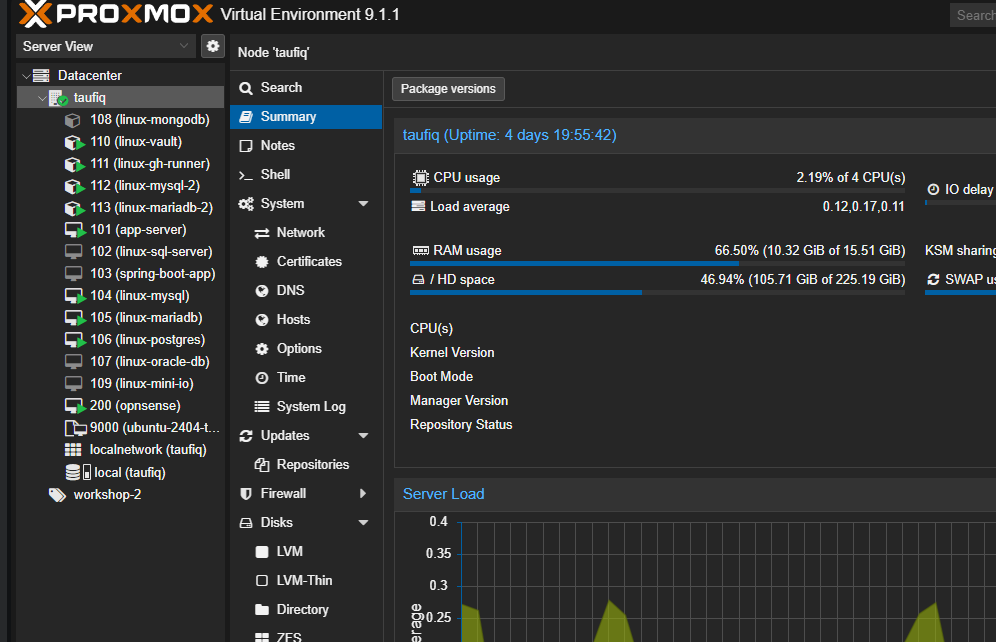

# DevOps Practice Plan — Homelab Execution Roadmap

A staged plan to turn the existing homelab (Proxmox, OPNsense, Vault, MinIO,
VLAN segmentation) from "infrastructure I run" into "infrastructure I
automate." Each stage builds on the last but can be tackled independently.

**Scope: Animal Shelter Workshop only.** Every stage below targets that one
project and the infrastructure that serves it — its Terraform, its Ansible,
its CI/CD pipeline, its own container image, its own path into k3s/GitOps.

Order: Terraform → Ansible → CI/CD → Docker → k3s → Observability → GitOps →
Public Cloud.

Reordered from a generic "Docker first" curriculum on 2026-07-26: Stages 1-3
below (Terraform, Ansible, CI/CD) are mostly already real — built, and in two
cases running production — so they get finished before starting genuinely new
ground. Stage 1 has one known, documented, unfixed blocker; closing it is a
prerequisite for the Practice Discipline section's "time the recovery" goal
further down. Docker and k3s move to Stages 4-5 since they have no dependency
on 1-3, but k3s is a hard prerequisite for GitOps (Stage 7) — ArgoCD runs
inside a k3s cluster, so that stage can't move earlier than this order allows.

---

## Host Capacity Reality Check (measured 2026-07-26, applies to every stage below)

I SSH'd into `proxmox` (100.97.8.93) and pulled real numbers instead of
assuming headroom. Host `taufiq`: **4 physical cores, 15.9 GB RAM.**



Currently-running fleet (app-server + the 3 original DB VMs + opnsense +
vault + gh-runner + the 2 split-off DB CTs — the normal footprint, before
adding anything from this plan):

| | Allocated | Actually used | Host total |
|---|---|---|---|
| vCPU | 13 (3.25x overcommit) | ~2-5% (load avg 0.09/4) | 4 physical |
| RAM | ~17.9 GB | ~8.7 GB | 15.9 GB |

- **CPU has real headroom.** 13 vCPU is allocated across guests on paper, but
  the host idles at 95-98%. None of this plan's stages are CPU-bound —
  Docker, a k3s control plane, and ArgoCD all fit on the CPU side easily.
- **RAM does not.** Allocated already exceeds physical RAM for the guests
  running *today*. `free -h` shows only ~1.4 GB truly free, and **1.3 GB is
  already sitting in swap** — the host has already been pushed past physical
  memory once under this exact normal workload, with live production DB VMs
  on it. RAM, not CPU, is the constraint every stage below needs to respect.
- **Working rule for the rest of this plan:** before powering on anything new
  and leaving it running, `ssh proxmox "free -h"` first. Don't add a
  persistent guest on top of an already-swapping host without a plan to free
  RAM elsewhere (the cheapest thing to stop temporarily is `linux-gh-runner`,
  CT 111 — it's only needed during an actual CI/CD run).

---

## End-State Capacity Projection (what this plan actually adds, and whether it fits)

Most of this plan's stages don't add anything persistent — they're code/pipeline
changes to infrastructure that already exists. Only two stages add a genuinely
new, permanent guest:

| Stage | New guest/service | Recommended size | Permanent? |
|---|---|---|---|
| 1 — Terraform | 4 test VMs (201/204/205/206) | 2048 MB × 4 = 8 GB | **No** — torn down once the loop's proven, per Stage 1's own instructions |
| 2 — Ansible | none (refactor of existing code) | — | — |
| 3 — CI/CD | none (pipeline logic only) | — | — |
| 4 — Docker | none required; Harbor is optional/deferred | Harbor ≈ 2+ GB if added later | Deferred by Stage 4's own capacity note |
| 5 — k3s | 1 new CT | start 1.5-2 GB, 1 core | **Yes** |
| 6 — Observability | **Done** — 1 new CT (`linux-observability`, 114, VLAN 80): Prometheus+Grafana+Loki+Alertmanager, same pattern as Vault/MinIO/Mongo | 1 core / 1.5GB (started small, same lesson as Stage 5's k3s CT) | **Yes** |
| 7 — GitOps | no new guest — ArgoCD installs *inside* Stage 5's k3s node | adds ≈ 1-2 GB *to* that same node | **Yes** (grows Stage 5's footprint) |
| 8 — Public Cloud | none — runs on AWS/GCP, not this host | — | — |

The two permanent additions are the k3s CT (grows from ~2 GB to ~3-4 GB once
Stage 7's ArgoCD lands on it) and one observability CT/VM (~2-3 GB).

**Projected host RAM, applying both permanent additions to the current baseline:**

```
Right now:             10.3 GB used  /  15.5 GB total   (66.5%, ~5.2 GB headroom, 1.3 GB already in swap)

+ k3s CT (with ArgoCD):      +3-4 GB
+ Observability CT:          +2-3 GB
                        -----------------
Projected used:         15.3 - 17.3 GB  /  15.5 GB total
```

That lands **at or past the physical ceiling**, with zero safety margin —
not "a bit more swap," but sustained swapping on a host where three live
production databases already sit. As currently scoped, Stages 5-7 don't fit
on this box without freeing real RAM first.

**What actually creates enough room:** converting `linux-mysql`/`linux-mariadb`
(currently VMs, 1 core/2048 MB each) to CTs — the same pattern already proven
by `linux-mysql-2`/`linux-mariadb-2` — is the biggest single lever, worth
roughly 1-1.5 GB of genuinely reclaimable RAM per host (VMs here have no
balloon device configured, so their allocation is otherwise locked in
regardless of actual use). Doing both conversions (~2-3 GB freed) is roughly
enough to absorb both new CTs above without deep swapping. The alternative is
what Stage 5 already anticipates for k3s multi-node expansion — a second
physical Proxmox node — just triggered here by Stage 6's addition, not only
by "expand k3s to 2+ nodes." Either way, treat this as a decision to make
*before* Stage 6, not something to discover after RAM is already exhausted.

---

## Stage 1 — Terraform: Finish Proving the Loop, It Was Never Completed

**Goal:** the `.tf` code in `Animal-Shelter-Workshop/infrastructure/terraform`
is real, not a stub — it uses `bpg/proxmox`, cloud-init, and a `for_each`
module, and `docs/07-terraform.md` documents several genuine bugs actually
hit and fixed (wrong storage pool, cloud-init datastore defaulting to
`local-lvm`, wrong node name, an SSH key mismatch). But **the full loop has
never been proven end-to-end.** Terraform targets VM IDs 201/204/205/206 —
deliberately separate from the real 101/104/105/106 that were provisioned by
hand and actually run production. There is no `.tfstate` in the directory
today, and `docs/09-production-hardening.md` says outright: *"every real run
so far has targeted the existing hand-configured box"*, then flags that a
**fresh Terraform VM would fail `app-server.yml` today** — cloud-init only
creates a `workshop` user, not the `taufiq` user the playbook now assumes.
That's a documented, unfixed blocker, not a hypothetical. Treat this stage as
finishing a real gap, not tidying up something that already works:

- [x] Run `terraform init` → `plan` → `apply` for real, start to finish, and
      get all 4 VMs to actually boot and join Tailscale — do not assume this
      currently works just because the code and the bug-fix history exist.
      **Done 2026-07-26** — took far more than the one documented blocker:
      the automation token had zero Proxmox ACL grants, the provider's SSH
      connection for cloud-init snippet upload resolved the node's
      unreachable LAN IP, and the VMs had no VLAN tag at all so they never
      got a DHCP lease. Full story: `docs/19-devops-practice/01-terraform-vm-ct-creation-fleet-import-and-automation.md`
- [x] Fix the known blocker before declaring success: add a task (cloud-init
      user-data, or an early Ansible play) that creates the `taufiq` user on
      a fresh VM — `app-server.yml` is documented to fail without it.
      **Done** — added to `cloud-init.yml.tftpl` alongside `workshop`
- [x] Run the full loop for real, once: `apply` → `ansible-playbook
      playbooks/site.yml` against the fresh 201/204/205/206 VMs → confirm
      the app actually serves a request, not just that packages installed.
      **Done** — also needed a MySQL/MariaDB root-auth bootstrap task (fresh
      installs default to socket auth, not the shared password) and a
      `/home/taufiq` permission fix (www-data couldn't traverse into it).
      `curl` returned a real rendered Laravel homepage, HTTP 200. Full
      `db:seed` run also uncovered `fakerphp/faker` was require-dev only,
      breaking production's `--no-dev` install — fixed and verified via a
      full 363-test backend suite run on `linux-gh-runner` before pushing
- [x] Decide deliberately what happens to the result — tear the 200-series
      VMs back down (they were meant as a parallel proof, not a migration
      target) and document "proven once, on this date," or keep them as a
      genuine second environment. Either is fine; an undocumented decision
      isn't. **Torn down 2026-07-26**, immediately after verification
- [x] Only after that first successful run, layer on the harder exercises:
      bring `linux-mysql-2`/`linux-mariadb-2` (currently manual CTs) into
      Terraform or explicitly decide they stay manual; move state onto
      self-hosted MinIO's S3-compatible backend instead of a local
      `.tfstate`; extract the `locals { vms = {...} }` pattern into a real
      reusable module. State-management exercises on top of an unproven
      base don't teach much — get the base working first.
      **Done 2026-07-26** — all three: MinIO S3-compatible backend live on
      `linux-mini-io` (bucket-scoped credential, not root); both CTs adopted
      via `terraform import`, validated zero-drift against a disposable
      scratch container *before* ever touching the real production
      containers (byte-identical `pct config` before/after); `locals { vms
      }` extracted into `modules/proxmox-vm/`. Full story:
      `docs/19-devops-practice/01-terraform-vm-ct-creation-fleet-import-and-automation.md`
- [x] **Extended further, 2026-07-28**: the two CTs above were only part of
      the live fleet — `app-server` and the other 3 original DB VMs, plus
      every CT built by hand since (`linux-k3s`, `linux-mongodb`,
      `linux-vault`, `linux-gh-runner`, `linux-observability`), were still
      fully manual. All 10 of those real hosts are now adopted into
      Terraform too, same zero-drift-first discipline (a scratch CT and a
      scratch VM, never real hosts, used to prove the pattern first),
      confirmed via `qm config`/`pct config` byte-identical before/after on
      every one. Deliberately still excluded: `opnsense` (the network's
      actual gateway) and the stopped legacy VMs. Only Ansible-level
      management (Stage 2, below) still needs a from-scratch VM to actually
      create a machine end-to-end without any GUI step at all — Terraform
      itself now manages every real machine that's supposed to be managed.
      Full story: `docs/19-devops-practice/11-terraform-full-fleet-import.md`
- [x] **Extended once more, 2026-07-28**: the fleet import above only ever
      *adopted* CTs, never created one from scratch — Terraform had never
      actually built a CT the way it had already proven for VMs. Added 2
      disposable test CTs to the test loop, proved creation works, and
      pushed the proof all the way through to a real Ansible handoff (not
      just "the machine boots"). Real infra was intentionally stopped
      first to make room, and every test machine was collapsed back down
      once the loop was verified, same discipline as the very first proof.
      Found and fixed 8 real bugs along the way, from a Proxmox lock
      timeout to Ansible/WSL environment quirks to a playbook assumption
      that only breaks against a genuinely fresh clone of an existing
      role. All 5 DB hosts came up fully working; `app-server` got to the
      one deliberate boundary (a real public domain) that shouldn't be
      faked. Full story:
      `docs/19-devops-practice/12-terraform-ct-creation-and-full-loop-proof.md`

**Capacity note:** `vms.tf` configures all 4 test VMs at 2048 MB each — booting
them all at once is another ~8 GB on top of the ~17.9 GB already allocated to
the normal fleet (see Host Capacity Reality Check above), on a host with ~1.4 GB
actually free right now. Check `free -h` on `proxmox` before `apply`, bring
the 4 VMs up one at a time rather than all at once if it's tight, and tear
them down immediately once the loop is proven rather than leaving them
running — they were never meant to be a second permanent environment.

---

## Stage 2 — Ansible: Roles, Coverage, and Proof of Idempotency

**Goal:** `infrastructure/ansible` already has a working `site.yml`, five
per-host DB playbooks, `group_vars`, and a Vault AppRole
(`community.hashi_vault.vault_kv2_get`) feeding secrets in — skip the
`ansible all -m ping` and install→configure→verify basics, they're proven in
production already. Fixing Stage 1's blocker means touching this exact
Ansible/cloud-init boundary anyway, so do these two stages back to back.
What's still genuinely open:

- [x] `playbooks/tasks/vault-agent.yml` is one task file, not a role —
      convert it (and the shared pieces of the five DB playbooks) into a
      real `roles/` structure with `tasks/`, `handlers/`, `templates/`,
      `defaults/`
- [x] Formally verify idempotency: run each playbook twice back-to-back and
      confirm zero `changed` tasks on the second run; for any task that
      always reports changed (a restart handler, a template re-render),
      decide whether that's correct or a bug, don't just assume
- [x] Try **Molecule** against the smallest playbook (`linux-postgres.yml`)
      for real automated testing, instead of eyeballing `--check` output
- [x] `group_vars/all.yml` documents, in its own comments, that the shared
      MySQL/MariaDB root credential is deliberately plaintext — unlike
      `asw_secrets`, which is Vault-backed. Closing that one named
      exception (routing it through Vault too) is a concrete, scoped
      improvement, not hypothetical hardening
- [x] Once roles exist, extend management to the homelab-level CTs
      currently provisioned by hand from docs (`linux-vault`,
      `linux-gh-runner`, `linux-mini-io`, `linux-mongodb`) — good next
      targets since they're simpler, single-purpose hosts

---

## Stage 3 — CI/CD: Close the Gaps in an Already-Shipped Pipeline

**Goal:** `Animal-Shelter-Workshop`'s `tests.yml` + `deploy.yml` already do
path-based diff routing (only re-run the DB or app playbook when relevant
files changed since the last good deploy), pull every secret from Vault at
runtime, run real smoke tests (`5/5 online`, HTTP 200 direct + tunnel), and
roll back to the last-known-good SHA on failure with a written caveat about
Laravel migrations being forward-only. Build vs. test vs. deploy stages,
Vault-at-runtime secrets, and basic rollback are done — beyond the original
scope of this stage. Doing this stage third means the Terraform-drift item
below is now actually achievable, since Stage 1 will have made Terraform work
for the first time. The real remaining gaps:

- [x] `deploy-db` has **no rollback by design** — it fails loud because
      there's no safe automatic reversal of an `apt install` or a UFW
      change. Add a pre-playbook backup step (`mysqldump`/`pg_dump` before
      `site.yml --limit databases` runs) so a bad DB change has an actual
      recovery path instead of just a documented shrug — done 2026-07-26,
      reuses the existing coordinated `php artisan db:backup` (a new
      one-shot `agent-backup.hcl` Vault Agent config) rather than raw
      per-host dumps, which this repo already tried and retired
- [x] Terraform isn't wired into CI/CD at all right now — `deploy.yml` only
      runs `ansible-playbook`. Auto-`apply` is too destructive to automate
      blindly, but add a scheduled or manual `terraform plan` job that
      posts drift to a job summary, so infra drift is visible without
      someone running it locally and remembering to check — done
      2026-07-26, `terraform-drift.yml`, own Vault path/policy/token
      (`secret/asw-terraform-cd`) kept separate from `asw-cd`'s app-deploy
      secrets, Terraform installed on `linux-gh-runner`
- [x] The current smoke test only asserts the aggregate `5/5 online` string
      — a single connection failing (say, just `postgres`) still passes as
      long as the other 4 are up. Break out a per-connection check so a
      partial DB outage fails the deploy loudly instead of hiding behind an
      aggregate pass — done 2026-07-26, `db:refresh-status --fail-on-down`
      (scheduler's own plain invocation untouched, still always succeeds)
- [x] **Bonus fix, found while doing the above:** `deploy.yml`'s path-based
      routing regexes never picked up `roles/` after Stage 2's roles
      refactor, so a roles-only change silently deployed as if nothing had
      changed — confirmed live (Stage 2's own roles-refactor push ran
      `deploy-app` with `--tags deploy` only, skipping the provision-tagged
      Vault Agent role). Fixed 2026-07-26: `roles/` now widens both
      `INFRA_APP` and `INFRA_DB`
- [ ] Once Stage 6 exists, feed deploy frequency/duration into it instead
      of treating every pipeline run as a one-off with no historical view

---

## Stage 4 — Containers: Docker

**Goal:** containerize `Animal-Shelter-Workshop` itself, understand image
builds. No dependency on Stages 1-3; this is genuinely new ground — no
Dockerfile exists in the repo today, `app-server.yml` installs PHP/Nginx
straight onto the VM.

- [x] Write a multi-stage `Dockerfile` for the Laravel app (Composer/npm
      build stage + slim `php-fpm` runtime stage, matching the PHP 8.3 +
      extensions `app-server.yml` already installs)
- [x] Write a `docker-compose.yml` wiring the container to one local test
      DB (not all 5 — that's what the real Tailscale-connected VMs/CTs are
      for), separate from the real Proxmox DB fleet
- [x] Practice image tagging/versioning (`v1.0.0`, `latest`)
- [x] Push images to a registry — Docker Hub, or self-host **Harbor** in
      the homelab for extra practice. **Capacity note:** Harbor's own stack
      (core + Postgres + Redis + registry + trivy) realistically wants
      2+ GB of RAM — on a host with ~1.4 GB actually free right now (see
      Host Capacity Reality Check above), that alone would push further
      into swap. Use Docker Hub first; only stand up Harbor after freeing
      RAM elsewhere (Stage 6 will make it easy to see how much headroom
      actually exists before trying)

---

## Stage 5 — Kubernetes (k3s)

**Goal:** move from single containers to orchestrated, self-healing
deployments. Needs Stage 4's images to actually deploy something real, and is
itself a hard prerequisite for Stage 7 (GitOps) — ArgoCD runs inside a k3s
cluster, so that stage cannot start before this one is done.

**Capacity note (from the Host Capacity Reality Check above):** the host has
plenty of CPU headroom (95-98% idle) but only ~1.4 GB RAM actually free, with
1.3 GB already parked in swap under the normal fleet. That changes how this
stage should be built, not whether it can be:

- [x] Run k3s in an **LXC container, not a VM** — same reasoning already
      used for `linux-vault`/`linux-gh-runner`/`linux-mongodb`, and it skips
      a second guest kernel's overhead, which matters on a host this tight
      on RAM
- [x] Start deliberately small — 1 core / 1.5-2 GB — and check `free -h` +
      swap on `proxmox` before scaling up, instead of assuming a k3s
      "minimum recommended" config just fits
- [x] Stand up a single-node k3s cluster on one CT
- [x] Get Stage 4's `Animal-Shelter-Workshop` image running manually as one
      Pod via `kubectl run`
- [x] Write a proper `Deployment` + `Service` YAML for it
- [x] Kill the pod on purpose, confirm it self-heals via replicas
- [x] Add a `ConfigMap` and `Secret` for its config (start with non-DB
      config; wiring the real 5-connection DB setup into k3s config is a
      later, harder step, not this one)
- [x] Explore the **Vault Agent Injector** for Kubernetes (ties Vault into
      k3s directly)
- [x] Once comfortable, expand to 2+ nodes — this is the point where RAM
      most likely runs out on a single 4-core/15.9 GB host, and pairs with
      adding a second physical Proxmox node rather than squeezing a second
      k3s node onto the same box — **deferred, documented**: this homelab
      has exactly one standalone Proxmox host (no cluster), so real
      multi-node expansion isn't possible yet; revisit if a second physical
      node is ever added
- [x] Practice scheduling, taints/tolerations, and node draining for
      maintenance — proven on the single node (taint/toleration side by
      side, full cordon/drain/uncordon cycle)

---

## Stage 6 — Observability

**Goal:** metrics, logs, and alerting living in the reserved VLAN 80.
Genuinely new ground — no Prometheus/Grafana/Loki anywhere in the homelab
today. No hard dependency on Stages 1-5, but doing it here means it can
immediately absorb Stage 3's deploy-frequency/duration goal and give you
something to watch once Stage 7 (GitOps) starts making automatic changes to
the cluster.

- [x] Install `node_exporter` on every VM. **Done** — new Ansible role
      (`roles/node_exporter`), applied fleet-wide via `playbooks/
      node-exporter-fleet.yml` to all 12 live hosts (`monitoring_targets`
      group), restricted to `tailscale0` via UFW.
- [x] Point Prometheus at all VMs, build one fleet-wide Grafana dashboard
      (CPU/RAM/disk). **Done** — new CT `linux-observability` (114, VLAN
      80), Prometheus scraping all 12 targets, Grafana dashboard
      `asw-fleet-overview` with CPU/RAM/disk panels per host.
- [x] Install Promtail on each VM, ship `journalctl` output to Loki.
      **Done** — new `roles/promtail`, Loki on `linux-observability`,
      all 12 hosts confirmed shipping logs.
- [x] Practice correlating a metrics spike with what was happening in the
      logs at that exact time. **Done** — real CPU load test on
      `linux-gh-runner`, marker log lines bracketed a clean 100% CPU
      spike in Prometheus, confirmed via Loki query.
- [x] Configure Alertmanager to fire a Discord/Telegram webhook on disk
      >90% or a service going unresponsive. **Done** — Alertmanager with
      a Telegram receiver (`InstanceDown`, `HighDiskUsage` rules).
- [x] Test it for real: deliberately fill a disk or kill a service,
      confirm the alert fires, then diagnose using only the
      dashboard/logs (no cheating by remembering what was broken).
      **Done** — stopped `node_exporter` on `linux-k3s`, `InstanceDown`
      fired to Telegram in ~2.5 min, root cause found blind via Loki
      (`systemctl stop` journal entry), resolved cleanly on restart.
      Full writeup: `docs/19-devops-practice/06-observability-prometheus-grafana-loki-alertmanager.md`

---

## Stage 7 — GitOps

**Goal:** git becomes the source of truth for what's deployed. Requires
Stage 5's k3s cluster to exist — ArgoCD is installed into it, not alongside
it.

**Capacity note:** ArgoCD's own components typically want another ~1-2 GB on
top of whatever Stage 5's k3s node is already using. By this stage the
cumulative new RAM demand from Docker + k3s + GitOps is stacking on a host
that had only ~1.4 GB free before any of this plan started. If Stage 5's
"expand to 2+ nodes" already required a second physical Proxmox node, ArgoCD
belongs on that expanded cluster, not squeezed onto the original box alone.

- [x] Install **ArgoCD** in the k3s cluster. **Done** — official stable
      manifests, `argocd` namespace, all 7 components `Running`. The
      `applicationsets.argoproj.io` CRD was too large for a plain
      `kubectl apply` (last-applied-configuration annotation over the
      256KB limit) — fixed with `--server-side --force-conflicts`.
- [x] Point it at `Animal-Shelter-Workshop`'s own repo — put Stage 5's
      manifests in a `k8s/` directory there rather than a separate repo.
      **Done** — `Application` resource `animal-shelter-workshop`, repo
      `https://github.com/tttaufiqqq/Animal-Shelter-Workshop.git`,
      `path: k8s`, `targetRevision: main`, `syncPolicy.automated`
      (`prune: true`, `selfHeal: true`). Adopted the existing Stage 5
      Deployment cleanly — same Pods, no restart, immediately `Synced`/
      `Healthy`.
- [x] Make a change in git (bump replicas, change an env var), confirm
      ArgoCD auto-syncs it into the cluster. **Done** — bumped
      `asw-app` from 2 to 3 replicas in `k8s/deployment.yaml`, pushed
      (`cd53331`), forced a hard refresh; ArgoCD synced it and a third
      Pod came up `2/2 Running` within seconds.
- [x] Make a manual change directly in the cluster with `kubectl edit`,
      confirm ArgoCD detects the drift and reverts it back to match git.
      **Done** — `kubectl patch deployment asw-app` to 5 replicas;
      `selfHeal: true` caught it as `OutOfSync` and reverted to 3 within
      ~10 seconds, confirmed via `kubectl -n argocd get events`
      (`Initiated automated sync` → `Partial sync operation ... succeeded`).

---

## Stage 8 — Public Cloud Exposure (Azure for Students)

**Goal:** a genuine hybrid-cloud story, not purely on-prem. No dependency on
any other stage — can genuinely be done anytime, kept last because it's a
stretch goal. Account already existed — **Azure for Students**, checked
2026-07-26, $87.61 of $100 credit remaining, expiring March 2027 (~8 months
of runway, ~$10.95/month is the real budget line, not "whatever's
cheapest").

### Step 1 — the budget guardrail — DONE (2026-07-26)

- [x] Monthly budget `homelab-stage8-guardrail`, $10, expiring 4/30/2027,
      alerts at 50/80/100%. Full story: `docs/19-devops-practice/08-azure-cloud-backup-sync.md`

### Step 2 — Blob Storage (the S3 equivalent) — DONE (2026-07-26)

- [x] Storage account + private container + container-scoped SAS token
      (no Delete), credential added to the existing
      `secret/animal-shelter-workshop` Vault path, `AzureBackupSync` wired
      into the existing `db:backup` command, deployed and verified live —
      all 6 files landing in Blob on every run.
      **2 bonus fixes found along the way** (both unrelated to this
      stage): a `pipefail`/`SIGPIPE` bug in `deploy.yml`'s own smoke test
      that could fail a healthy deploy (`b55b624`), and a documented
      MySQL/MariaDB grant that had silently reverted because it was never
      codified into Ansible (`dc34d09`). Full story, including both bugs:
      `docs/19-devops-practice/08-azure-cloud-backup-sync.md`

### Step 3 — Azure Functions (the Lambda equivalent) — DONE (2026-07-26/27)

- [x] Function App reading a dedicated Vault demo secret over **Tailscale
      Funnel** (the "secure tunnel" the plan called for — no new tunnel
      tech, Tailscale's own feature), through a narrowly-scoped read-only
      AppRole, verified live returning fresh data on every call.
      **Bug found and fixed:** first deploy 503'd everywhere — traced to
      Node 24 not being fully supported by the Functions host runtime yet,
      despite the CLI recommending it; Node 22 fixed it immediately. Full
      story: `docs/19-devops-practice/09-azure-functions-vault-tailscale-funnel.md`

### Step 4 — stretch: Terraform talking to a second provider — DONE (2026-07-26/27)

- [x] New `azurerm`-provider Terraform config
      (`infrastructure/terraform-azure/`), applied for real — hit 2 real
      snags (Terraform's AzureCLI authorizer hung indefinitely, switched to
      a Service Principal; the planned `Standard_B1s`/`B2s` both failed on
      regional capacity restrictions, `Standard_D2s_v3` worked). Proved via
      real SSH: hostname matched, "up 0 min" confirmed a genuine fresh boot.
      Destroyed immediately after (`terraform destroy`, then deleted the
      temporary Service Principal) — nothing left running. Full story:
      `docs/19-devops-practice/10-terraform-azurerm-stretch-goal.md`

**This was the last item in the entire devops-practice-plan.** All 8 stages
are now complete.

---

## Practice Discipline (apply throughout, not just at the end)

- **Break things on purpose** — kill containers mid-deploy, corrupt a
  Terraform state file, fail a CI pipeline intentionally, then practice
  the fix. Troubleshooting instinct matters more than "have I heard of X."
- **Time the recovery** — can a VM be rebuilt from Terraform + Ansible in
  under 15 minutes? A concrete, provable number beats "familiar with IaC"
  on a resume. This requires Stage 1 to be finished first — there's no
  number to time until the loop completes at least once.
- **Document as it's built** — same habit already used in the homelab
  repo's `docs/` folders, keep it up for every new tool added here.

---

## Certifications (check current details before committing time/money)

- **CKA** (Certified Kubernetes Administrator) — most recognized entry
  point for container orchestration
- **Terraform Associate** — IaC-specific credential

Cert content and exam formats shift over time, verify directly with the
issuing body before relying on this list.
