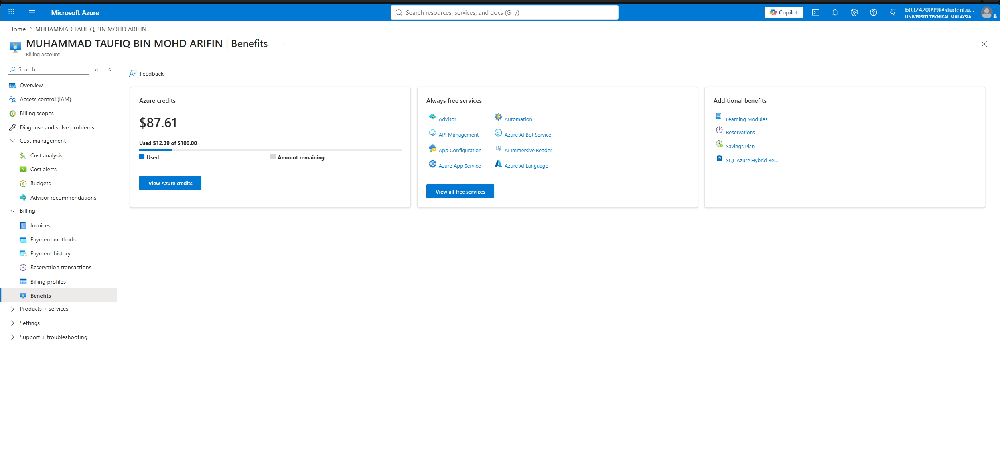
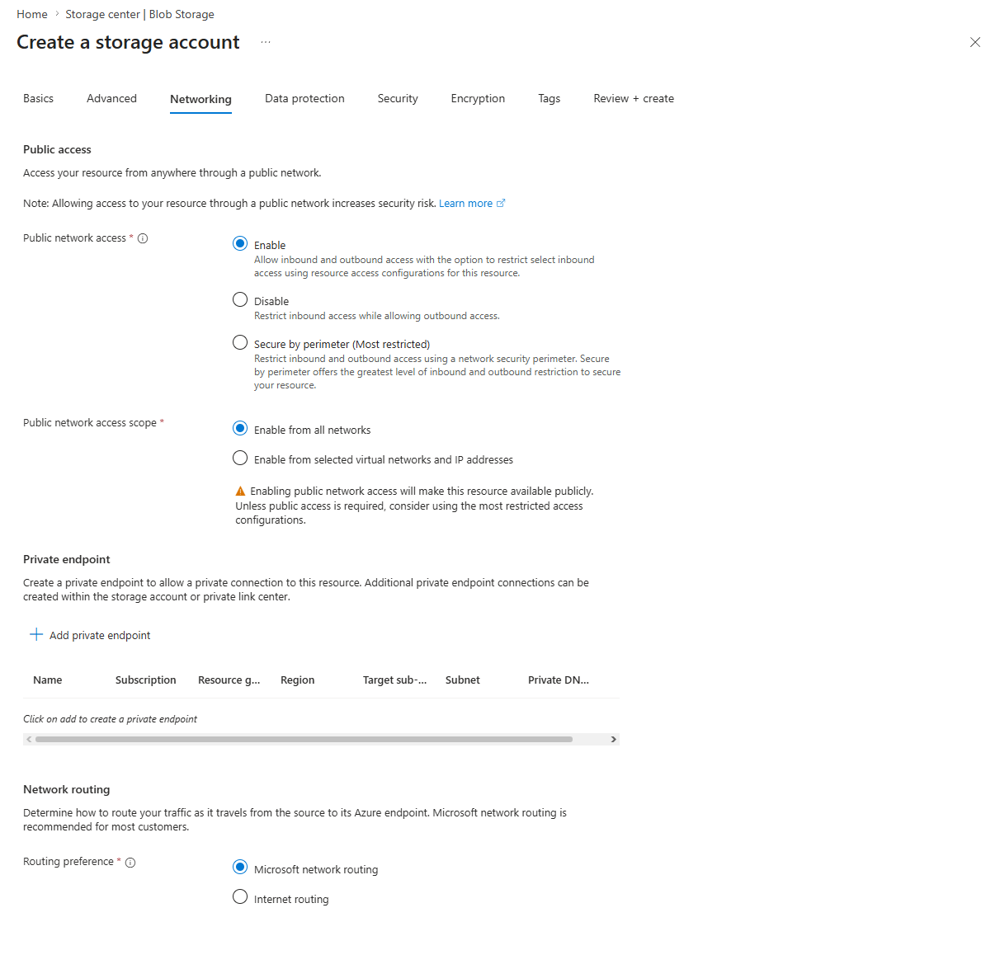
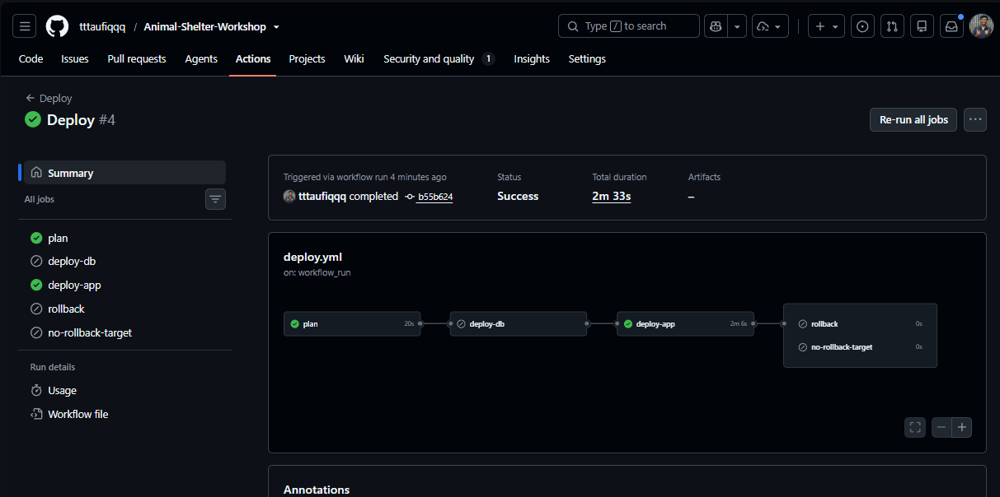

# DevOps Practice Plan — Homelab Execution Roadmap

A staged plan to turn the existing homelab (Proxmox, OPNsense, Vault, MinIO,
VLAN segmentation) from "infrastructure I run" into "infrastructure I
automate." Each stage builds on the last but can be tackled independently.

**Scope: Animal Shelter Workshop only.** Every stage below targets that one
project and the infrastructure that serves it — its Terraform, its Ansible,
its CI/CD pipeline, its own container image, its own path into k3s/GitOps.

Order: Terraform → Ansible → CI/CD → Docker → k3s → Observability → GitOps →
Public Cloud.

Reordered from a generic "Docker first" curriculum on 2026-07-26: Stages 1-3
below (Terraform, Ansible, CI/CD) are mostly already real — built, and in two
cases running production — so they get finished before starting genuinely new
ground. Stage 1 has one known, documented, unfixed blocker; closing it is a
prerequisite for the Practice Discipline section's "time the recovery" goal
further down. Docker and k3s move to Stages 4-5 since they have no dependency
on 1-3, but k3s is a hard prerequisite for GitOps (Stage 7) — ArgoCD runs
inside a k3s cluster, so that stage can't move earlier than this order allows.

---

## Host Capacity Reality Check (measured 2026-07-26, applies to every stage below)

I SSH'd into `proxmox` (100.97.8.93) and pulled real numbers instead of
assuming headroom. Host `taufiq`: **4 physical cores, 15.9 GB RAM.**


Currently-running fleet (app-server + the 3 original DB VMs + opnsense +
vault + gh-runner + the 2 split-off DB CTs — the normal footprint, before
adding anything from this plan):

| | Allocated | Actually used | Host total |
|---|---|---|---|
| vCPU | 13 (3.25x overcommit) | ~2-5% (load avg 0.09/4) | 4 physical |
| RAM | ~17.9 GB | ~8.7 GB | 15.9 GB |

- **CPU has real headroom.** 13 vCPU is allocated across guests on paper, but
  the host idles at 95-98%. None of this plan's stages are CPU-bound —
  Docker, a k3s control plane, and ArgoCD all fit on the CPU side easily.
- **RAM does not.** Allocated already exceeds physical RAM for the guests
  running *today*. `free -h` shows only ~1.4 GB truly free, and **1.3 GB is
  already sitting in swap** — the host has already been pushed past physical
  memory once under this exact normal workload, with live production DB VMs
  on it. RAM, not CPU, is the constraint every stage below needs to respect.
- **Working rule for the rest of this plan:** before powering on anything new
  and leaving it running, `ssh proxmox "free -h"` first. Don't add a
  persistent guest on top of an already-swapping host without a plan to free
  RAM elsewhere (the cheapest thing to stop temporarily is `linux-gh-runner`,
  CT 111 — it's only needed during an actual CI/CD run).

---

## End-State Capacity Projection (what this plan actually adds, and whether it fits)

Most of this plan's stages don't add anything persistent — they're code/pipeline
changes to infrastructure that already exists. Only two stages add a genuinely
new, permanent guest:

| Stage | New guest/service | Recommended size | Permanent? |
|---|---|---|---|
| 1 — Terraform | 4 test VMs (201/204/205/206) | 2048 MB × 4 = 8 GB | **No** — torn down once the loop's proven, per Stage 1's own instructions |
| 2 — Ansible | none (refactor of existing code) | — | — |
| 3 — CI/CD | none (pipeline logic only) | — | — |
| 4 — Docker | none required; Harbor is optional/deferred | Harbor ≈ 2+ GB if added later | Deferred by Stage 4's own capacity note |
| 5 — k3s | 1 new CT | start 1.5-2 GB, 1 core | **Yes** |
| 6 — Observability | 1 new CT/VM (Prometheus+Grafana+Loki+Alertmanager — not yet assigned a host in Stage 6, assume one dedicated CT, same pattern as Vault/MinIO/Mongo) | ≈ 2-3 GB, 2 cores | **Yes** |
| 7 — GitOps | no new guest — ArgoCD installs *inside* Stage 5's k3s node | adds ≈ 1-2 GB *to* that same node | **Yes** (grows Stage 5's footprint) |
| 8 — Public Cloud | none — runs on AWS/GCP, not this host | — | — |

The two permanent additions are the k3s CT (grows from ~2 GB to ~3-4 GB once
Stage 7's ArgoCD lands on it) and one observability CT/VM (~2-3 GB).

**Projected host RAM, applying both permanent additions to the current baseline:**

```
Right now:             10.3 GB used  /  15.5 GB total   (66.5%, ~5.2 GB headroom, 1.3 GB already in swap)

+ k3s CT (with ArgoCD):      +3-4 GB
+ Observability CT:          +2-3 GB
                        -----------------
Projected used:         15.3 - 17.3 GB  /  15.5 GB total
```

That lands **at or past the physical ceiling**, with zero safety margin —
not "a bit more swap," but sustained swapping on a host where three live
production databases already sit. As currently scoped, Stages 5-7 don't fit
on this box without freeing real RAM first.

**What actually creates enough room:** converting `linux-mysql`/`linux-mariadb`
(currently VMs, 1 core/2048 MB each) to CTs — the same pattern already proven
by `linux-mysql-2`/`linux-mariadb-2` — is the biggest single lever, worth
roughly 1-1.5 GB of genuinely reclaimable RAM per host (VMs here have no
balloon device configured, so their allocation is otherwise locked in
regardless of actual use). Doing both conversions (~2-3 GB freed) is roughly
enough to absorb both new CTs above without deep swapping. The alternative is
what Stage 5 already anticipates for k3s multi-node expansion — a second
physical Proxmox node — just triggered here by Stage 6's addition, not only
by "expand k3s to 2+ nodes." Either way, treat this as a decision to make
*before* Stage 6, not something to discover after RAM is already exhausted.

---

## Stage 1 — Terraform: Finish Proving the Loop, It Was Never Completed

**Goal:** the `.tf` code in `Animal-Shelter-Workshop/infrastructure/terraform`
is real, not a stub — it uses `bpg/proxmox`, cloud-init, and a `for_each`
module, and `docs/07-terraform.md` documents several genuine bugs actually
hit and fixed (wrong storage pool, cloud-init datastore defaulting to
`local-lvm`, wrong node name, an SSH key mismatch). But **the full loop has
never been proven end-to-end.** Terraform targets VM IDs 201/204/205/206 —
deliberately separate from the real 101/104/105/106 that were provisioned by
hand and actually run production. There is no `.tfstate` in the directory
today, and `docs/09-production-hardening.md` says outright: *"every real run
so far has targeted the existing hand-configured box"*, then flags that a
**fresh Terraform VM would fail `app-server.yml` today** — cloud-init only
creates a `workshop` user, not the `taufiq` user the playbook now assumes.
That's a documented, unfixed blocker, not a hypothetical. Treat this stage as
finishing a real gap, not tidying up something that already works:

- [ ] Run `terraform init` → `plan` → `apply` for real, start to finish, and
      get all 4 VMs to actually boot and join Tailscale — do not assume this
      currently works just because the code and the bug-fix history exist
- [ ] Fix the known blocker before declaring success: add a task (cloud-init
      user-data, or an early Ansible play) that creates the `taufiq` user on
      a fresh VM — `app-server.yml` is documented to fail without it
- [ ] Run the full loop for real, once: `apply` → `ansible-playbook
      playbooks/site.yml` against the fresh 201/204/205/206 VMs → confirm
      the app actually serves a request, not just that packages installed
- [ ] Decide deliberately what happens to the result — tear the 200-series
      VMs back down (they were meant as a parallel proof, not a migration
      target) and document "proven once, on this date," or keep them as a
      genuine second environment. Either is fine; an undocumented decision
      isn't
- [ ] Only after that first successful run, layer on the harder exercises:
      bring `linux-mysql-2`/`linux-mariadb-2` (currently manual CTs) into
      Terraform or explicitly decide they stay manual; move state onto
      self-hosted MinIO's S3-compatible backend instead of a local
      `.tfstate`; extract the `locals { vms = {...} }` pattern into a real
      reusable module. State-management exercises on top of an unproven
      base don't teach much — get the base working first

**Capacity note:** `vms.tf` configures all 4 test VMs at 2048 MB each — booting
them all at once is another ~8 GB on top of the ~17.9 GB already allocated to
the normal fleet (see Host Capacity Reality Check above), on a host with ~1.4 GB
actually free right now. Check `free -h` on `proxmox` before `apply`, bring
the 4 VMs up one at a time rather than all at once if it's tight, and tear
them down immediately once the loop is proven rather than leaving them
running — they were never meant to be a second permanent environment.

---

## Stage 2 — Ansible: Roles, Coverage, and Proof of Idempotency

**Goal:** `infrastructure/ansible` already has a working `site.yml`, five
per-host DB playbooks, `group_vars`, and a Vault AppRole
(`community.hashi_vault.vault_kv2_get`) feeding secrets in — skip the
`ansible all -m ping` and install→configure→verify basics, they're proven in
production already. Fixing Stage 1's blocker means touching this exact
Ansible/cloud-init boundary anyway, so do these two stages back to back.
What's still genuinely open:

- [ ] `playbooks/tasks/vault-agent.yml` is one task file, not a role —
      convert it (and the shared pieces of the five DB playbooks) into a
      real `roles/` structure with `tasks/`, `handlers/`, `templates/`,
      `defaults/`
- [ ] Formally verify idempotency: run each playbook twice back-to-back and
      confirm zero `changed` tasks on the second run; for any task that
      always reports changed (a restart handler, a template re-render),
      decide whether that's correct or a bug, don't just assume
- [ ] Try **Molecule** against the smallest playbook (`linux-postgres.yml`)
      for real automated testing, instead of eyeballing `--check` output
- [ ] `group_vars/all.yml` documents, in its own comments, that the shared
      MySQL/MariaDB root credential is deliberately plaintext — unlike
      `asw_secrets`, which is Vault-backed. Closing that one named
      exception (routing it through Vault too) is a concrete, scoped
      improvement, not hypothetical hardening
- [ ] Once roles exist, extend management to the homelab-level CTs
      currently provisioned by hand from docs (`linux-vault`,
      `linux-gh-runner`, `linux-mini-io`, `linux-mongodb`) — good next
      targets since they're simpler, single-purpose hosts

---

## Stage 3 — CI/CD: Close the Gaps in an Already-Shipped Pipeline

**Goal:** `Animal-Shelter-Workshop`'s `tests.yml` + `deploy.yml` already do
path-based diff routing (only re-run the DB or app playbook when relevant
files changed since the last good deploy), pull every secret from Vault at
runtime, run real smoke tests (`5/5 online`, HTTP 200 direct + tunnel), and
roll back to the last-known-good SHA on failure with a written caveat about
Laravel migrations being forward-only. Build vs. test vs. deploy stages,
Vault-at-runtime secrets, and basic rollback are done — beyond the original
scope of this stage. Doing this stage third means the Terraform-drift item
below is now actually achievable, since Stage 1 will have made Terraform work
for the first time. The real remaining gaps:

- [ ] `deploy-db` has **no rollback by design** — it fails loud because
      there's no safe automatic reversal of an `apt install` or a UFW
      change. Add a pre-playbook backup step (`mysqldump`/`pg_dump` before
      `site.yml --limit databases` runs) so a bad DB change has an actual
      recovery path instead of just a documented shrug
- [ ] Terraform isn't wired into CI/CD at all right now — `deploy.yml` only
      runs `ansible-playbook`. Auto-`apply` is too destructive to automate
      blindly, but add a scheduled or manual `terraform plan` job that
      posts drift to a job summary, so infra drift is visible without
      someone running it locally and remembering to check
- [ ] The current smoke test only asserts the aggregate `5/5 online` string
      — a single connection failing (say, just `postgres`) still passes as
      long as the other 4 are up. Break out a per-connection check so a
      partial DB outage fails the deploy loudly instead of hiding behind an
      aggregate pass
- [ ] Once Stage 6 exists, feed deploy frequency/duration into it instead
      of treating every pipeline run as a one-off with no historical view

---

## Stage 4 — Containers: Docker

**Goal:** containerize `Animal-Shelter-Workshop` itself, understand image
builds. No dependency on Stages 1-3; this is genuinely new ground — no
Dockerfile exists in the repo today, `app-server.yml` installs PHP/Nginx
straight onto the VM.

- [ ] Write a multi-stage `Dockerfile` for the Laravel app (Composer/npm
      build stage + slim `php-fpm` runtime stage, matching the PHP 8.3 +
      extensions `app-server.yml` already installs)
- [ ] Write a `docker-compose.yml` wiring the container to one local test
      DB (not all 5 — that's what the real Tailscale-connected VMs/CTs are
      for), separate from the real Proxmox DB fleet
- [ ] Practice image tagging/versioning (`v1.0.0`, `latest`)
- [ ] Push images to a registry — Docker Hub, or self-host **Harbor** in
      the homelab for extra practice. **Capacity note:** Harbor's own stack
      (core + Postgres + Redis + registry + trivy) realistically wants
      2+ GB of RAM — on a host with ~1.4 GB actually free right now (see
      Host Capacity Reality Check above), that alone would push further
      into swap. Use Docker Hub first; only stand up Harbor after freeing
      RAM elsewhere (Stage 6 will make it easy to see how much headroom
      actually exists before trying)

---

## Stage 5 — Kubernetes (k3s)

**Goal:** move from single containers to orchestrated, self-healing
deployments. Needs Stage 4's images to actually deploy something real, and is
itself a hard prerequisite for Stage 7 (GitOps) — ArgoCD runs inside a k3s
cluster, so that stage cannot start before this one is done.

**Capacity note (from the Host Capacity Reality Check above):** the host has
plenty of CPU headroom (95-98% idle) but only ~1.4 GB RAM actually free, with
1.3 GB already parked in swap under the normal fleet. That changes how this
stage should be built, not whether it can be:

- [ ] Run k3s in an **LXC container, not a VM** — same reasoning already
      used for `linux-vault`/`linux-gh-runner`/`linux-mongodb`, and it skips
      a second guest kernel's overhead, which matters on a host this tight
      on RAM
- [ ] Start deliberately small — 1 core / 1.5-2 GB — and check `free -h` +
      swap on `proxmox` before scaling up, instead of assuming a k3s
      "minimum recommended" config just fits
- [ ] Stand up a single-node k3s cluster on one CT
- [ ] Get Stage 4's `Animal-Shelter-Workshop` image running manually as one
      Pod via `kubectl run`
- [ ] Write a proper `Deployment` + `Service` YAML for it
- [ ] Kill the pod on purpose, confirm it self-heals via replicas
- [ ] Add a `ConfigMap` and `Secret` for its config (start with non-DB
      config; wiring the real 5-connection DB setup into k3s config is a
      later, harder step, not this one)
- [ ] Explore the **Vault Agent Injector** for Kubernetes (ties Vault into
      k3s directly)
- [ ] Once comfortable, expand to 2+ nodes — this is the point where RAM
      most likely runs out on a single 4-core/15.9 GB host, and pairs with
      adding a second physical Proxmox node rather than squeezing a second
      k3s node onto the same box
- [ ] Practice scheduling, taints/tolerations, and node draining for
      maintenance

---

## Stage 6 — Observability

**Goal:** metrics, logs, and alerting living in the reserved VLAN 80.
Genuinely new ground — no Prometheus/Grafana/Loki anywhere in the homelab
today. No hard dependency on Stages 1-5, but doing it here means it can
immediately absorb Stage 3's deploy-frequency/duration goal and give you
something to watch once Stage 7 (GitOps) starts making automatic changes to
the cluster.

- [ ] Install `node_exporter` on every VM
- [ ] Point Prometheus at all VMs, build one fleet-wide Grafana dashboard
      (CPU/RAM/disk)
- [ ] Install Promtail on each VM, ship `journalctl` output to Loki
- [ ] Practice correlating a metrics spike with what was happening in the
      logs at that exact time
- [ ] Configure Alertmanager to fire a Discord/Telegram webhook on disk
      >90% or a service going unresponsive
- [ ] Test it for real: deliberately fill a disk or kill a service,
      confirm the alert fires, then diagnose using only the
      dashboard/logs (no cheating by remembering what was broken)

---

## Stage 7 — GitOps

**Goal:** git becomes the source of truth for what's deployed. Requires
Stage 5's k3s cluster to exist — ArgoCD is installed into it, not alongside
it.

**Capacity note:** ArgoCD's own components typically want another ~1-2 GB on
top of whatever Stage 5's k3s node is already using. By this stage the
cumulative new RAM demand from Docker + k3s + GitOps is stacking on a host
that had only ~1.4 GB free before any of this plan started. If Stage 5's
"expand to 2+ nodes" already required a second physical Proxmox node, ArgoCD
belongs on that expanded cluster, not squeezed onto the original box alone.

- [ ] Install **ArgoCD** in the k3s cluster
- [ ] Point it at `Animal-Shelter-Workshop`'s own repo — put Stage 5's
      manifests in a `k8s/` directory there rather than a separate repo
- [ ] Make a change in git (bump replicas, change an env var), confirm
      ArgoCD auto-syncs it into the cluster
- [ ] Make a manual change directly in the cluster with `kubectl edit`,
      confirm ArgoCD detects the drift and reverts it back to match git

---

## Stage 8 — Public Cloud Exposure (Azure for Students)

**Goal:** a genuine hybrid-cloud story, not purely on-prem. No dependency on
any other stage — can genuinely be done anytime, kept last because it's a
stretch goal. Already have the account — **Azure for Students**, checked
2026-07-26:



**The real constraint is the $87.61 left, not the technology.** The credit
was confirmed to expire March 2027 — call it 8 months of runway from today.
$87.61 ÷ 8 ≈ **$10.95/month** is the actual budget line, not "whatever's
cheapest," and none of the 3 services below are on the "Always free" tile —
Storage, Functions, and VMs all draw from that $87.61 (Functions has its own
separate perpetual free execution grant on top, see below, but the Storage
Account underneath it still draws from credit, just negligibly).

### Step 1 — the budget guardrail — DONE (2026-07-26)


- [x] I named it `homelab-stage8-guardrail`
- [x] I kept the reset period Monthly
- [x] I set the expiration date to 4/30/2027 (one month past the credit's
      actual March 2027 expiry)
- [x] I set the amount to $10.00 (matches the $10.95/month pace I worked
      out from $87.61 remaining ÷ ~8 months of runway, with a small margin)
- [x] I set alerts at 50% ($5) / 80% ($8) / 100% ($10) actual-cost
      thresholds, emailing `taufiq33992@gmail.com`
- [x] I confirmed it live in the Budgets list: evaluated spend $0.00,
      progress 0.00% — evaluation runs on a delay ("begins in a few hours"),
      so $0.00 right now is expected, not a sign anything's broken

### Step 2 — Blob Storage (the S3 equivalent)

**Storage account and container — DONE (2026-07-26):**


- [x] I created storage account `aswbackupstaufiq` in its own resource
      group (`homelab-stage8`) — Standard performance, **LRS** redundancy
      (cheapest tier, fine for a backup copy with no availability
      requirement)


- [x] I reviewed the Networking, Data protection, and Security tabs and
      left them at their safe defaults, with one deliberate call worth
      recording: I kept **public network access enabled, from all
      networks** — `app-server` reaches Azure over the public internet, not
      from inside an Azure VNet, and pinning it to a home IP would break the
      sync whenever my ISP rotates it. The actual access control I'm relying
      on is the scoped credential (below), not the network boundary. I left
      "Allow anonymous access on individual containers" **unchecked** — the
      account-level lock that keeps `backups` from ever becoming publicly
      readable
- [x] I created the Blob container `backups`, access level **Private (no
      anonymous access)**
- [x] I generated a container-scoped SAS token (Read/Write/List/Create
      only, no Delete — a leaked token still can't destroy offsite copies),
      expiry set to 03/30/2027 to match the credit's own lifetime
- [x] I stored the credential in Vault as 2 new fields on the *existing*
      `secret/animal-shelter-workshop` secret (`azure_backup_sas_token`,
      `azure_backup_container_url`) — I reused `asw-deploy`'s existing
      read-only policy on that path instead of standing up a new AppRole,
      since it already had access
- [x] I updated `env-app.j2` and `vault-agent.hcl.j2` so the new fields flow
      through the same Vault Agent injection pipeline as Cloudinary/mail —
      the scheduler process (which runs the nightly `db:backup`) gets them
      automatically
- [x] I wrote `App\Services\Backup\AzureBackupSync` and wired it into
      `BackupDatabases.php`, right after the manifest is committed — it
      uploads the run's dump files + `manifest.json` over the Blob REST API
      using the SAS token, no SDK dependency needed. I made sure a sync
      failure is caught and logged, never fails the backup command or
      blocks pruning — the local backup is already valid regardless of the
      offsite copy's outcome
- [x] I didn't need a separate schedule entry — the sync rides inside the
      already-scheduled `db:backup` (`routes/console.php`,
      `dailyAt('02:00')`), so this also covers what would otherwise have
      been a separate "Step 4: wire into nightly schedule" task


- [x] I deployed it via the normal CD pipeline (push to `main` → `Tests` →
      `Deploy`) — **Deploy #4, commit `b55b624`, succeeded** (2m 6s,
      `deploy-app` green, no rollback needed)


- [x] **Bonus fix I found along the way, unrelated to this stage:** my
      first deploy attempt (`Deploy #3`, commit `6de75b8`) failed and rolled
      back — not because of my new code, but because of a pre-existing bug
      in `deploy.yml`'s own smoke test. `echo "$OUTPUT" | grep -q '5/5
      online'` let `grep -q` exit the instant it found a match, before
      `echo` finished writing the rest of the (long) migration listing —
      under `set -o pipefail`, `echo`'s resulting `SIGPIPE` failed the whole
      step even though the health check had genuinely found `5/5 online`. I
      fixed it in both the deploy and rollback smoke tests with a pure bash
      substring match (`[[ "$OUTPUT" == *"5/5 online"* ]]`) — no subprocess,
      no pipe, no race
- [x] **Second bonus fix I found along the way, also unrelated to this
      stage:** a manual `db:backup` test run I ran aborted immediately —
      `mysqldump: workshop_2_prod has insufficient privileges to SHOW
      CREATE PROCEDURE`. I checked all 4 MySQL/MariaDB hosts: **every one**
      was missing the routine-viewing grant `docs/10-backups.md` already
      documents needing (`SELECT ON mysql.proc` for the 2 MariaDB hosts,
      `SHOW_ROUTINE` for the 2 MySQL 8 hosts) — present nowhere despite my
      own doc's 2026-07-20 restore drill recording it as fixed. Most likely
      explanation: I applied it by hand that day and never codified it into
      the Ansible playbooks, so a later re-provisioning run reset each
      user's privileges back to just `ALL PRIVILEGES ON workshop_2_prod.*`
      and silently dropped it. I re-applied it on all 4 hosts.
- [x] **Follow-up I did (2026-07-26, commit `dc34d09`):** I folded the
      grant into the *same* managed `mysql_user` `priv` string in all 4 DB
      playbooks (`{{ db_name }}.*:ALL/*.*:SHOW_ROUTINE` for the 2 MySQL
      hosts, `.../mysql.proc:SELECT` for the 2 MariaDB hosts) instead of a
      separate task — a separate task with a narrower `priv` would just
      flip-flop against this one every other run, since `mysql_user`'s
      default `append_privs:false` revokes anything not listed. I ran
      `site.yml` against all 4 hosts twice live: both runs `changed=0`,
      confirming this now survives re-provisioning instead of silently
      reverting again
- [x] **I fully verified this end-to-end (2026-07-26, run
      `20260726_041712`):** I ran a manual backup that completed
      successfully post-fix — all 5 dumps, logical FK audit, `Synced to
      Azure Blob Storage.` printed, and I confirmed via a direct Blob List
      Containers API call that all 6 files (`manifest.json` + 5 dumps)
      actually landed in `backups/20260726_041712/`


- [x] Cost check: 6 small files (compressed SQL dumps + a Postgres custom
      dump + a JSON manifest) — negligible against my $10/month budget

**The full flow, once deployed:**

```
┌────────────────────────────────────────────────────────────┐
│  Every night, 02:00 (already scheduled — unchanged)         │
└───────────────────────────┬──────────────────────────────────┘
                             ▼
┌────────────────────────────────────────────────────────────┐
│  app-server: Laravel scheduler fires                         │
│  (wrapped by Vault Agent, which injects secrets into env)    │
└───────────────────────────┬──────────────────────────────────┘
                             ▼
┌────────────────────────────────────────────────────────────┐
│  Vault Agent reads secret/animal-shelter-workshop            │
│  → injects AZURE_BACKUP_SAS_TOKEN + CONTAINER_URL             │
│    (alongside the existing DB/Cloudinary/mail secrets)       │
└───────────────────────────┬──────────────────────────────────┘
                             ▼
┌────────────────────────────────────────────────────────────┐
│  php artisan db:backup runs                                  │
│   1. dumps all 5 databases → storage/app/backups/<run-id>/   │
│   2. writes manifest.json                                    │
│   3. AzureBackupSync uploads those files                     │
│   4. prunes old local runs (7 daily + 4 weekly)               │
└───────────────────────────┬──────────────────────────────────┘
                             ▼
┌────────────────────────────────────────────────────────────┐
│  Azure Blob container "backups" (aswbackupstaufiq)            │
│  → offsite copy exists, independent of the Proxmox host       │
└────────────────────────────────────────────────────────────┘
```

### Step 3 — Azure Functions (the Lambda equivalent)

- [ ] Search bar → **Function App** → Create, **Consumption plan**
- [ ] Build a small function that calls the lab's Vault API over a secure
      tunnel and reads one of `asw_secrets`' actual fields (scoped read-only,
      same `asw-deploy`-style AppRole discipline used everywhere else in this
      project — never the root token)
- [ ] Cost check: Consumption plan carries its own perpetual free grant
      (1M executions/month) separate from the $10 budget above — a homelab
      test function stays inside that grant easily. Only the small backing
      Storage Account it needs draws from credit, negligibly

### Step 4 — stretch: Terraform talking to a second provider

- [ ] Replicate Stage 1's Terraform config using the `azurerm` provider
      instead of `bpg/proxmox`, provisioning one small VM (`Standard_B1s` —
      the cheapest burstable size)
- [ ] Prove it applies and boots, then **destroy it immediately** — this is
      the one item in Stage 8 that can meaningfully eat the $10/month budget
      if left running, unlike Steps 2-3. Same discipline as Stage 1's own
      test VMs: prove it once, tear it down, don't let it become a second
      permanent environment

---

## Practice Discipline (apply throughout, not just at the end)

- **Break things on purpose** — kill containers mid-deploy, corrupt a
  Terraform state file, fail a CI pipeline intentionally, then practice
  the fix. Troubleshooting instinct matters more than "have I heard of X."
- **Time the recovery** — can a VM be rebuilt from Terraform + Ansible in
  under 15 minutes? A concrete, provable number beats "familiar with IaC"
  on a resume. This requires Stage 1 to be finished first — there's no
  number to time until the loop completes at least once.
- **Document as it's built** — same habit already used in the homelab
  repo's `docs/` folders, keep it up for every new tool added here.

---

## Certifications (check current details before committing time/money)

- **CKA** (Certified Kubernetes Administrator) — most recognized entry
  point for container orchestration
- **Terraform Associate** — IaC-specific credential

Cert content and exam formats shift over time, verify directly with the
issuing body before relying on this list.
